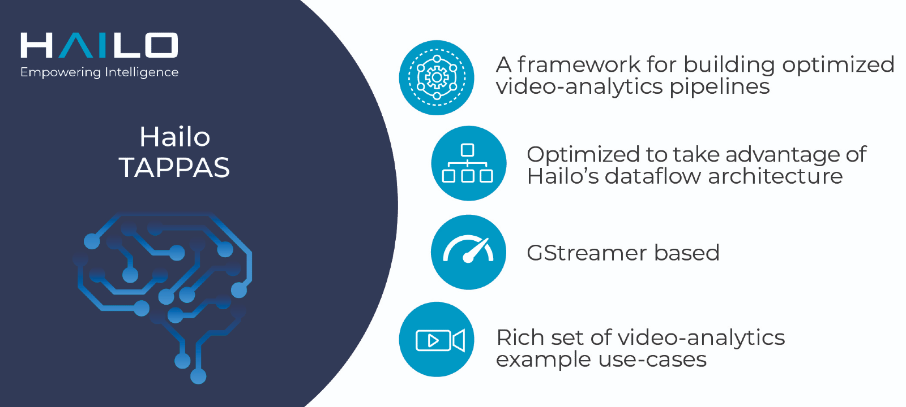
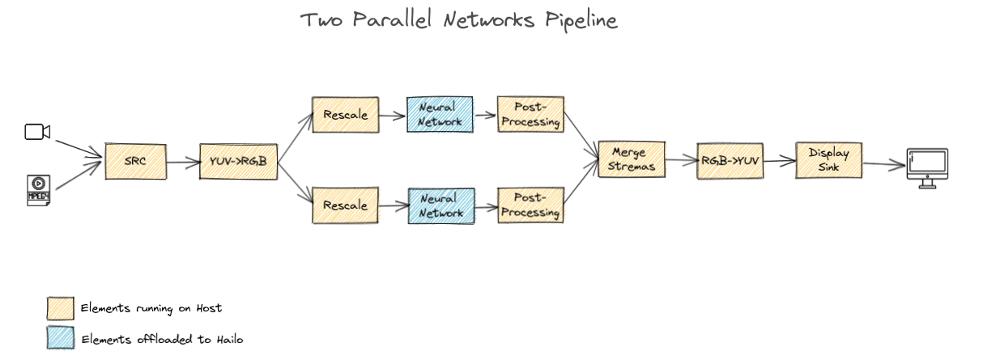
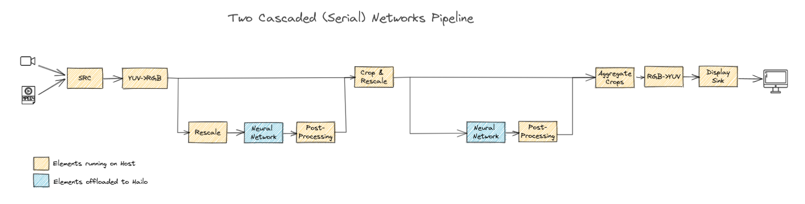
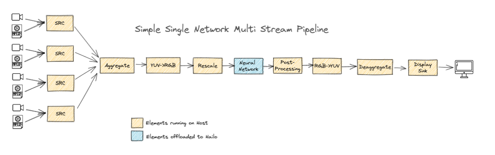

Hailo TAPPAS - Optimized Execution of Video-Processing Pipelines
================================================================

.. |check_mark| image:: ./resources/check_mark.png
  :width: 20
  :align: middle

.. raw:: html

   

      
   

----

Overview
--------

TAPPAS is a framework for using video analytics to build optimized processing pipelines in systems
with the Hailo-8 accelerator. Hailo-8 accelerates NN inference. TAPPAS optimizes the rest of the
pipeline to take full advantage of Hailo's dataflow architecture.

The core of TAPPAS is a library of non-neural video-processing elements.
These elements include:

* Hailo abstraction - elements to send/receive data from the Hailo accelerator.
* Glue-logic (e.g. format conversion YUV->RGB )
* Decision logic (e.g.rule-based filtering; branching; conditional invocation etc.)
* Data flow regulation elements (e.g. buffering; throttling; muxing/de-muxing)
* Functional elements (e.g. NMS, Tracking, Tiling, etc. )

TAPPAS comes packaged with a rich set of video analytics examples built on top of TAPPAS. These examples demonstrate common use-cases and showcase performance.

.. image:: ./resources/HAILO_TAPPAS_SW_STACK.jpg

----

Getting started
---------------

Prerequisites
^^^^^^^^^^^^^

* Hailo-8 device
* HailoRT PCIe driver installed
* At least 6GB's of free disk space

.. note::
    This version is compatible with HailoRT v4.12.0.

Installation
^^^^^^^^^^^^

.. list-table::
   :header-rows: 1

   * - Option
     - Instructions
     - Supported OS
   * - **Hailo SW Suite***
     - `SW Suite Install guide <docs/installation/sw-suite-install.rst>`_
     - Ubuntu x86 20.04, Ubuntu x86 22.04
   * - Pre-built Docker image
     - `Docker install guide <docs/installation/docker-install.rst>`_
     - Ubuntu x86 20.04, Ubuntu x86 22.04, Ubuntu aarch64 20.04 (64-bit)
   * - Manual install
     - `Manual install guide <docs/installation/manual-install.rst>`_
     - Ubuntu x86 20.04, Ubuntu x86 22.04, Ubuntu aarch64 20.04
   * - Yocto installation
     - `Read more about Yocto installation <docs/installation/yocto.rst>`_
     - Yocto supported BSP's
   * - Raspberry pi installation
     - `Read more about Raspberry pi installation <docs/installation/raspberry-pi-install.rst>`_
     - Raspberry Pi OS, Ubuntu 20.04

``* It is recommended to start your development journey by first installing the Hailo SW Suite``

Documentation
^^^^^^^^^^^^^

* `Framework architecture and elements documentation <docs/TAPPAS_architecture.rst>`_
* `Guide to writing your own C++ postprocess element <docs/write_your_own_application/write-your-own-postprocess.rst>`_
* `Guide to writing your own Python postprocess element <docs/write_your_own_application/write-your-own-python-postprocess.rst>`_
* `Debugging and profiling performance <docs/write_your_own_application/debugging.rst>`_
* `Cross compile <tools/cross_compiler/README.rst>`_ - A guide for cross-compiling

----

Example Applications built with TAPPAS
--------------------------------------

TAPPAS comes with a rich set of pre-configured pipelines optimized for different common hosts.

.. important:: 
    * All example applications utilize both the host (for non-neural tasks) and the Neural-Network Core
      (for neural-networks inference), therefore performance results are affected by the host.
    * General application examples do not include any architecture-specific accelerator usage,
      and therefore will provide the easiest way to run an application, but with sub-optimal performance.
    * Architecture-specific application examples (i.MX, Raspberry PI, etc.) use platform-specific
      hardware accelerators and are not compatible with different architectures.

.. note::
    All i.MX example application are validated on i.MX8 and i.MX6 platforms and are compatible with the architectures.

.. note::
    Running application examples requires a direct connection to a monitor.

Basic Single Network Pipelines
^^^^^^^^^^^^^^^^^^^^^^^^^^^^^^

Pipelines that run a single network. The diagram below shows the pipeline data-flow.

.. image:: resources/single_net_pipeline.jpg

The following table details the currently available examples.

.. list-table::
   :header-rows: 1
   :stub-columns: 1
   :widths: 40 12 12 12 12 12
   :align: center

   * - 
     - `General <apps/gstreamer/general/README.rst>`_
     - `i.MX8 <apps/gstreamer/imx8/README.rst>`_
     - `i.MX6 <apps/gstreamer/imx6/README.rst>`_
     - `Raspberry Pi 4 <apps/gstreamer/raspberrypi/README.rst>`_
     - `x86 Hardware Accelerated <apps/gstreamer/x86_hw_accelerated/README.rst>`_
   * - Classification 
     - |check_mark|
     -  
     -  
     -  
     -  
   * - Object Detection
     - |check_mark|
     - |check_mark|
     - |check_mark|
     - |check_mark|
     - 
   * - Pose Estimation
     - |check_mark|
     - |check_mark|
     - 
     - |check_mark|
     - 
   * - Semantic Segmentation
     - |check_mark|
     - |check_mark|
     - 
     - |check_mark|
     - 
   * - Depth Estimation
     - |check_mark|
     - |check_mark|
     - |check_mark|
     - |check_mark|
     - 
   * - Face Detection
     - |check_mark|
     - 
     - 
     - |check_mark|
     - 
   * - Facial landmark
     - |check_mark|
     - |check_mark|
     - 
     - 
     - 
   * - Instance segmentation
     - |check_mark|
     - 
     - 
     - 
     - 
   * - Classification with Python Postprocessing
     - |check_mark|
     - 
     - 
     - 
     - 
   * - Object Detection Multiple Devices (Century)
     - |check_mark|
     - 
     - 
     - 
     - |check_mark|

Two Network Pipelines
^^^^^^^^^^^^^^^^^^^^^

Examples of basic pipelines running two networks.
The parallel networks pipeline is an simple extension of the single network pipeline and is shown in the following diagram:

The cascaded (serial) flow shows two networks running in series. This example pipeline is of the popular configuration where the first network is a detector which finds some Region-of-Interest (ROI) in the input image and the second network processes the cropped ROI (a face-detection-and-landmarking use case of this pipeline is shown at the top of this guide). The pipeline is shown in the following diagram:

.. list-table::
   :header-rows: 1
   :stub-columns: 1
   :widths: 40 12 12 12 12 12
   :align: center

   * - 
     - `General <apps/gstreamer/general/README.rst>`_
     - `i.MX8 <apps/gstreamer/imx8/README.rst>`_
     - `i.MX6 <apps/gstreamer/imx6/README.rst>`_
     - `Raspberry Pi 4 <apps/gstreamer/raspberrypi/README.rst>`_
     - `x86 Hardware Accelerated <apps/gstreamer/x86_hw_accelerated/README.rst>`_
   * - Parallel - Object Det + Depth Estimation
     - |check_mark|
     - 
     - 
     - |check_mark|
     - 
   * - Parallel - Object Det + Pose Estimation
     - |check_mark|
     - 
     - 
     - 
     - 
   * - Cascaded - Face Detection & Landmarks
     - |check_mark|
     - |check_mark|
     - 
     - |check_mark|
     - 
   * - Cascaded - Person Det & Single Person Pose Estimation
     - |check_mark|
     - 
     - 
     - 
     - 
   * - Cascaded - Face Detection & Recognition
     - |check_mark|
     - 
     - 
     - 
     - 

Multi-Stream Pipelines
^^^^^^^^^^^^^^^^^^^^^^

.. list-table::
   :header-rows: 1
   :stub-columns: 1
   :widths: 40 12 12 12 12 12
   :align: center

   * - 
     - `General <apps/gstreamer/general/README.rst>`_
     - `i.MX8 <apps/gstreamer/imx8/README.rst>`_
     - `i.MX6 <apps/gstreamer/imx6/README.rst>`_
     - `Raspberry Pi 4 <apps/gstreamer/raspberrypi/README.rst>`_
     - `x86 Hardware Accelerated <apps/gstreamer/x86_hw_accelerated/README.rst>`_
   * - Multi-stream Object Detection
     - |check_mark|
     - 
     - 
     - 
     - |check_mark|
   * - Multi-stream Multi-Device Object Detection
     - |check_mark|
     - 
     - 
     - 
     - 

Pipelines for High-Resolution Processing Via Tiling
^^^^^^^^^^^^^^^^^^^^^^^^^^^^^^^^^^^^^^^^^^^^^^^^^^^

.. image:: docs/resources/tiling-example.png

.. list-table::
   :header-rows: 1
   :stub-columns: 1
   :widths: 40 12 12 12 12 12
   :align: center

   * - 
     - `General <apps/gstreamer/general/README.rst>`_
     - `i.MX8 <apps/gstreamer/imx8/README.rst>`_
     - `i.MX6 <apps/gstreamer/imx6/README.rst>`_
     - `Raspberry Pi 4 <apps/gstreamer/raspberrypi/README.rst>`_
     - `x86 Hardware Accelerated <apps/gstreamer/x86_hw_accelerated/README.rst>`_
   * - HD Object Detection
     - |check_mark|
     - 
     - 
     - 
     - 

Example Use Case Pipelines
^^^^^^^^^^^^^^^^^^^^^^^^^^

Our LPR reference application demonstrates the use of 3 networks, with a database.
The pipeline demonstrates inference based decision making (Vehicle detection) for secondary inference tasks (License plate extraction). This allows multiple networks to cooperate in the pipeline for reactive behavior.

.. image:: resources/lpr_pipeline.png

Our Multi-Person Multi-Camera Tracking reference application demonstrates person tracking across multiple streams using RE-ID tracking.
The pipeline demonstrates another method for inference based decision making that also connects between different video streams.

.. image:: resources/re_id_pipeline.png

Our VMS reference application demonstrates the use of 5 networks over multiple streams, and is a reference for video management system applications.

.. image:: resources/vms_pipeline.png

.. list-table::
   :header-rows: 1
   :stub-columns: 1
   :widths: 40 12 12 12 12 12
   :align: center

   * - 
     - `General <apps/gstreamer/general/README.rst>`_
     - `i.MX8 <apps/gstreamer/imx8/README.rst>`_
     - `i.MX6 <apps/gstreamer/imx6/README.rst>`_
     - `Raspberry Pi 4 <apps/gstreamer/raspberrypi/README.rst>`_
     - `x86 Hardware Accelerated <apps/gstreamer/x86_hw_accelerated/README.rst>`_
   * - LPR
     - |check_mark|
     - |check_mark|
     - 
     - 
     - 
   * - RE-ID
     - |check_mark|
     - 
     - 
     -
     - 
   * - VMS
     - 
     - 
     - 
     -
     - |check_mark|

----

Changelog
----------

**v3.23.0 (December 2022)**

* New Apps:

  * Added `x86_hw_accelerated <apps/gstreamer/x86_hw_accelerated/README.rst>`_ example pipelines
    that use Video Acceleration API (VA-API) over Intel processors that support
    `Quick Sync <https://en.wikipedia.org/wiki/Intel_Quick_Sync_Video>`_:

    * `Video Management System <apps/gstreamer/x86_hw_accelerated/video_management_system/README.rst>`_ -
      a pipeline that demonstrates a VMS application which runs several streams and different tasks - Face Recognition,
      Face Attributes and Person Attributes. Currently this example pipeline is supported on Ubuntu 22.04 only
    * `Multi-stream detection <apps/gstreamer/x86_hw_accelerated/multistream_detection/README.rst>`_
    * `Century <apps/gstreamer/x86_hw_accelerated/century/README.rst>`_

  * Pose Estimation pipeline with two cascading networks - `Person detection and single person pose estimation <apps/gstreamer/general/cascading_networks/README.rst>`_
  * `Face recognition <apps/gstreamer/general/face_recognition/README.rst>`_
  * Updated `i.MX6 Object Detection App <apps/gstreamer/imx6/detection/README.rst>`_ - New network, updated the pipeline to include i.MX6 hardware acceleration

* Added new models to `Instance Segmentation Pipeline <apps/gstreamer/general/instance_segmentation/README.rst>`_:

  * yolact_regnetx_1.6gf
  * yolact_regnetx_800mf (80 classes) 

* `Century app <apps/gstreamer/general/century/README.rst>`_ now uses a new network (yolov5m)
* `Multi-Camera Multi-Person Tracking (RE-ID) <apps/gstreamer/general/multi_person_multi_camera_tracking/README.rst>`_  -  Improved pipeline performance and accuracy
* Added support for Ubuntu 22.04 (release-grade)

**v3.22.0 (November 2022)**

* New element `hailoimportzmq` - provides an entry point for importing metadata exported by `hailoexportzmq` (HailoObjects) into the pipeline
* Added Depth Estimation, Object Detection and Classification pipelines for `i.MX6 Pipelines <apps/gstreamer/imx6/README.rst>`_ 
* Changed the debugging tracers to use an internal tracing mechanism  

**v3.21.0 (October 2022)**

* New Apps:
  
  * `Multi-stream detection that uses HailoRT Stream Multiplexer <apps/gstreamer/general/multistream_detection/README.rst>`_ - Demonstrates the usage of HailoRT stream multiplexer (preview)

* New elements - `hailoexportfile` and `hailoexportmq` which provide an access point in the pipeline to export metadata (HailoObjects)
* Improved pipeline profiling by adding new tracers and replacing the GUI of `gst-shark <docs/write_your_own_application/debugging.rst>`_
* Ubuntu 22 is now supported (GStreamer 1.20, preview)
* Yocto Kirkstone is now supported (GStreamer 1.20)

**v3.20.0 (August 2022)**

* New Apps:
  
  * `Detection every X frames pipeline <apps/gstreamer/general/detection/README.rst>`_ - Demonstrates the ability of skipping frames using a tracker

* Improvements to Multi-Camera Multi-Person Tracking (RE-ID) pipeline (released)

**v3.19.1 (July 2022)**

* New Apps:
  
  * Multi-Camera Multi-Person Tracking (RE-ID) pipeline `multi_person_multi_camera_tracking.sh <apps/gstreamer/general/multi_person_multi_camera_tracking/README.rst>`_ (preview)

**v3.19.0 (June 2022)**

* New Apps:

  * Added Cascading networks, Depth Estimation, Pose Estimation and Semantic Segmentation pipelines for `i.MX Pipelines <apps/gstreamer/imx8/README.rst>`_

* Added an option to control post-process parameters via a JSON configuration for the detection application
* Added support for Raspberry Pi Raspbian OS
* `Native Application <apps/native/detection/README.rst>`_ now uses TAPPAS post-process
* LPR (License Plate Recognition) pipeline is simplified to bash only
* New detection post-process - Nanodet

.. note::
    Ubuntu 18.04 will be deprecated in TAPPAS future version

.. note::
    Python 3.6 will be deprecated in TAPPAS future version

**v3.18.0 (April 2022)**

* New Apps:

  * LPR (License Plate Recognition) pipeline and facial landmark pipeline for `i.MX Pipelines <apps/gstreamer/imx8/README.rst>`_

* Added the ability of compiling a specific TAPPAS target (post-processes, elements)
* Improved the performance of Raspberry Pi example applications

**v3.17.0 (March 2022)** 

* New Apps:

  * LPR (License Plate Recognition) pipeline for `General Pipelines <apps/gstreamer/general/README.rst>`_ (preview)
  * Detection & pose estimation app
  * Detection (MobilenetSSD) - Multi scale tiling app

* Update infrastructure to use new HailoRT installation packages
* Code is now publicly available on `Github <https://github.com/hailo-ai/tappas>`_
   

**v3.16.0 (March 2022)** 
   
* New Apps:

  * Hailo `Century <https://hailo.ai/product-hailo/hailo-8-century-evaluation-platform/>`_ app - Demonstrates detection on one video file source over 6 different Hailo-8 devices
  * Python app - A classification app using a post-process written in Python

* New Elements:

  * Tracking element "HailoTracker" - Add tracking capabilities
  * Python element "HailoPyFilter" - Enables to write post-processes using Python

* Yocto Hardknott is now supported
* Raspberry Pi 4 Ubuntu dedicated apps
* HailoCropper cropping bug fixes
* HailoCropper now accepts cropping method as a shared object (.so)

**v3.14.1 (March 2022)** 

* Fix Yocto Gatesgarth compilation issue
* Added support for hosts without X-Video adapter

**v3.15.0 (February 2022)** 

* New Apps:

  * Detection and depth estimation - Networks switch app
  * Detection (MobilenetSSD) - Single scale tilling app

**v3.14.0 (January 2022)**

* New Apps:

  * Cascading apps - Face detection and then facial landmarking

* New Yocto layer - Meta-hailo-tappas
* Window enlargement is now supported
* Added the ability to run on multiple devices
* Improved latency on Multi-device RTSP app

**v3.13.0 (November 2021)**

* Context switch networks in multi-stream apps are now supported
* New Apps:

  * Yolact - Instance segmentation
  * FastDepth - Depth estimation
  * Two networks in parallel on the same device - FastDepth + Mobilenet SSD
  * Retinaface

* Control Element Integration - Displaying device stats inside a GStreamer pipeline (Power, Temperature)
* New Yocto recipes - Compiling our GStreamer plugins is now available as a Yocto recipe
* Added a C++ detection example (native C++ example for writing an app, without GStreamer)

   
**v3.12.0 (October 2021)** 

* Detection app - MobilenetSSD added
* NVR multi-stream multi device app (detection and pose estimation)
* Facial Landmarks app
* Segmentation app
* Classification app
* Face detection app
* Hailomuxer gstreamer element
* Postprocess implementations for various networks
* GStreamer infrastructure improvements
* Added ARM architecture support and documentation

  
**v3.11.0 (September 2021)**

* GStreamer based initial release
* NVR multi-stream detection app
* Detection app
* Hailofilter gstreamer element
* Pose Estimation app
