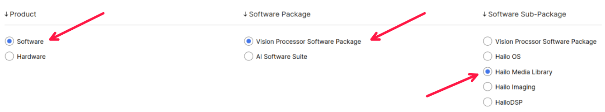

Hailo TAPPAS - Optimized Execution of Video-Processing Pipelines
================================================================

.. |gstreamer| image:: https://img.shields.io/badge/gstreamer-1.16%20%7C%201.18%20%7C%201.20-blue
   :target: https://gstreamer.freedesktop.org/
   :alt: Gstreamer 1.16 | 1.18 | 1.20
   :width: 150
   :height: 20

.. |hailort| image:: https://img.shields.io/badge/HailoRT-4.19.0-green
   :target: https://github.com/hailo-ai/hailort
   :alt: HailoRT
   :height: 20

.. |license| image:: https://img.shields.io/badge/License-LGPLv2.1-green
   :target: https://github.com/hailo-ai/tappas/blob/master/LICENSE
   :alt: License: LGPL v2.1
   :height: 20

.. |check_mark| image:: ./resources/check_mark.png
  :width: 20
  :align: middle

.. image:: ./resources/github_Tappas_Mar24.jpg
  :height: 300
  :width: 600
  :align: center

.. raw:: html

   

      
   

|gstreamer| |hailort| |license|

----

Overview
--------

TAPPAS is a set of full application examples for Hailo devices, combining vision pipeline elements and
pre-trained AI tasks.

The applications in this branch showcase system integration scenarios of specific use cases for the Hailo-15 platform.
Hardware accelerated components of Hailo-15 are leveraged to optimize performance and memory usage, showing best-practices for application development.

TAPPAS can be used for evaluations, reference code, and demos:

* Accelerating time to market by reducing development time and deployment effort
* Simplifying integration with Hailo-15's runtime SW stack
* Providing a starting point for customers to fine-tune their applications

.. image:: ./resources/hailo_15_stack.svg

----

A Note on Hailo-8
-----------------

.. note::
    This branch is intended for Hailo-15 only. 
    For Hailo-8 applications and packages, please refer to the `main branch <https://github.com/hailo-ai/tappas>`_.
    While many SW features here still parallel the Hailo-8 branch, subtle differences optimize this branch for Hailo-15.
    This includes a utilization in DSP accelerated operations and a Hailo-15 focused native example application.

----

Getting Started with Hailo-15
-----------------------------

For a quick start with Hailo-15, please refer to the Vision Processor Software Package documentation section
in Hailo's `Developer Zone <https://hailo.ai/developer-zone/documentation/>`_.

----

Example Applications Built with TAPPAS Hailo-15
-----------------------------------------------

.. note::
    Running application examples requires a connected host with monitor for display.

TAPPAS offers a comprehensive example of a complete AI application, showcasing the integration of multiple vision elements and AI tasks.
We encourage you to try the application, and follow along with the guide provided. Here pipeline decisions will be explained and example code will be elaborated on.
This example should serve as a clean demonstartion with good practices for how to build a complete AI application on Hailo-15, while taking full advantage of the 
hardware accelerated features provided on board.

Read the full guide on the `Hailo-15 C++ Example Application <./apps/h15/native/ai_example_app/README.rst>`_.

Other example applications are also provided, albeit with less guided analysis, in the **apps/** folder on the Hailo-15 image (provided that TAPPAS
is included in the image). These applications are quick references for various features and configurations.

A Detection Pipeline, for example, is provided to showcase single-stream detection with a pre-trained model.
This pipeline is a good starting point for seeing the basic capabilities of Hailo-15 in action.

To run the detection pipeline, follow the steps below:

1. Connect a host machine with monitor for display to the Hailo-15 device.
2. On the host machine, open a terminal and prepare a display pipeline to capture UDP output (it is all one command line):

.. code-block:: bash

    $ gst-launch-1.0 udpsrc port=5000 address=10.0.0.2 ! application/x-rtp,encoding-name=H264 ! queue max-size-buffers=30 max-size-bytes=0 max-size-time=0 leaky=no ! \
      rtpjitterbuffer mode=0 ! queue max-size-buffers=30 max-size-bytes=0 max-size-time=0 leaky=no ! rtph264depay ! \
      queue max-size-buffers=30 max-size-bytes=0 max-size-time=0 leaky=no ! h264parse ! avdec_h264 ! \
      queue max-size-buffers=30 max-size-bytes=0 max-size-time=0 leaky=downstream ! videoconvert n-threads=8 ! \
      queue max-size-buffers=30 max-size-bytes=0 max-size-time=0 leaky=no ! \
      fpsdisplaysink fps-update-interval=2000 name=hailo_display text-overlay=false sync=false

3. On the Hailo-15, run the application:

.. code-block:: bash

    $ ./apps/detection/detection.sh

The application will now start and you should see a display window open with the detection results. You can repeat this process
for the other applications in the **apps/** folder.

.. note::
    If your host is struggling to decode and display high resolutions in real-time, you can try using VA-API for hardware accelerated decoding.
    To see if your host machine is VA-API capable and then use it, `refer to this guide <./apps/h8/gstreamer/x86_hw_accelerated/README.rst>`_.

----

Further Reading
---------------
While this branch provides a fast track to Hailo-15 application development, it is recommended to continue reading available
documentation for deeper mastery. 

Hailo-15 comes with a rich ecosystem of tools and libraries. To make the most of those resources, you can explore the
`Hailo Developer Zone <https://hailo.ai/developer-zone/documentation/>`_.

As a next step, we recommend the `Hailo Media Library <https://github.com/hailo-ai/hailo-media-library/>`_ (HML) documentation.
HML is a powerful library of vision pipeline tools and modules that leverage the hardware accelerated components of Hailo-15 to
build robust, real-time pipelines.

To access the documentation, sign up for the `Hailo Developer Zone <https://hailo.ai/developer-zone/documentation/>`_ and then use the filters to reach the
relevant documentation:

Changelog
---------

.. important::
    This release branch introduces a shift in focus towards Hailo-15. Hailo-8 applications will continue to be supported in the 
    `main branch <https://github.com/hailo-ai/tappas>`_. 
    As such, the versioning scheme has been updated to reflect this change, and from here-on will align to the Hailo-15 packaging Suite versioning.

**v1.5.0 (Hailo-15 Suite) (Oct 2024)**

* Refactor CPP AI Example Application as a standalone application
* Add Multi-Scale tiling support in AI Example Application
* Support pkg-config for TAPPAS modules
* Shift branch focus to Hailo-15

**v3.29.1 (Hailo-8 Suite) (Aug 2024) and Below**

* For previous versions, please refer to the `Hailo-8 branch <https://github.com/hailo-ai/tappas>`_.