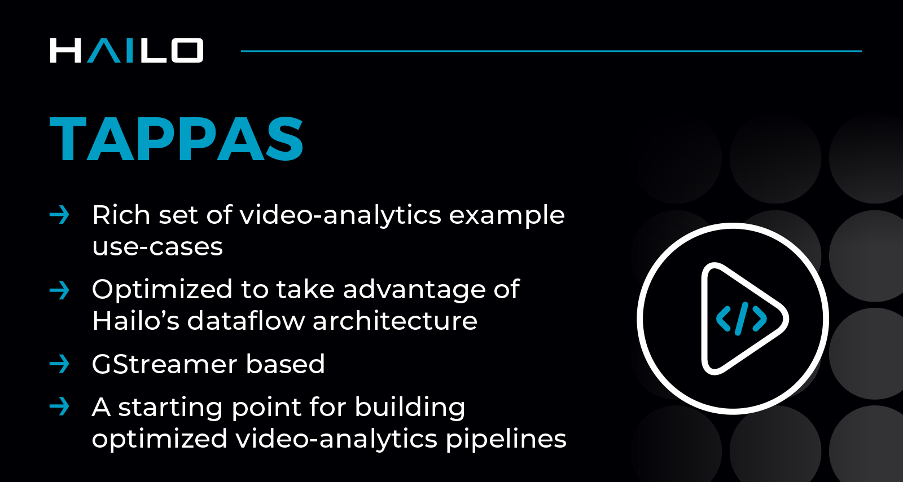

Hailo TAPPAS - Optimized Execution of Video-Processing Pipelines
================================================================

.. |gstreamer| image:: https://img.shields.io/badge/gstreamer-1.16%20%7C%201.18%20%7C%201.20-blue
   :target: https://gstreamer.freedesktop.org/
   :alt: Gstreamer 1.16 | 1.18 | 1.20
   :width: 150
   :height: 20

.. |hailort| image:: https://img.shields.io/badge/HailoRT-4.22.0%20%7C%205.0.0-green
   :target: https://github.com/hailo-ai/hailort
   :alt: HailoRT 4.22.0 | 5.0.0
   :height: 20

.. |license| image:: https://img.shields.io/badge/License-LGPLv2.1-green
   :target: https://github.com/hailo-ai/tappas/blob/master/LICENSE
   :alt: License: LGPL v2.1
   :height: 20

.. |check_mark| image:: ./resources/check_mark.png
  :width: 20
  :align: middle

|gstreamer| |hailort| |license|

----

Overview
--------

TAPPAS is Hailo's infrasturcture for building applications, implementing pipeline elements and
pre-trained AI tasks.

Hailo apllications are now maintained at `this repository <https://github.com/hailo-ai/hailo-apps-infra>`_.

Demonstrating Hailo's system integration scenario of specific use cases on predefined systems
(software and Hardware platforms). It can be used for evaluations, reference code and demos:

* Accelerating time to market by reducing development time and deployment effort
* Simplifying integration with Hailo’s runtime SW stack
* Providing a starting point for customers to fine-tune their applications

----

Getting Started with Hailo-8 And Hailo-10
-----------------------------------------

Prerequisites
^^^^^^^^^^^^^

* Hailo-8 or Hailo-10 device
* HailoRT PCIe driver installed
* At least 6GB's of free disk space

.. note::
    This version is compatible with HailoRT v4.22.0 for Hailo-8 devices, and with HailoRT v5.0.0 for Hailo-10 devices.

Installation
^^^^^^^^^^^^

.. list-table::
   :header-rows: 1

   * - Option
     - Instructions
     - Supported OS
   * - **Hailo SW Suite***
     - `SW Suite Install guide <docs/installation/sw-suite-install.rst>`_
     - Ubuntu x86 24.04, Ubuntu x86 22.04
   * - Manual install
     - `Manual install guide <docs/installation/manual-install.rst>`_
     - Ubuntu x86 24.04, Ubuntu x86 22.04, Ubuntu aarch64 20.04
   * - Yocto installation
     - `Read more about Yocto installation <docs/installation/yocto.rst>`_
     - Yocto supported BSP's
   * - Raspberry Pi 5 installation
     - `Read more about Raspberry Pi 5 installation <https://github.com/hailo-ai/hailo-rpi5-examples/blob/main/doc/install-raspberry-pi5.md>`_
     - Raspberry Pi OS

``* It is recommended to start your development journey by first installing the Hailo SW Suite``

Documentation
^^^^^^^^^^^^^

* `Framework architecture and elements documentation <docs/TAPPAS_architecture.rst>`_
* `Guide to writing your own C++ postprocess element <docs/write_your_own_application/write-your-own-postprocess.rst>`_
* `Guide to writing your own Python postprocess element <docs/write_your_own_application/write-your-own-python-postprocess.rst>`_
* `Debugging and profiling performance <docs/write_your_own_application/debugging.rst>`_
* `Cross compile <tools/cross_compiler/README.rst>`_ - A guide for cross-compiling

----

Getting Started with Hailo-15
-----------------------------

TAPPAS is now released separately for Hailo-8, for Hailo-15 please refer to https://github.com/hailo-ai/hailo-camera-apps.

For a quick start with Hailo-15, please refer to the Vision Processor Software Package documentation section
in Hailo's `Developer Zone <https://hailo.ai/developer-zone/documentation/>`_.

----

Example Applications Built with TAPPAS
--------------------------------------

TAPPAS includes a `single-stream object detection pipeline <apps/h8/gstreamer/general/detection/README.rst>`_ built on top of GStreamer.
These example application is part of the Hailo AI Software Suite.

Hailo offers an additional set of
`Application Code Examples <https://github.com/hailo-ai/Hailo-Application-Code-Examples>`_.
For the Raspberry Pi 5 applications, go to
`Hailo Raspberry Pi 5 Examples <https://github.com/hailo-ai/hailo-rpi5-examples>`_.

.. important:: 
    * Example application utilize both the host (for non-neural tasks) and the Neural-Network Core
      (for neural-networks inference), therefore performance results are affected by the host.
    * This application example does not include any architecture-specific accelerator usage,
      and therefore will provide the easiest way to run an application, but with sub-optimal performance.

.. note::
    Running application examples requires a direct connection to a monitor.

----

Support
-------

If you need support, please post your question on our `Hailo community Forum <https://community.hailo.ai/>`_ for assistance.

Contact information is available at `hailo.ai <https://hailo.ai/contact-us/>`_.

----

Changelog
----------

**v5.0.0 (July 2025)**

* All example applications, except the object detection application, are now maintained at `Hailo Applications <https://github.com/hailo-ai/hailo-apps-infra>`_.
* Updated manual installation process
* Added support for Ubuntu 24.04
* Added support for Python 3.12
* This release supports both HailoRT v4.22.0 (Hailo-8) and HailoRT v5.0.0 (Hailo-10)
