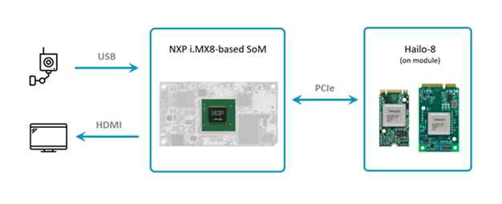
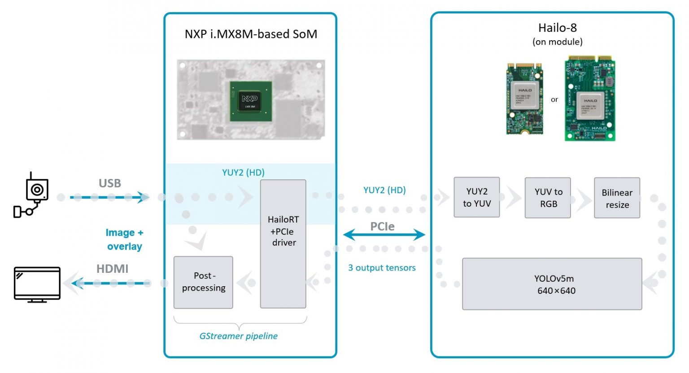

# Detection Pipeline

## Table of Contents

- [Detection Pipeline](#detection-pipeline)
  - [Table of Contents](#table-of-contents)
  - [Overview](#overview)
  - [Drill Down](#drill-down)
  - [Options](#options)
  - [Run](#run)
  - [How it works](#how-it-works)
  - [Links](#links)

## Overview

Our requirement from this pipeline is a real-time high-accuracy object detection to run on a single video stream using an embedded host. The required input video resolution was HD (high definition, 720p).

The chosen platform for this project is based on NXP’s i.MX8M ARM processor. The Hailo-8TM AI processor is connected to it as an AI accelerator.

<div align="center">
    
</div>

## Drill Down

Although the i.MX8M is a capable host, processing and decoding real-time HD video is bound to utilize a lot of the CPU’s resources, which may eventually reduce performance. To solve this problem, most of the vision pre-processing pipeline has been offloaded to the Hailo-8 device in our application.

The camera sends the raw video stream, encoded in YUV color format using the YUY2 layout. The data passes through Hailo’s runtime software library, called HailoRT, and through Hailo’s PCIe driver. The data’s format is kept unmodified, and it is sent to the Hailo-8 device as is.

Hailo-8’s NN core handles the data preprocessing, which includes decoding the YUY2 scheme, converting from the YUV color space to RGB and, finally, resizing the frames into the resolution expected by the deep learning detection model.

The Hailo Dataflow Compiler supports adding these pre-processing stages to any model when compiling it. In this case, they are added before the YOLOv5m detection model.

<div align="center">
    
</div>

## Options

```sh
./detection.sh [--input FILL-ME]
```

- `--input` is an optional flag, path to the video camera used (default is /dev/video2).
- `--show-fps`  is an optional flag that enables printing FPS on screen.
- `--print-gst-launch` is a flag that prints the ready gst-launch command without running it"

## Run

```sh
cd $TAPPAS_WORKSPACE/arm/apps/detection
./detection.sh
```

The output should look like:
<div align="center">
    
</div>

## How it works

This section is optional and provides a drill-down into the implementation of the `detection` app with a focus on explaining the `GStreamer` pipeline.
This section uses `yolov5` as an example network so network input width, height, and hef name are set accordingly.

```sh
gst-launch-1.0 \
    v4l2src device=$input_source ! video/x-raw,format=YUY2,width=1280,height=720,framerate=30/1 ! \
    queue leaky=downstream max-size-buffers=5 max-size-bytes=0 max-size-time=0 ! \
    hailonet hef-path=$hef_path debug=False is-active=true qos=false batch-size=1 ! \
    queue leaky=no max-size-buffers=30 max-size-bytes=0 max-size-time=0 ! \
    hailofilter function-name=$network_name so-path=$postprocess_so qos=false debug=False ! \
    queue leaky=no max-size-buffers=30 max-size-bytes=0 max-size-time=0 ! \
    hailofilter so-path=$draw_so qos=false debug=False ! \
    queue leaky=downstream max-size-buffers=5 max-size-bytes=0 max-size-time=0 ! \
    videoconvert ! \
    fpsdisplaysink video-sink=xvimagesink name=hailo_display sync=false text-overlay=false ${additonal_parameters}
```

Let's explain this pipeline section by section:

1. ```sh
    v4l2src device=$input_source ! video/x-raw,format=YUY2,width=1280,height=720,framerate=30/1
    ```

    Specifies the path of the camera, specify the required format and resolution.

2. ```sh
    queue leaky=downstream max-size-buffers=5 max-size-bytes=0 max-size-time=0 ! \
    ```

    Before sending the frames into the `hailonet` element, set a queue to leaky (Read more about queues [here](https://gstreamer.freedesktop.org/documentation/coreelements/queue.html?gi-language=c))

3. ```sh
    hailonet hef-path=$hef_path debug=False is-active=true qos=false batch-size=1 ! \
    queue leaky=no max-size-buffers=30 max-size-bytes=0 max-size-time=0 ! \
    ```

    Performs the inference on the Hailo-8 device.

4. ```sh
    hailofilter function-name=yolov5 so-path=$POSTPROCESS_SO qos=false debug=False ! \
    queue name=hailo_draw0 leaky=no max-size-buffers=30 max-size-bytes=0 max-size-time=0 ! \
    hailofilter so-path=$DRAW_POSTPROCESS_SO qos=false debug=False  ! \
    queue leaky=downstream max-size-buffers=5 max-size-bytes=0 max-size-time=0 ! \
    ```

    Each `hailofilter` performs a given post-process. In this case the first performs the `Yolov5m` post-process and the second performs box drawing. Then set a leaky queue to let the sink drop frames.

5. ```sh
    videoconvert ! \
    fpsdisplaysink video-sink=xvimagesink name=hailo_display sync=true text-overlay=false ${additonal_parameters}
    ```

    Apply the final convert to let GStreamer utilize the format required by the `fpsdisplaysink` element

## Links

- [hailofilter](../../../docs/../../docs/elements/hailo_filter.md)
- [Blog post about this setup](https://hailo.ai/blog/customer-case-study-developing-a-high-performance-application-on-an-embedded-edge-ai-device/)