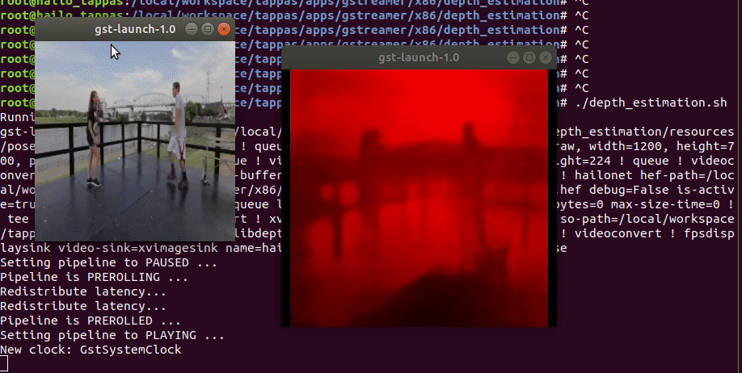

# Depth Estimation Pipelines

## Table of Contents

- [Depth Estimation Pipelines](#depth-estimation-pipelines)
  - [Table of Contents](#table-of-contents)
  - [Depth Estimation](#depth-estimation)
  - [Options](#options)
  - [Run](#run)
  - [Model](#model)
  - [How it works](#how-it-works)

## Depth Estimation

`depth_estimation.sh` demonstrates depth estimation on one video file source.
This is done by running a `single-stream object depth estimation pipeline` on top of GStreamer using the Hailo-8 device.

## Options

```sh
./depth_estimation.sh [--video-src FILL-ME]
```

- `-i --input` is an optional flag, a path to the video displayed.
- `--print-gst-launch` is a flag that prints the ready gst-launch command without running it
- `--show-fps` is an optional flag that enables printing FPS on screen

## Run

```sh
cd /local/workspace/tappas/apps/gstreamer/raspberrypi/depth_estimation
./depth_estimation.sh
```

The output should look like:

<div align="center">
     
</div>

## Model

- `fast_depth` in resolution of 224X224X3.

## How it works

This section is optional and provides a drill-down into the implementation of the `depth estimation` app with a focus on explaining the `GStreamer` pipeline.
This section uses `fast_depth` as an example network so network input width, height, hef name, are set accordingly.

```sh
gst-launch-1.0 \
    filesrc location=$input_source name=src_0 ! qtdemux ! h264parse ! avdec_h264 ! queue ! videoconvert n-threads=8 ! queue ! \
    tee name=t ! queue leaky=no max-size-buffers=30 max-size-bytes=0 max-size-time=0 ! \
    aspectratiocrop aspect-ratio=1/1 ! queue ! videoscale ! queue ! \
    hailonet hef-path=$hef_path device-id=$hailo_bus_id debug=False is-active=true qos=false batch-size=1 ! \
    queue leaky=no max-size-buffers=30 max-size-bytes=0 max-size-time=0 ! \
    hailofilter so-path=$draw_so qos=false debug=False ! videoconvert n-threads=8 ! \
    queue leaky=no max-size-buffers=30 max-size-bytes=0 max-size-time=0 ! \
    videoconvert ! fpsdisplaysink video-sink=ximagesink name=hailo_display sync=false text-overlay=false \
    t. ! queue leaky=no max-size-buffers=30 max-size-bytes=0 max-size-time=0 ! \
    videoscale ! video/x-raw, width=300, height=300 ! queue ! videoconvert n-threads=8 ! \
    ximagesink sync=false ${additonal_parameters}
```

Let's explain this pipeline section by section:

1. ```
   filesrc location=$input_source name=src_0 ! qtdemux ! h264parse ! avdec_h264 ! queue ! videoconvert n-threads=8 ! queue ! \
   ```
   Specifies the location of the video used, then decodes and converts to the required format using 8 threads for acceleration.
2. ```
   tee name=t 
   ```
   declare a tee that splits the pipeline into two branches.
3. ```
   queue leaky=no max-size-buffers=30 max-size-bytes=0 max-size-time=0 ! \
   aspectratiocrop aspect-ratio=1/1 ! queue ! videoscale ! queue ! \
   ```
   The beginning of the first split of the tee. The network used expects no borders, so a crop mechanism is needed.  
   Re-scales the video dimensions to fit the input of the network. In this case it is cropping the video and rescaling the video to 224x224 with the caps negotiation of `hailonet`.

4. ```
   hailonet hef-path=$hef_path device-id=$hailo_bus_id debug=False is-active=true qos=false batch-size=1 ! \
   queue leaky=no max-size-buffers=30 max-size-bytes=0 max-size-time=0 ! \
   ```
   Performs the inference on the Hailo-8 device.
5. ```
   hailofilter so-path=$draw_so qos=false debug=False ! videoconvert n-threads=8 ! \
   queue leaky=no max-size-buffers=30 max-size-bytes=0 max-size-time=0 ! \
   ```
   Performs a given draw-process, in this case, performs `fast_depth` depth estimation drawing per pixel.
6. ```
   videoconvert n-threads=8 ! fpsdisplaysink video-sink=ximagesink name=hailo_display sync=false text-overlay=false \
   ```
   Apply the final convert to let GStreamer utilize the format required by the `fpsdisplaysink` element
7. ```
   t. ! queue leaky=no max-size-buffers=30 max-size-bytes=0 max-size-time=0 ! \
   videoscale ! video/x-raw, width=300, height=300 ! queue 
   ```
   The beginning of the second split of the tee.
   Re-scales the video dimensions.
8. ```
   videoconvert n-threads=8 ! \
   ximagesink sync=false ${additonal_parameters}
   ```
   Apply the final convert to let GStreamer utilize the format required by the `ximagesink` element

> **_NOTE_**: Additional details about the pipeline provided in further examples
