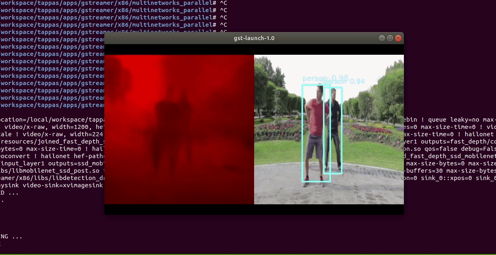

# Detection and Depth Estimation Pipeline

## Detection and Depth Estimation

`detection_and_depth_estimation.sh` demonstrates depth estimation and detection on one video file source.
This is done by running two streams on top of GStreamer using one Hailo-8 device with using two `hailonet` elements.

## Options

```sh
./detection_and_depth_estimation.sh [--video-src FILL-ME]
```

- `-i --input` is an optional flag, a path to the video displayed.
- `--print-gst-launch` is a flag that prints the ready gst-launch command without running it
- `--show-fps` is an optional flag that enables printing FPS on screen

## Run

```sh
cd $TAPPAS_WORKSPACE/apps/gstreamer/raspberrypi/multinetworks_parallel/
./detection_and_depth_estimation.sh
```

The output should look like:

<div align="center">
     
</div>

## Model

- `fast_depth` in resolution of 224X224X3.
- `mobilenet_ssd` in resolution of 300X300X3.

## How it works

This app is based on our [parallel networks pipeline template](../../../../docs/pipelines/parallel_networks.md)

With small modifications:

1. Use decode elements instead of `decodebin`
2. Increase the number of threads on the `videoconvert`