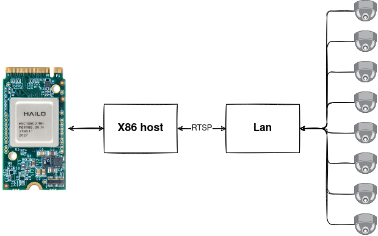
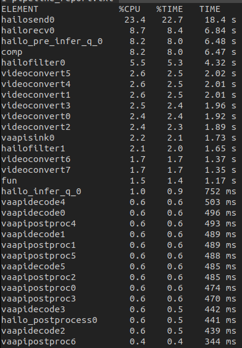
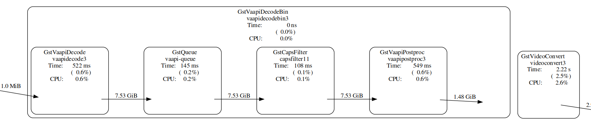
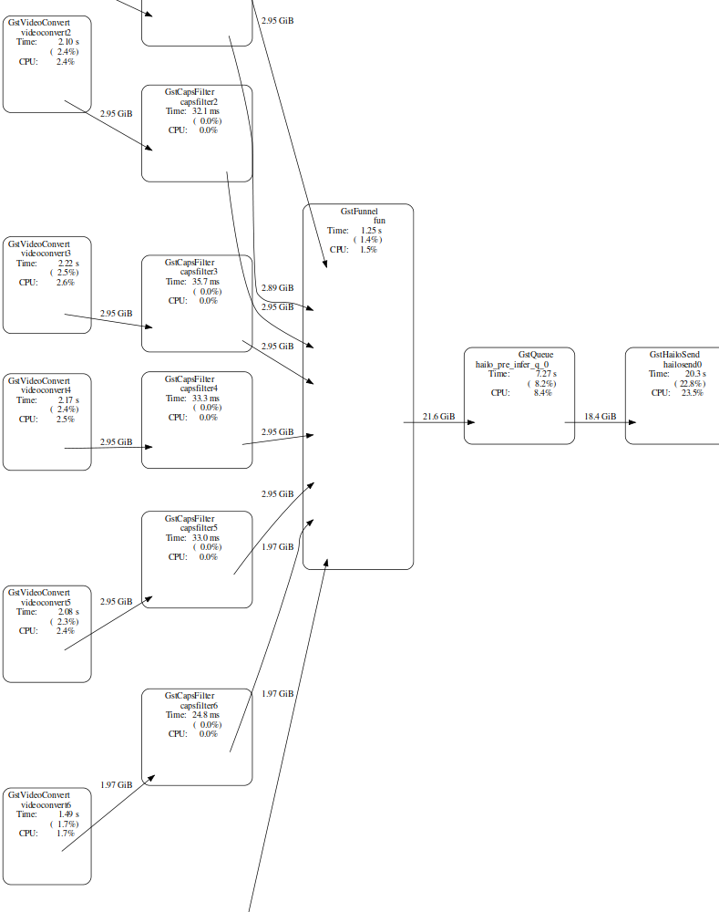
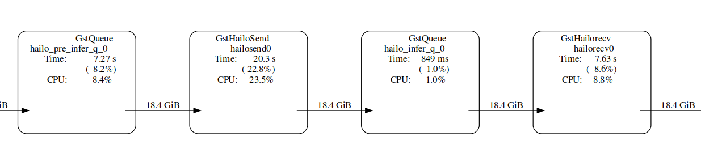
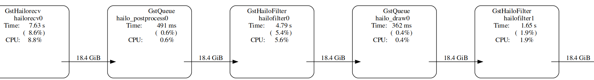
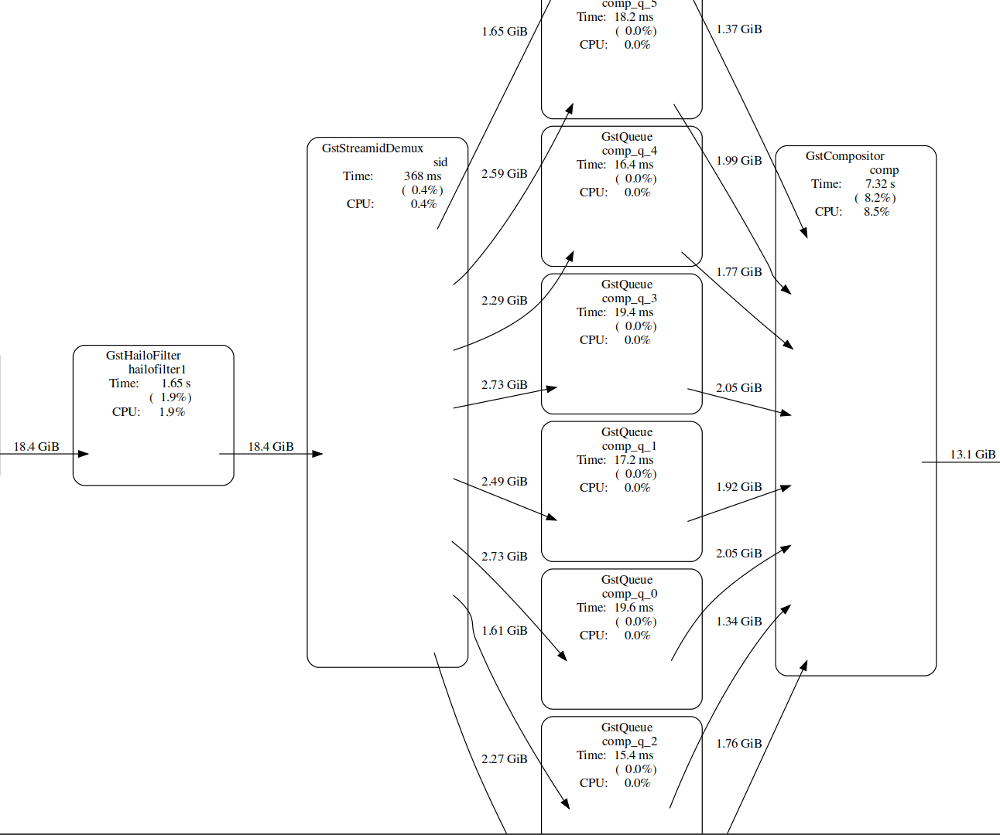
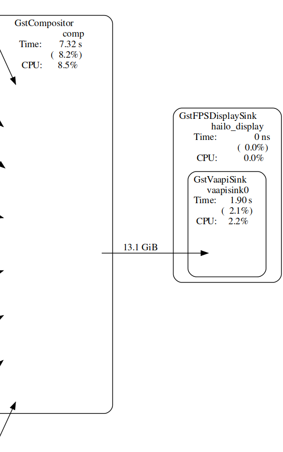

# Multi-Stream RTSP object detection Pipeline

## Table of Contents

- [Multi-Stream RTSP object detection Pipeline](#multi-stream-rtsp-object-detection-pipeline)
  - [Table of Contents](#table-of-contents)
  - [Overview](#overview)
  - [Prerequisites](#prerequisites)
  - [Preparations](#preparations)
  - [Run the pipeline](#run-the-pipeline)
  - [Model](#model)
  - [Overview of the pipeline](#overview-of-the-pipeline)

## Overview

This GStreamer pipeline demonstrates object detection on 8 camera streams over RTSP protocol.

All the streams are processed in parallel through the decode and scale phases, and enter the Hailo device frame by frame.

Afterwards postprocess and drawing phases add the classified object and bounding boxes to each frame. \
The last step is to match each frame back to its respective stream and output all of them to the display.



 `Real Time Streaming Protocol (RTSP)` is a network control protocol designed for use in entertainment and communications systems to control streaming media servers. The protocol is used for establishing and controlling media sessions between endpoint.

## Prerequisites

- TensorPC
- Ubuntu 18.04
- [RTSP](../../../../docs/terminology.md#real-time-streaming-protocol-rtsp) Cameras, We recommend using: [AXIS M10 Network Cameras](https://www.axis.com/products/axis-m1045-lw)
- Hailo-8 device connected via PCIe

- [Multi-Stream RTSP object detection Pipeline](#multi-stream-rtsp-object-detection-pipeline)
  - [Table of Contents](#table-of-contents)
  - [Overview](#overview)
  - [Prerequisites](#prerequisites)
  - [Preparations](#preparations)
  - [Run the pipeline](#run-the-pipeline)
  - [Model](#model)
  - [Overview of the pipeline](#overview-of-the-pipeline)

## Preparations

1. Before running, configuration of the RTSP camera sources is required.
open the `multistream_pipeline.sh` in edit mode with your preffered editor.
Configure the eight sources to match your own cameras.

```sh
readonly SRC_0="rtsp://<ip address>/?h264x=4 user-id=<username> user-pw=<password>"
readonly SRC_1="rtsp://<ip address>/?h264x=4 user-id=<username> user-pw=<password>"
etc..
```

## Run the pipeline

```sh
./multistream_pipeline.sh
```

1. `--show-fps` prints the fps to the output.
    >
2. `--num-of-sources` sets the number of rtsp sources to use by given input. the default and recommended value in this pipeline is 8 sources"
3. `--debug` uses gst-top to print time and memory consuming elements, saves the results as text and graph.
   >

   Open the pipeline_report.txt to view the full report showing all elements, your report should be similar to this:
    >

> **NOTE**: When the debug flag is used and the app is running inside of a docker, exit the app by tying `Ctrl+C` in order to save the results. (Due to docker X11 display communication issues)

## Model

`YOLOv5` is a modern object detection architecture that is based on the `YOLOv3` meta-architecture with `CSPNet` backbone. The `YOLOv5` was released on 05/2020 with a very efficient design and SoTA accuracy results on the `COCO benchmark`.

in this pipeline, wer'e using a specific variant of the `YOLOv5` architecture - `yolov5m` that stands for medium sized networks.

- Pre trained and compiled `yolov5m` model stored as .hef file.
- Resolution: 640x640x3
- Full precision accuracy: 41.7mAP
- Dataset: COCO val2017 <https://cocodataset.org/#home>

Enter the git project to read further: <https://github.com/ultralytics/yolov5>
Link to the network yaml in Hailo Model Zoo - <https://github.com/hailo-ai/hailo_model_zoo/blob/master/hailo_model_zoo/cfg/networks/yolov5m.yaml>

## Overview of the pipeline

The following elements are the structure of the pipeline:

- `rtspsrc` makes a connection to an rtsp server and read the data. used as a src to get the video stream from rtsp-cameras.
- `rtph264depay` extracts h264 video from rtp packets.
    >

    >
- `videoconvert` converting the frame into RGB format
    >
- `funnel` takes multiple input sinks and outputs one source. an N-to-1 funnel that attaches a streamid to each stream, can later be used to demux back into separate streams. this lets you queue frames from multiple streams to send to the hailo device one at a time.
    >

- `hailonet` Performs the inference on the Hailo-8 device - configures the chip with the hef and starts hailo's inference process - sets streaming mode and sends the buffers into the chip.
requires the following properties: `hef-path` - points to the compiled yolov5m hef, `qos` that must be set to false - to disable frame drops, and `batch-size`.
[read more about hailonet](../../../../docs/elements/hailo_net.md)

    >

- `hailofilter2` performs given postprocess, chosen with the `so-path` property. In this pipeline, one is incorporated to performe yolov5m postprocess. Afterwards a `hailooverlay` is used for box drawing.
    >
     >**NOTE**:  If multiple hailofilters are present and dependent on each other, then `qos` must be disabled for each.
      If there is only one hailofilter, then qos may be enabled (although it is still recommended to disable).

- `streamiddemux` a reverse to the funnel. It is a 1-to-N demuxer that splits a serialized stream based on stream id to multiple outputs.
- `compositor` composites pictures from multiple sources. handy for multi-stream/tiling like applications, as it lets you input many streams and draw them all together as a grid.
    >

- `fpsdisplaysink` outputs video into the screen, and displays the current and average framerate.
    > **NOTE**: `sync=false` property in `fpsdisplaysink` element disables real-time synchronization with the pipeline - it is mandatory on this case to reach the best performance.>


