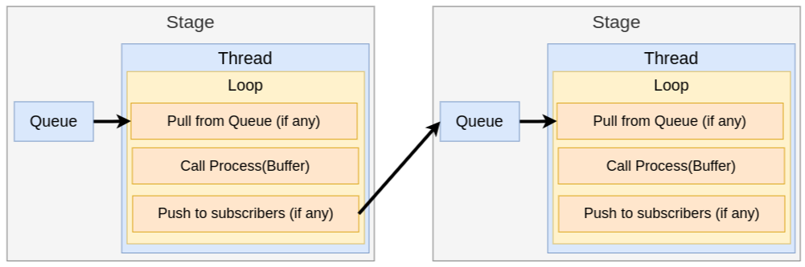
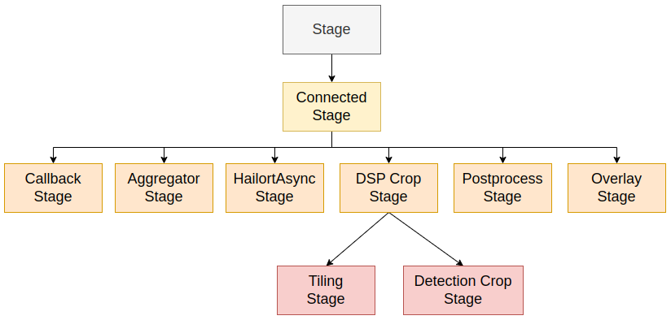
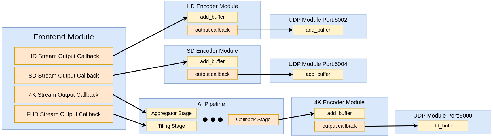

=============
App Structure
=============

This guide dives into the implementation of the application and explains the design decisions made and how other
pipelines may be built from similar components.

We will cover the following topics:

.. contents:: Table of Contents
   :depth: 3
   :backlinks: none

Anatomy of a Pipeline
=====================

A pipeline is made of discrete components that are connected together to form a data processing chain. Each component
should be able to process data asynchronously and in parallel with other components. This allows for the pipeline to
stream buffers and reduce latency. Data processing can be anything from image transfromations (dewarping) to masking (privacy mask) to inference.
The Hailo media Library that is comes with the Hailo15 software suite provides 2 such components that can be used out of the box: **Frontend** and **Encoder** c++ modules.

.. figure:: readme_resources/app_structure/pipeline.png
    :alt: Application Pipeline
    :align: center
    :height: 274 px
    :width: 1004 px
    :scale: 80%

    A PIPELINE is made of STAGEs, stages are connected by QUEUEs.

To meet these requirements, we implemented a class hierarchy that represents these discrete components called Stages. Each Stage
owns and manages a thread that runs asynchronously to process data. To facilitated data processing between stages, we implemented a
Queue class that supports limited queue size and blocking operations. A stage owns it's own input queues, and is responsible for pulling buffers of data
to process from them before pushing to the next stages (subscribers).

    Each stage runs its own THREAD that pulls a BUFFER from an internal QUEUE. The stage will PROCESS the buffer and push it to subscribers.

The data passed between stages may include information other than the image buffer itself: you may want to pass all kinds of metadata such as inference tensors or timestamping information.
To manage all of this information, we implemented a class called Buffer that is a container for the image data and metadata. The image data is represented by the **HailoMediaLibraryBufferPtr** type in Media Library. This is the format for output buffers from all
Media Library components and is a convenient way to represent and work with DMA memory. The Buffer class also holds a HailoROIPtr to represent inference results (detection boxes, landmarks, etc..). This class hierarchy is used throughout Tappas and allows us To
integrate stages in this application with many other modules in the Tappas suite (ie: tracking, overlay, postprocessing).

.. figure:: readme_resources/app_structure/buffer.png
    :alt: Application Pipeline
    :align: center
    :height: 354 px
    :width: 479 px
    :scale: 80%

    A buffer is a container for an image and metadata. It is passed between stages in the pipeline.

We can further extend the Stage generic class to implement specific stages that perform a certain task. For example, 
the **HailortAsyncStage** is a subclass of Stage that is responsible for running inference on video frames using the Hailort Async API. 
The **OverlayStage** is a subclass of Stage that is responsible for overlaying inference results on video frames and pushing them to the next stage.

    Stages can inherit and extend functionality.

By connecting these stages together, we can build complex pipelines that perform various tasks on video streams.

The Buffer Class
================

As the main data structure that is passed between stages, the Buffer class is a container for image data and metadata. The image data is represented by the **HailoMediaLibraryBufferPtr** type in Media Library.
This is the format for output buffers from all Media Library operations such as dewarping and resizing. The HailoMediaLibraryBufferPtr can represent an image using DMA memory, which is the default memory type in this application.
Media Library also offers a buffer pool class - MediaLibraryBufferPool - that can be used to allocate and manage buffers in a pool. This is useful for reusing buffers and reducing memory allocation overhead.
The pool also allows the allocation of DMA memory (shown in certain stages like HailortAsyncStage).
All code for the Buffer class and related metadata can be found in **infra/buffer.hpp**

Buffer
------
Lets look at the Buffer class in more detail:

        .. code-block:: cpp

            class Buffer {
            private:
                HailoMediaLibraryBufferPtr m_buffer;
                HailoROIPtr m_roi;
                std::vector<MetadataPtr> m_metadata;
                std::vector<TimeStampPtr> m_timestamps;

    Here we see that a Buffer object contains a **HailoMediaLibraryBufferPtr**, a **HailoROIPtr**, and vectors of 
    **MetadataPtr** and **TimeStampPtr**. The **HailoMediaLibraryBufferPtr** is the image data, the **HailoROIPtr** is 
    the inference results, and the vectors are for metadata and timestamps.

    Let's take a look at the construction:

        .. code-block:: cpp

            Buffer(HailoMediaLibraryBufferPtr buffer)
                : m_buffer(buffer) 
            {
                m_roi = std::make_shared<HailoROI>(HailoROI(HailoBBox(0.0f, 0.0f, 1.0f, 1.0f)));
                TimeStampPtr time_stamp =  std::make_shared<TimeStamp>("Source");
                m_timestamps.push_back(time_stamp);
            }

    Note that the constructor takes a pre-existing **HailoMediaLibraryBufferPtr** as input. This is becuase we will recieve
    one as the output to the Media Library Frontend and Encoder modules. The constructor also creates a **HailoROI** object
    with default values and a **TimeStamp** object with the name "Source", indicating timestamp for this buffer's source.
    If we pass a shared pointer to this Buffer class between stages, then it will naturally manage the lifetime of the **HailoMediaLibraryBufferPtr** as needed:

        .. code-block:: cpp

            using BufferPtr = std::shared_ptr<Buffer>;

        Indeed, we will use this **BufferPtr** type to pass buffers between stages in the pipeline.

    The rest of the class implementation is simple getters & setters for the various memebers it holds.

Metadata
--------
Metadata is implemented as a lightweight class that is easily extendible as new features are added:

        .. code-block:: cpp

            enum class MetadataType
            {
                UNKNOWN,
                TENSOR,
                EXPECTED_CROPS,
            };

            class Metadata 
            {
            private:
                MetadataType m_type;
            public:
                Metadata(MetadataType type=MetadataType::UNKNOWN) : m_type(type)
                {}

                virtual ~Metadata() = default;

                MetadataType get_type()
                {
                    return m_type;
                }
            };
            using MetadataPtr = std::shared_ptr<Metadata>;

    Since we may have different types of metadata inheriting from this class, we have a **MetadataType** enum to differentiate between them.
    Consider the following subclass:

        .. code-block:: cpp

            class BufferMetadata : public Metadata
            {
            private:
                BufferPtr m_buffer;
            public:
                BufferMetadata(BufferPtr buffer, MetadataType type=MetadataType::UNKNOWN) : Metadata(type), m_buffer(buffer)
                {}

                BufferPtr get_buffer()
                {
                    return m_buffer;
                }
            };
            using BufferMetadataPtr = std::shared_ptr<BufferMetadata>;

    This type of metadata holds a **BufferPtr** to another buffer. This is useful for tagging peices of memory to an image buffer, the cheif example being inference tensors:

        .. code-block:: cpp

            class TensorMetadata : public BufferMetadata
            {
            private:
                std::string m_tensor_name;
            public:
                TensorMetadata(BufferPtr buffer, std::string tensor_name) : BufferMetadata(buffer, MetadataType::TENSOR), m_tensor_name(tensor_name)
                {}

                std::string get_tensor_name()
                {
                    return m_tensor_name;
                }
            };
            using TensorMetadataPtr = std::shared_ptr<TensorMetadata>;

    The **TensorMetadata** class holds a tensor name in addition to the buffer pointer. This is useful for identifying which tensor is associated with this buffer.

Queue
=====

Now that we know how to contain data in our pipeline, we need a Queue class to manage the flow of data between stages. 
The Queue class is a simple wrapper around an *std::queue* that supports blocking operations and a limited queue size.
You can find all code associated with Queue in **infra/queue.hpp**.

        .. code-block:: cpp

            class Queue
            {
            private:
                std::queue<BufferPtr> m_queue;
                size_t m_max_buffers;
                bool m_leaky;
                std::string m_name;
                bool m_flushing;
                std::unique_ptr<std::condition_variable> m_condvar;
                std::shared_ptr<std::mutex> m_mutex;
                uint64_t m_drop_count = 0, m_push_count = 0;

            public:
                Queue(std::string name, size_t max_buffers, bool leaky=false)
                    : m_max_buffers(max_buffers), m_leaky(leaky), m_name(name), m_flushing(false) 
                {
                    m_mutex = std::make_shared<std::mutex>();
                    m_condvar = std::make_unique<std::condition_variable>();
                    m_queue = std::queue<BufferPtr>();
                }

                ~Queue()
                {
                    m_flushing = true;
                    m_condvar->notify_all();
                    flush();
                }

The **Queue** class holds an *std::queue* of **BufferPtr** objects, a maximum buffer size, a leaky flag, and a name. It also holds a condition variable and mutex for blocking operations.
Blocking can be important in push/pop operations so that stages can wait for buffers to be available to process. The **Queue** class also has a **flush** method that clears the queue and notifies all waiting threads to wake up, this is important when shutting down the pipeline.

Push
----
        .. code-block:: cpp

            void push(BufferPtr buffer)
            {
                std::unique_lock<std::mutex> lock(*(m_mutex));
                if (!m_leaky)
                {
                    // if not leaky, then wait until there is space in the queue
                    m_condvar->wait(lock, [this]
                                    { return m_queue.size() < m_max_buffers; });
                } 
                else 
                {
                    // if leaky, pop the front for a full queue
                    if(m_queue.size() >= m_max_buffers)
                    {
                        m_queue.pop();
                        m_drop_count++;
                    }
                }
                m_queue.push(buffer);
                m_push_count++;
                m_condvar->notify_one();
            }
    
    In this function we take a **BufferPtr** as input and push it onto the queue. If the queue is full and not leaky, then we wait until there is space in the queue. If the queue is leaky, then we pop the front of the queue to make space for the new buffer. We also notify any waiting threads that a buffer has been pushed onto the queue.

Pop
---
        .. code-block:: cpp

            BufferPtr pop()
            {
                std::unique_lock<std::mutex> lock(*(m_mutex));
                // wait for there to be something in the queue to pull
                m_condvar->wait(lock, [this]
                                    { return !m_queue.empty() || m_flushing; });
                if (m_queue.empty())
                {
                    // if we reachied here, then the queue is empty and we are flushing
                    return nullptr;
                }
                BufferPtr buffer = m_queue.front();
                m_queue.pop();
                m_condvar->notify_one();
                return buffer;
            }

    In this function we pop a **BufferPtr** from the queue. If the queue is empty, then we wait until there is a buffer to pull. If the queue is empty and we are flushing, then we return a nullptr. We also notify any waiting threads that a buffer has been popped from the queue.

Flush
-----
        .. code-block:: cpp

            void flush()
            {
                std::unique_lock<std::mutex> lock(*(m_mutex));
                m_flushing = true;
                while (!m_queue.empty())
                {
                    m_queue.pop();
                }
                m_condvar->notify_all();
            }

    The **flush** function clears the queue and notifies all waiting threads to wake up. This is important when shutting down the pipeline.

Stage
=====

Now that we have a way to pass data between stages, we need a way to process that data. 
The Stage class is a generic class that represents a stage in the pipeline, it's code can be found in **infra/stage.hpp**:

        .. code-block:: cpp

            Stage(std::string name, bool print_fps) : m_stage_name(name), m_print_fps(print_fps)
            {
                m_mutex = std::make_shared<std::mutex>();
                m_condvar = std::make_unique<std::condition_variable>();
            }

            virtual ~Stage() = default;

            std::string get_name()
            {
                return m_stage_name;
            }

            virtual AppStatus start()
            {
                m_end_of_stream = false;
                m_thread = std::thread(&Stage::loop, this);
                return AppStatus::SUCCESS;
            }

            virtual AppStatus stop()
            {
                set_end_of_stream(true);
                m_thread.join();
                return AppStatus::SUCCESS;
            }

            virtual AppStatus init()
            {
                return AppStatus::SUCCESS;
            }

            virtual AppStatus deinit()
            {
                return AppStatus::SUCCESS;
            }

            virtual void add_queue(std::string name){};

            virtual void push(BufferPtr buffer, std::string caller_name){};

            virtual void loop(){};

            virtual AppStatus process(BufferPtr buffer)
            {
                return AppStatus::SUCCESS;
            }
    
    Here you can see the relevant virtual functions that can be extended by child classes. Each stage holds a name that can be used to retrieve it from the pipeline and to identify when
    multiple stages are connected. Among the virtual functions are **start** and **stop** which are used to start and stop the stage's thread, **init** and **deinit** which are used to initialize 
    and deinitialize the stage, and **process** which is used to process a buffer.

ConnectedStage
--------------
Stage is mostly virtual, but we can extend it to create a concrete class that can be connected to other stages:

        .. code-block:: cpp

            class ConnectedStage : public Stage
            {
            protected:
                size_t m_queue_size;
                bool m_leaky;
                std::vector<QueuePtr> m_queues;
                std::vector<ConnectedStagePtr> m_subscribers;

            public:
                ConnectedStage(std::string name, size_t queue_size, bool leaky=false, bool print_fps=false) :
                    Stage(name, print_fps), m_queue_size(queue_size), m_leaky(leaky)
                {
                }

    This subclass of Stage holds vectors of **Queue** and subscribers. The queues are used to pull data from pre-ceeding stages, and the subscribers are the next stages in the pipeline that need to be pushed to.

    Here is how subscribers are added:
    
            .. code-block:: cpp

                void add_queue(std::string name) override
                {
                    m_queues.push_back(std::make_shared<Queue>(name, m_queue_size, m_leaky));
                }

                void add_subscriber(ConnectedStagePtr subscriber)
                {
                    m_subscribers.push_back(subscriber);
                    subscriber->add_queue(m_stage_name);
                }
        
        Note that when a subscriber is added, a **Queue** is also added *to the subscriber*. This is because the subscriber needs a **Queue** to pull data from.
        The name of this stage is used to name the **Queue**, so that the subscriber can identify which **Queue** was connected to who.
        For example, if we have a stage named "A" and a subscriber named "B", then the **Queue** connecting them will be named "A".
    
    Stages have a push function that can be called to add a buffer to the input **Queue**:

            .. code-block:: cpp

                void push(BufferPtr data, std::string caller_name) override
                {
                    for (auto &queue : m_queues)
                    {
                        if (queue->name() == caller_name)
                        {
                            queue->push(data);
                            break;
                        }
                    }
                    m_condvar->notify_one();
                }

    The stages also have a send-to-subscribers function that can be called to push a buffer to all subscribers (or a specific one by name if needed):

            .. code-block:: cpp

                void send_to_subscribers(BufferPtr data)
                {
                    for (auto &subscriber : m_subscribers)
                    {
                        subscriber->push(data, m_stage_name);
                    }
                }

                void send_to_specific_subsciber(std::string stage_name, BufferPtr data)
                {
                    for (auto &subscriber : m_subscribers)
                    {
                        if (stage_name == subscriber->get_name())
                        {
                            subscriber->push(data, m_stage_name);
                        }
                    } 
                }

        Recall that the name of the **Queue** is the name of the stage that is pushing to it. Now the send_to_subscribers function pushes the buffer with this stage's name as the caller name. This way the subscribing stage knows to what input **Queue** this **BufferPtr** belongs.

Loop
~~~~
    The loop is what runs in the stage's thread. It pulls a buffer from the input **Queue** and processes it:

            .. code-block:: cpp

                void loop() override
                {
                    init();

                    while (!m_end_of_stream)
                    {
                        BufferPtr data = m_queues[0]->pop(); // The first connected queue is always considered "main stream"
                        if (data == nullptr && m_end_of_stream)
                        {
                            break;
                        }

                        if (m_print_fps && !m_first_fps_measured)
                        {
                            m_last_time = std::chrono::steady_clock::now();
                            m_first_fps_measured = true;
                        }

                        process(data);

                        if (m_print_fps)
                        {
                            m_counter++;
                            print_fps();
                        }
                    }

                    deinit();
                }
    
    Note that in this subclass init(), deinit(), and process() are still virtual stubs. 
    It is up to inheriting classes to implement these functions.
    This loop will continue to pull and process buffers until the end of stream is reached, breaking the while() condition.

Pipeline
========
Now that we have all the components we need to build a pipeline, we can connect them together to form a data processing chain.
This class is the simplest in the infrastructure, it can be found in **infra/pipeline.hpp**:

            .. code-block:: cpp

                class Pipeline
                {
                private:
                    std::vector<StagePtr> m_stages;

                public:

                    void add_stage(StagePtr stage)
                    {
                        m_stages.push_back(stage);
                    }

    All it holds is a vector of **StagePtr** (shared pointers to the parent **Stage** class).

    The key functionality of the pipeline is to start and stop all stages:

            .. code-block:: cpp

                void start_pipeline()
                {
                    for (auto &stage : m_stages)
                    {
                        stage->start();
                    }
                }

                void stop_pipeline()
                {
                    for (auto &stage : m_stages)
                    {
                        stage->stop();
                    }
                }
    
    If needed, specific stages can also be retrieved by name:
    
            .. code-block:: cpp

                StagePtr get_stage_by_name(std::string stage_name)
                {
                    for (auto &stage : m_stages)
                    {
                        if (stage->get_name() == stage_name)
                        {
                            return stage;
                        }
                    }
                    return nullptr;
                }

main.cpp
========
The main.cpp file is where the pipeline is built and run. It is the entry point of the application where the main function is held:

            .. code-block:: cpp

                int main(int argc, char *argv[])
                {
                    // App resources 
                    std::shared_ptr<AppResources> app_resources = std::make_shared<AppResources>();

                    // register signal SIGINT and signal handler
                    signal_utils::register_signal_handler([app_resources](int signal)
                    { 
                        std::cout << "Stopping Pipeline..." << std::endl;
                        // Stop pipeline
                        stop_app(app_resources);
                        // terminate program  
                        exit(signal); 
                    });

                    // Parse user arguments
                    cxxopts::Options options = build_arg_parser();
                    auto result = options.parse(argc, argv);
                    std::vector<ArgumentType> argument_handling_results = handle_arguments(result, options);
                    int timeout  = result["timeout"].as<int>();

                    for (ArgumentType argument : argument_handling_results)
                    {
                        switch (argument)
                        {
                        case ArgumentType::Help:
                            return 0;
                        case ArgumentType::Timeout:
                            break;
                        case ArgumentType::PrintFPS:
                            app_resources->print_fps = true;
                            break;
                        case ArgumentType::PrintLatency:
                            app_resources->print_latency = true;
                            break;
                        case ArgumentType::Error:
                            return 1;
                        }
                    }

                    // Configure frontend and encoders
                    configure_frontend_and_encoders(app_resources);

                    // Create pipeline and stages
                    create_pipeline(app_resources);

                    // Subscribe elements
                    subscribe_elements(app_resources);

                    // Start pipeline
                    start_app(app_resources);

                    std::cout << "Started playing for " << timeout << " seconds." << std::endl;

                    // Wait
                    std::this_thread::sleep_for(std::chrono::seconds(timeout));

                    // Stop pipeline
                    stop_app(app_resources);

                    return 0;
                }

    The main function itself is quite simple. It starts by creating an **AppResources** object that holds all the resources needed by the application:

            .. code-block:: cpp

                    struct AppResources
                    {
                        MediaLibraryFrontendPtr frontend;
                        std::map<output_stream_id_t, MediaLibraryEncoderPtr> encoders;
                        std::map<output_stream_id_t, UdpModulePtr> udp_outputs;
                        PipelinePtr pipeline;
                        bool print_fps;
                        bool print_latency;
                    };
    
    This struct gives a convenient way to share application resources between the functions called in main().
    After parsing user arguments and setting a signal handler (to stop the pipeline on CTRL-C or SIGINT), the main function configures the frontend and encoders, creates the pipeline and stages, subscribes elements, and starts the pipeline.

Create and Configure Frontend and Encoders
------------------------------------------

The Hailo Media Library provides C++ modules for the Frontend and Encoder, which are both configured via JSON strings or files. In this application we save such configuration files and keep their paths in **#define** at the top of the main.cpp file.
With those files in hand, we can create a frontend module and a new instance of encoder module for each output stream:

            .. code-block:: cpp

                void configure_frontend_and_encoders(std::shared_ptr<AppResources> app_resources)
                {
                    // Create and configure frontend
                    std::string frontend_config_string = read_string_from_file(FRONTEND_CONFIG_FILE);
                    tl::expected<MediaLibraryFrontendPtr, media_library_return> frontend_expected = MediaLibraryFrontend::create(FRONTEND_SRC_ELEMENT_V4L2SRC, frontend_config_string);
                    if (!frontend_expected.has_value())
                    {
                        std::cout << "Failed to create frontend" << std::endl;
                        return;
                    }
                    app_resources->frontend = frontend_expected.value();

                    // Get frontend output streams
                    auto streams = app_resources->frontend->get_outputs_streams();
                    if (!streams.has_value())
                    {
                        std::cout << "Failed to get stream ids" << std::endl;
                        throw std::runtime_error("Failed to get stream ids");
                    }

                    // Create encoders and output files for each stream
                    for (auto s : streams.value())
                    {
                        if (s.id == AI_SINK)
                        {
                            // AI pipeline does not get an encoder since it is merged into 4K
                            continue;
                        }

                        create_encoder_and_output_file(s.id, app_resources);
                    }
                }

    The configured frontend and encoders are stored in the **AppResources** struct for later use. Note that we also skip creating an encoder for the AI_SINK stream, as it is not streamed externally. Instead it's results are added to the 4K stream.
    This loop calls a different function to configure an encoder with a different configuration file for each output stream, matching resolutions and bitrates:

            .. code-block:: cpp

                void create_encoder_and_output_file(const std::string& id, std::shared_ptr<AppResources> app_resources)
                {
                    // Create and conifgure udp
                    std::cout << "Creating encoder udp_" << id << std::endl;
                    tl::expected<UdpModulePtr, AppStatus> udp_expected = UdpModule::create(id, HOST_IP, PORT_FROM_ID(id), EncodingType::H264);
                    if (!udp_expected.has_value())
                    {
                        std::cout << "Failed to create udp" << std::endl;
                        return;
                    }
                    app_resources->udp_outputs[id] = udp_expected.value();

                    // Create and configure encoder
                    std::cout << "Creating encoder enc_" << id << std::endl;
                    std::string encoderosd_config_string = read_string_from_file(ENCODER_OSD_CONFIG_FILE(id).c_str());
                    tl::expected<MediaLibraryEncoderPtr, media_library_return> encoder_expected = MediaLibraryEncoder::create(encoderosd_config_string, id);
                    if (!encoder_expected.has_value())
                    {
                        std::cout << "Failed to create encoder osd" << std::endl;
                        return;
                    }
                    app_resources->encoders[id] = encoder_expected.value();
                }

    See that this function also configures a UDP module for each encoder. This is because the encoder will push its output to the UDP module, which will then send it to the specified IP and port.

A Note on UDP module
~~~~~~~~~~~~~~~~~~~~
Although not implemented as a Stage class like the AI Pipeline, the UDP module is a simple class that can be used to send buffers to a specified IP and port. It is used in this application to send encoded video streams to a remote host.
It is implemented in **infra/udp_stage.hpp** as a mirror of the Frontend and Encoder C++ modules in the Media Library, with parallel usage.

Creating the Pipeline
---------------------
After configuring the frontend and encoder modules, the main.cpp creates the pipline. It may look like a long task at first but there are really only three steps that repeat.

        .. code-block:: cpp

            void create_pipeline(std::shared_ptr<AppResources> app_resources)
            {
                // Create pipeline
                app_resources->pipeline = std::make_shared<Pipeline>();

                // Create pipeline stages
                std::shared_ptr<TillingCropStage> tilling_stage = std::make_shared<TillingCropStage>(TILLING_STAGE,40, TILLING_INPUT_WIDTH, TILLING_INPUT_HEIGHT,
                                                                                                    TILLING_OUTPUT_WIDTH, TILLING_OUTPUT_HEIGHT,
                                                                                                    "", DETECTION_AI_STAGE, 5, false, app_resources->print_fps);
                std::shared_ptr<HailortAsyncStage> detection_stage = std::make_shared<HailortAsyncStage>(DETECTION_AI_STAGE, YOLO_HEF_FILE, 4, 40 ,"device0", 4, 4, std::chrono::milliseconds(100), app_resources->print_fps);
                std::shared_ptr<PostprocessStage> detection_post_stage = std::make_shared<PostprocessStage>(POST_STAGE, YOLO_POST_SO, YOLO_FUNC_NAME, "", 5, false, app_resources->print_fps);
                std::shared_ptr<AggregatorStage> agg_stage = std::make_shared<AggregatorStage>(AGGREGATOR_STAGE, false, 5, false, app_resources->print_fps);
                std::shared_ptr<BBoxCropStage> bbox_crop_stage = std::make_shared<BBoxCropStage>(BBOX_CROP_STAGE, 100, BBOX_CROP_INPUT_WIDTH, BBOX_CROP_INPUT_HEIGHT,
                                                                                                BBOX_CROP_OUTPUT_WIDTH, BBOX_CROP_OUTPUT_HEIGHT,
                                                                                                AGGREGATOR_STAGE_2, LANDMARKS_AI_STAGE, BBOX_CROP_LABEL, 3, false, app_resources->print_fps);
                std::shared_ptr<OverlayStage> overlay_stage = std::make_shared<OverlayStage>(OVERLAY_STAGE, 1, false, app_resources->print_fps);
                std::shared_ptr<AggregatorStage> agg_stage_2 = std::make_shared<AggregatorStage>(AGGREGATOR_STAGE_2, false, 20 , false, app_resources->print_fps);
                std::shared_ptr<CallbackStage> sink_stage = std::make_shared<CallbackStage>(AI_CALLBACK_STAGE, 2, false);
                std::shared_ptr<TrackerStage> tracker_stage = std::make_shared<TrackerStage>(TRACKER_STAGE, 1, false, -1, app_resources->print_fps);
                std::shared_ptr<HailortAsyncStage> landmarks_stage = std::make_shared<HailortAsyncStage>(LANDMARKS_AI_STAGE, LANDMARKS_HEF_FILE, 20, 101 ,"device0", 1, 1, std::chrono::milliseconds(100), app_resources->print_fps);
                std::shared_ptr<PostprocessStage> landmarks_post_stage = std::make_shared<PostprocessStage>(LANDMARKS_POST_STAGE, LANDMARKS_POST_SO, LANDMARKS_FUNC_NAME, "", 50, false, app_resources->print_fps);
                
                // Add stages to pipeline
                app_resources->pipeline->add_stage(tilling_stage);
                app_resources->pipeline->add_stage(detection_stage);
                app_resources->pipeline->add_stage(detection_post_stage);
                app_resources->pipeline->add_stage(agg_stage);
                app_resources->pipeline->add_stage(tracker_stage);
                app_resources->pipeline->add_stage(bbox_crop_stage);
                app_resources->pipeline->add_stage(agg_stage_2);
                app_resources->pipeline->add_stage(overlay_stage);
                app_resources->pipeline->add_stage(sink_stage);
                app_resources->pipeline->add_stage(landmarks_stage);
                app_resources->pipeline->add_stage(landmarks_post_stage);

                // Subscribe stages to each other
                tilling_stage->add_subscriber(detection_stage);
                detection_stage->add_subscriber(detection_post_stage);
                agg_stage->add_subscriber(tracker_stage);
                tracker_stage->add_subscriber(bbox_crop_stage);
                bbox_crop_stage->add_subscriber(agg_stage_2);
                bbox_crop_stage->add_subscriber(landmarks_stage);
                landmarks_stage->add_subscriber(landmarks_post_stage);
                landmarks_post_stage->add_subscriber(agg_stage_2);
                agg_stage_2->add_subscriber(overlay_stage);
                overlay_stage->add_subscriber(sink_stage);
            }

    In general, the three steps are:

    1. Create a stage with the appropriate constructor.
    2. Add the stage to the pipeline.
    3. Subscribe the stage to the previous stage in the pipeline.
   
    With this, the Pipeline object now holds all stages connected and ready to run. 
    All that is left is to connect these stages to the Fronend/Encoder/UDP modules and start the pipeline.

Connecting Media Library to the AI Pipeline
-------------------------------------------

The last step in building the application is to connect the Media Library modules to the AI pipeline. This is done by connecting the respective callbacks from the modules to push and pull from each other.
The general flow of callbacks should be as follows:

    The callbacks of each module can push buffers to the next stage in the pipeline.

Note that to push buffers fromt he AI pipeline to the 4K encoder we added a CallbackStage, which is a simple stage that takes a user defined callback.

The subscribe_elements() function implements the figure shown above:

        .. code-block:: cpp

            void subscribe_elements(std::shared_ptr<AppResources> app_resources)
            {
                // Get frontend output streams
                auto streams = app_resources->frontend->get_outputs_streams();
                if (!streams.has_value())
                {
                    std::cout << "Failed to get stream ids" << std::endl;
                    throw std::runtime_error("Failed to get stream ids");
                }

                // Subscribe to frontend
                FrontendCallbacksMap fe_callbacks;
                for (auto s : streams.value())
                {
                    if (s.id == AI_SINK)
                    {
                        std::cout << "subscribing ai pipeline to frontend for '" << s.id << "'" << std::endl;
                        app_resources->pipeline->get_stage_by_name(TILLING_STAGE)->add_queue(s.id);
                        fe_callbacks[s.id] = [s, app_resources](HailoMediaLibraryBufferPtr buffer, size_t size)
                        {
                            BufferPtr wrapped_buffer = std::make_shared<Buffer>(buffer);
                            app_resources->pipeline->get_stage_by_name(TILLING_STAGE)->push(wrapped_buffer, s.id);
                        };
                    }
                    else if (s.id == AI_VISION_SINK)
                    {
                        std::cout << "subscribing to frontend for '" << s.id << "'" << std::endl;
                        ConnectedStagePtr agg_stage = std::static_pointer_cast<ConnectedStage>(app_resources->pipeline->get_stage_by_name(AGGREGATOR_STAGE));
                        agg_stage->add_queue(s.id);
                        fe_callbacks[s.id] = [s, app_resources, agg_stage](HailoMediaLibraryBufferPtr buffer, size_t size)
                        {                      
                            BufferPtr wrapped_buffer = std::make_shared<Buffer>(buffer);
                            CroppingMetadataPtr cropping_meta = std::make_shared<CroppingMetadata>(4);
                            wrapped_buffer->add_metadata(cropping_meta);
                            agg_stage->push(wrapped_buffer, s.id);
                        };           
                        // subscribe aggregator to post stage as subframe
                        ConnectedStagePtr post_stage = std::static_pointer_cast<ConnectedStage>(app_resources->pipeline->get_stage_by_name(POST_STAGE));
                        post_stage->add_subscriber(agg_stage);
                    }
                    else
                    {
                        std::cout << "subscribing to frontend for '" << s.id << "'" << std::endl;
                        fe_callbacks[s.id] = [s, app_resources](HailoMediaLibraryBufferPtr buffer, size_t size)
                        {
                            app_resources->encoders[s.id]->add_buffer(buffer);
                        };
                    }
                }
                app_resources->frontend->subscribe(fe_callbacks);

    This first portion of the function connects the frontend otuput streams to the appropriate subscribers. We use the stream ID to determine what stream is being subscribed to.
    The AI_SINK stream is connected to the TillingCropStage, the AI_VISION_SINK stream is connected to the AggregatorStage, and all other streams are connected to their respective encoders.
    
    The Stage class we implemented does not take a **HailoMediaLibraryBufferPtr** but a **BufferPtr**. This is because we want to manage the refcount of the **HailoMediaLibraryBufferPtr** in the Buffer class.
    So for example, given a **HailoMediaLibraryBufferPtr** from the frentend module, we wrap the buffer in a **BufferPtr** and push it to the tiling stage like so:

        .. code-block:: cpp

            fe_callbacks[s.id] = [s, app_resources](HailoMediaLibraryBufferPtr buffer, size_t size)
            {
                BufferPtr wrapped_buffer = std::make_shared<Buffer>(buffer);
                app_resources->pipeline->get_stage_by_name(TILLING_STAGE)->push(wrapped_buffer, s.id);
            };

    We then connect the encoder modules to their respective UDP modules:

        .. code-block:: cpp

                // Subscribe to encoders
                for (const auto &entry : app_resources->encoders)
                {
                    if (entry.first == AI_SINK)
                    {
                        // AI pipeline does not get an encoder since it is merged into 4K
                        continue;
                    }

                    output_stream_id_t streamId = entry.first;
                    MediaLibraryEncoderPtr encoder = entry.second;
                    std::cout << "subscribing udp to encoder for '" << streamId << "'" << std::endl;
                    app_resources->encoders[streamId]->subscribe(
                        [app_resources, streamId](HailoMediaLibraryBufferPtr buffer, size_t size)
                        {
                            app_resources->udp_outputs[streamId]->add_buffer(buffer, size);
                        });
                }

    Lastly we connect the AI pipeline to the 4K encoder:

        .. code-block:: cpp

                // Subscribe ai stage to encoder
                std::cout << "subscribing ai pipeline to encoder '" << AI_VISION_SINK << "'" << std::endl;
                CallbackStagePtr ai_sink_stage = std::static_pointer_cast<CallbackStage>(app_resources->pipeline->get_stage_by_name(AI_CALLBACK_STAGE));
                ai_sink_stage->set_callback(
                    [app_resources](BufferPtr data)
                    {
                        if (app_resources->print_latency) {
                            app_resources->pipeline->print_latency();
                        }
                        app_resources->encoders[AI_VISION_SINK]->add_buffer(data->get_buffer());
                    });
            }

Running the Pipeline
--------------------
The application is now ready to start running. The last steps in the main function call start() for the pipeline, 
let the application run for an appointed amount of time, and then finally stop the application:

        .. code-block:: cpp

                // Start pipeline
                start_app(app_resources);

                std::cout << "Started playing for " << timeout << " seconds." << std::endl;

                // Wait
                std::this_thread::sleep_for(std::chrono::seconds(timeout));

                // Stop pipeline
                stop_app(app_resources);

                return 0;
            }