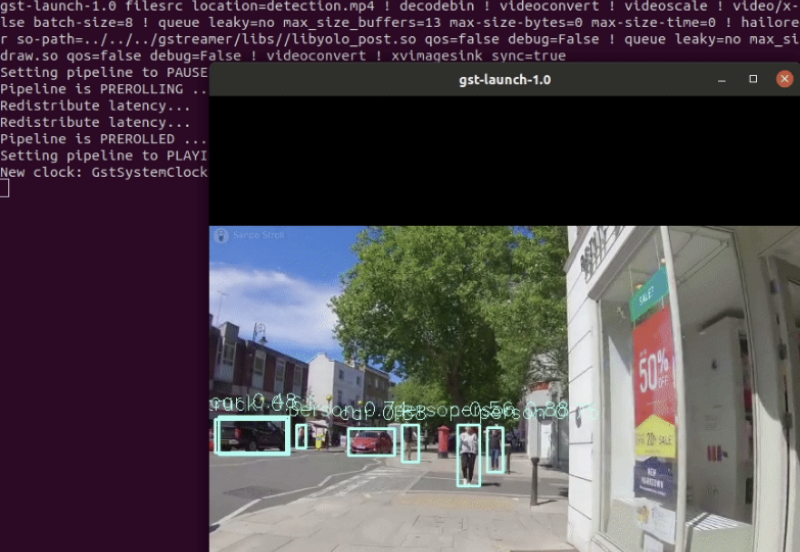

Detection Pipeline
==================

Overview
--------

``detection.sh`` demonstrates detection on one video file source and verifies Hailo’s configuration, by running a ``single-stream object detection pipeline`` on top of GStreamer using the Hailo-8 device.

Options
-------

.. code-block:: sh

   ./detection.sh [--input FILL-ME]

* ``--network``   is an optional flag that sets which network to use. Choose from [yolov5, nanodet], default is yolov5.
  This will set which ``hef file`` to use, the corresponding ``hailofilter`` function, and the scaling of the frame to match the width/height input dimensions of the network.
* ``--input`` is an optional flag, a path to the video displayed (default is detection.mp4).
* ``--show-fps``  is an optional flag that enables printing FPS on screen.
* ``--print-gst-launch`` is a flag that prints the ready gst-launch command without running it.
* ``--print-device-stats`` Print the power and temperature measured on the Hailo device.

Configuration
-------------

In case the selected network is yolo, the app post process parameters can be configured by a json file located in $TAPPAS_WORKSPACE/apps/h8/gstreamer/rockchip/detection/resources/configs

Supported Networks
------------------

* 'yolov5m_wo_spp_60p' - https://github.com/hailo-ai/hailo_model_zoo/blob/master/hailo_model_zoo/cfg/networks/yolov5m_wo_spp_60p.yaml

Run
---

.. code-block:: sh

   cd $TAPPAS_WORKSPACE/apps/h8/gstreamer/rockchip/detection
   ./detection.sh

The output should look like:

Method of Operation
-------------------

This app is based on the `single network pipeline template <../../../../../docs/pipelines/single_network.rst>`_

Using Retraining to Replace Models
---------------------------------------

.. note:: It is recommended to first read the `Retraining TAPPAS Models <../../../../../docs/write_your_own_application/retraining-tappas-models.rst>`_ page. 

Retraining Dockers (available on Hailo Model Zoo), can be used to replace the following models with ones
that are trained in the dataset:

- ``yolov5m``
  
  - `Retraining docker <https://github.com/hailo-ai/hailo_model_zoo/tree/master/training/yolov5>`_

    - For optimum compatibility and performance with TAPPAS, use for compilation the corresponding YAML file from above.
  - TAPPAS changes to replace model:

    - Update HEF_PATH on the .sh file
    - Update ``resources/configs/yolov5.json`` with your new post-processing parameters (NMS)
