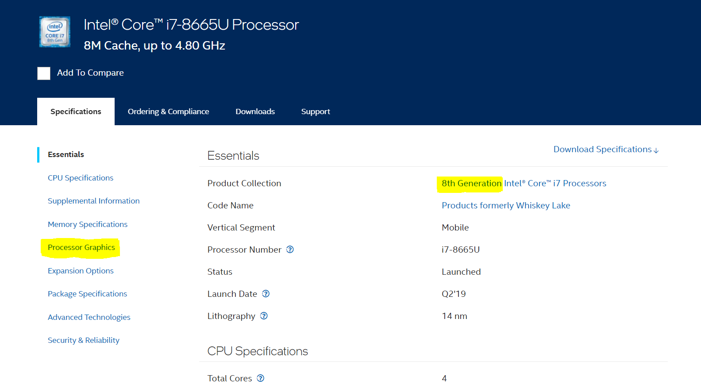

GStreamer based x86 applications
================================

Overview
--------

GStreamer has many plugins that support hardware acceleration for a large number of devices via several acceleration packages.
The hardware acceleration can be used for decoding/encoding operations, color convert, scaling, compositing etc.

On x86 based devices, one of the main plugins for hardware acceleration is vaapi plugin, that uses the VA-API hw acceleration library.

For more information about VA-API and device compatibility: `VAAPI (Video Acceleration API) <https://www.intel.com/content/www/us/en/developer/articles/technical/linuxmedia-vaapi.html>`_

The applications under the x86_hw_accelerated directory are using the vaapi gstreamer plugin and dependent on it.
In order to verify your device is compatible and supports the x86 hardware acceleration in gstreamer (AKA VA-API), please use the following guide.

Is my machine VA-API compatible?
--------------------------------

In order to find out If your machine is compatible we will have to verify:

#. You have an Intel CPU of 8th generation or higher.
#. Your Intel CPU has integrated graphics inside.

To determine if your CPU has integrated graphics you can follow `the following guide <https://www.binarytides.com/check-intel-igpu-details-on-ubuntu/>`_

To find out what is the generation of your Intel cpu and also whether it has integrated graphics:

#. Type `lscpu | grep "Model Name:"` on your computer.
#. Take the model name and search for it in the `Intel Ark <https://ark.intel.com/content/www/us/en/ark/search.html>`_
#. There you can find the generation of the CPU.
#. If the page of the specific processor has a `Processor Graphics` section, it has integrated graphics.

Here is an example of a cpu specifications on Intel Ark:

Highlighted are the `Processor Graphics` section and the CPU's generation.

VA-API Installation Guide
-------------------------

#. Run the VA-API accelerator's insallation via our script: ./install_accelerator.sh
#. Update the environment sourcing the following script: "source $TAPPAS_WORKSPACE/scripts/vaapi/set_env.sh"
#. Hailo provides a `Sanity Pipeline <sanity/README.rst>`_ that helps you verify that the installation phase went well. This is a good starting point.

Supported Pipelines
-------------------

#. `Sanity Pipeline <sanity/README.rst>`_ - Helps you verify that all the required components are installed correctly
#. `Multi-stream detection <multistream_detection/README.rst>`_ - Multi stream object detection using x86 hw acceleration.
#. `Video Management System <video_management_system/README.rst>`_ - Application demonstarting multiple pipelines on multiple streams.
#. `Century Pipeline <century/README.rst>`_ - Detection Pipeline with multiple devices.
