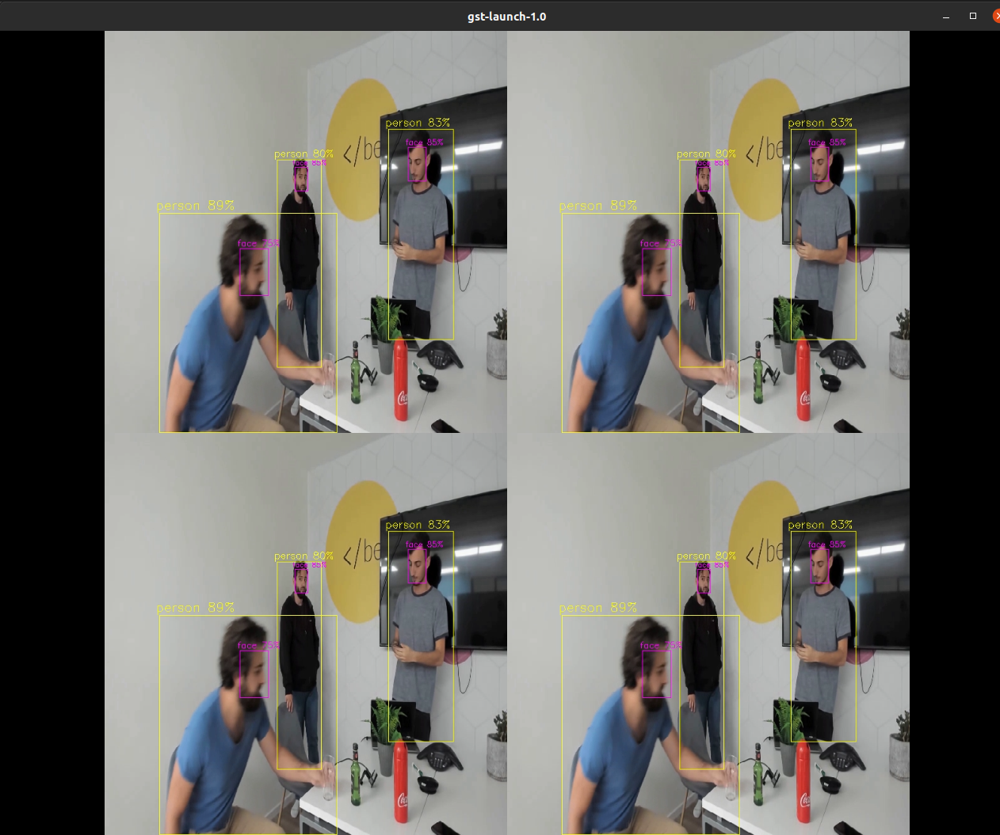

x86 Accelerated Multi-Stream Pipeline
======================================

Overview
--------

This GStreamer pipeline demonstrates Person+Face detection on multiple video streams.

All the streams are processed in parallel through the decode and scale phases, and enter the Hailo device frame by frame.

Afterwards postprocess and drawing phases add the classified object and bounding boxes to each frame.
The last step is to match each frame back to its respective stream and output all of them to the display.

In this pipeline the decoding phase is accelerated by `VA-API <../README.rst>`_.

Prerequisites
-------------

* RSC101
* Ubuntu 22.04 (or docker with ubuntu 22.04)
* Hailo-8 device connected via PCIe

Preparations
------------

Run the pipeline
----------------

.. code-block:: sh

   ./multistream_detection.sh

#. ``--show-fps`` Prints the fps to the output.
#. ``--num-of-sources`` Sets the number of sources to use by given input. The default and recommended value in this pipeline is 12 (for files) or 8 (for camera streams over RTSP protocol)"

The output should look like:

Configuration
-------------

The app post process parameters can be configured by a json file located in $TAPPAS_WORKSPACE/apps/h8/gstreamer/general/multistream_detection/resources/configs/yolov5.json

Supported Networks
------------------

* 'yolov5s_personface' - https://github.com/hailo-ai/hailo_model_zoo/blob/master/hailo_model_zoo/cfg/networks/yolov5s_personface.yaml

Overview of the pipeline
------------------------

These apps are based on our `multi stream pipeline template <../../../../../docs/pipelines/multi_stream.rst>`_

How to use Retraining to replace models
---------------------------------------

.. note:: It is recommended to first read the `Retraining TAPPAS Models <../../../../../docs/write_your_own_application/retraining-tappas-models.rst>`_ page. 

You can use Retraining Dockers (available on Hailo Model Zoo), to replace the following models with ones
that are trained on your own dataset:

- ``yolov5m``
  
  - `Retraining docker <https://github.com/hailo-ai/hailo_model_zoo/tree/master/training/yolov5>`_

    - For best compatibility and performance with TAPPAS, use for compilation the corresponsing YAML file from above.
  - TAPPAS changes to replace model:
    - Update HEF_PATH on the .sh file
    - Update ``resources/configs/yolov5_personface.json`` with your new post-processing parameters (NMS)
