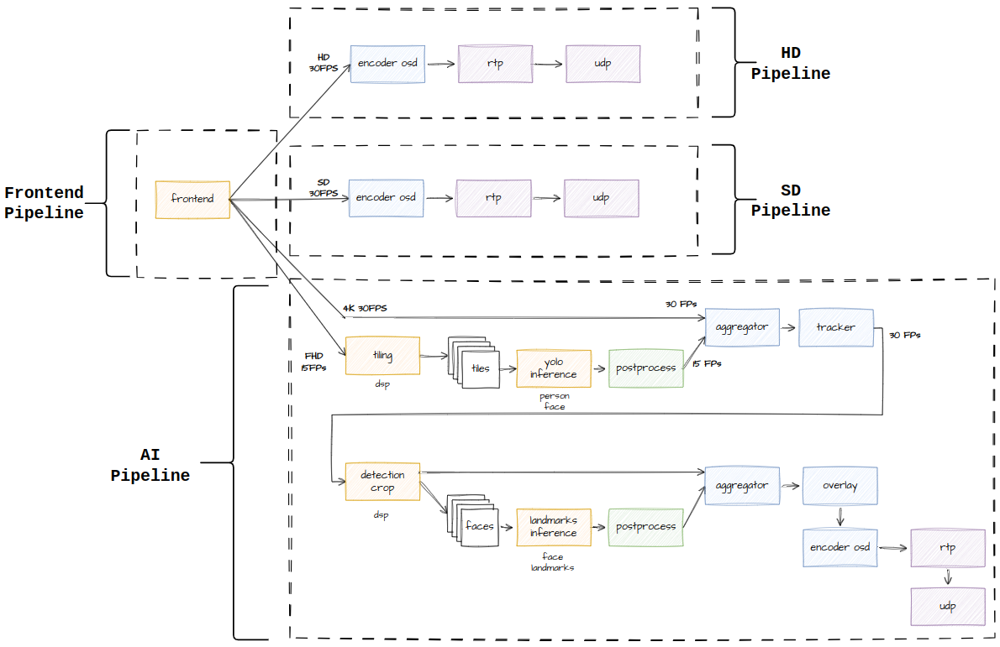
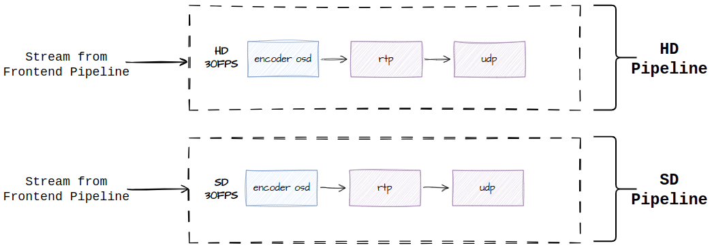
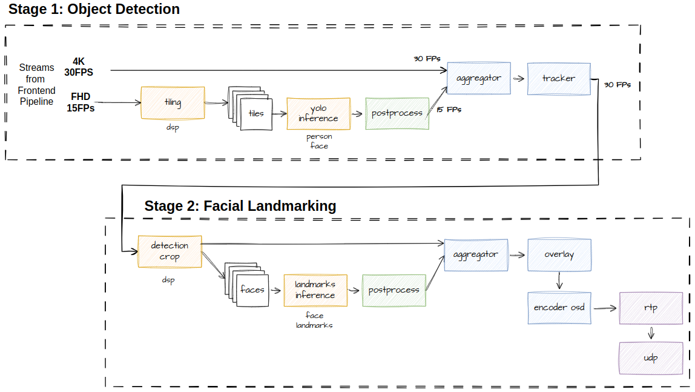
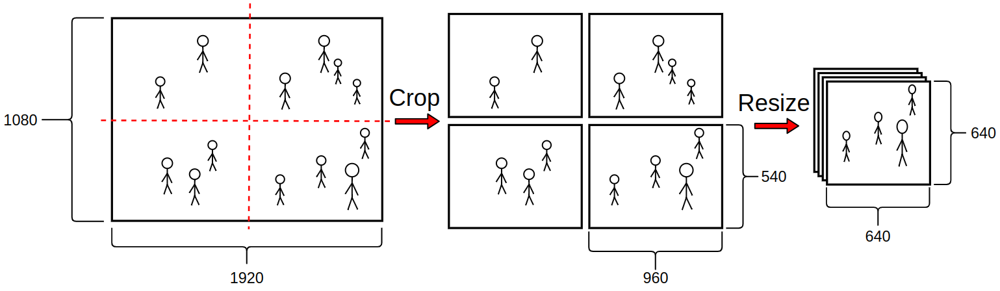
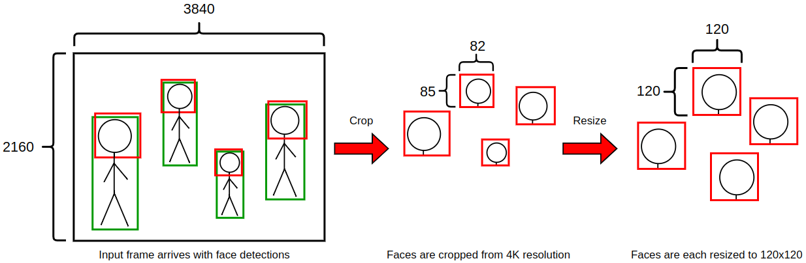
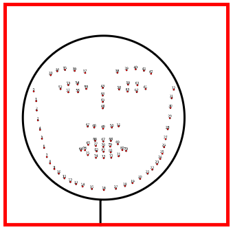

==========================
Understanding the Pipeline
==========================

Here we will break down the pipeline into smaller pieces and explain each part in detail.

To simplify the terminology, we will refer to the streams and their encapsulated stages as follows (in the grand scheme of the application these are considered *subpipelines*):

Frontend Pipeline
=================
.. image:: readme_resources/frontend.png
    :alt: Application Pipeline
    :align: center

The application begins with the Frontend pipeline. This is also known as the **Vision Pipeline**, as it is responsible for capturing the video feed from the camera and adjusting the image for application needs.
The Frontend pipeline is provided by the Media Library package on the Hailo15, and provides the following operations:

- **Video capture** - from the camera sensor
- **HDR** - High Dynamic Range, accelerated on the NN core
- **Low Light Enhancement (AI Denoising)** - noise reduction for low light ennhancement using the NN core
- **Dewarping (DSP)** - LDC image dewarping using the DSP
- **Privacy Mask (DSP)** - masking out certain areas of the image using the DSP
- **Multiple resize (DSP)** - resizing the image to multiple resolutions using the DSP

All of these features are configurable and can be enabled or disabled as needed by the user.

In the case of this application the Frontend resizes the image and outputs **4 resolutions**: 
**4K** (3840 x 2160), **HD** (1280 x 720), **SD** (720 x 480), and **FHD** (1920 x 1080).
The FHD resolution stream is used for inference, while the other streams are displayed on the screen.
It is important to note here that each stream can be output at a different framerate (also configurable to the user). 
For the case of this application, the three vision streams that go to display are output at 30 FPS, while the AI stream (FHD) is output at **15 FPS**.

For further reading on the Frontend module, please refer to the Media Library documentation.

HD/SD Pipelines
===============

The HD and SD pipelines are identical, and are responsible for encoding and streaming their video feed to RTSP.
The Encoder/OSD module is provided by the Media Library package on the Hailo15, and is accelerated by both the DSP and the encoder hardware.

After the Frontend pipeline, the HD and SD pipelines take the resized video streams and perform the following operations:

- **On-Screen Display (OSD)** - The HD/SD pipelines add overlays such as text, graphics, and timestamps to the video feed uisng DSP blending.
- **Encoding** - Video encoding to compress the video feed for streaming purposes. This is done with the hardware accelerated encoder provided in the Hailo15.
- **RTP/UDP Streaming** - The encoded video is payloaded into RTP packets and streamed over UDP to the host machine.

For further reading on the Encoder/OSD module, please refer to the Media Library documentation.

AI Pipeline
===========
The AI pipeline is the most complex part of the application, and is responsible for performing inference on the video stream.
It is comprised of the following two stages:

We will focus on each stage separately and explain the operations performed in each.

AI Stage 1: Tiling Object Detection
===================================
.. figure:: readme_resources/stage_1.png
    :alt: Application Pipeline
    :align: center

    The firt stage in the AI pipeline detects people and faces from the FHD stream and adds them to the 4K stream.

The first interesting point in this pipeline is that there are two input streams: 
the **FHD** stream is tiled into smaller pieces for inference, and the **4K** stream has the results overlayed on top.
Also note that these inputs are at different framerates: the FHD stream is at 15 FPS, while the 4K stream is at 30 FPS, we will come back to this later.

Tiling
------
We will first focus on the tiling sub-pipeline where the FHD stream passes inference.
The first stage here is tiling, where the image is **cropped and resized on the DSP** before being passed to the NN core for inference.
The tiling in this application is 2x2, and then resized to the size of the following network (640x640):

    The FHD image is tiled into 4 smaller images, each resized to 640x640 resolution.

Yolo Object Detection
---------------------
After tiling, we now have 4 new images that are passed to the NN core for inference. 
It is important to note here that although the input stream had a framerate of 15 FPS, the output of the tiling stage is **60 FPS (15 FPS * 4 tiles)**.
This means that if inference at this stage needs to meet at least 60FPS performance to not cause a bottleneck. Luckily the Hailo15 is capable of this performance.
Inference is performed on the tiles using the Hailo Async API, and after a light postprocessing stage we now have bounding boxes for the people and faces detected in the image.

.. figure:: readme_resources/detection.png
    :alt: Application Pipeline
    :align: center

    Detections are made for each of the 4 tiles.

Aggregation
-----------
With the bounding boxes in hand, we can now aggregate the results to the 4K stream. This is done through an aggregator stage, which takes the bounding box metadata
and adds it to the 4K stream. The size and location of the boxes is adjusted to the 4K resolution, so that they match their new image space.
The aggregator has two input streams coming at different framerates, so how is it able to take metadata from the sub stream? In this case the aggregator stage
is set to a "leaky" mode, so 4K frames coming at 30FPS do not wait for the tiled stream to catch up, and instead use the latest available metadata from the tiled stream (in packs of 4 tiles).
Between the two input framerates (30 FPS for 4K and 15 FPS for FHD), this means we have bounding boxes for every second frame of the 4K stream.

.. figure:: readme_resources/aggregator.png
    :alt: Application Pipeline
    :align: center
    :height: 1080 px
    :width: 1920 px
    :scale: 50%

    The detections from the 4 tiles are aggregated to the 4K image space.

Tracking
--------
As mentioned above, we now have a 4K stream at 30FPS that has detection boxes for every second frame.
We can complete the missing frames by tracking the detected objects between frames. 
This is done using the HailoTracker API provided in Tappas, which tracks bounding boxes using a Joint Detection and Embedding (JDE) algorithm.
The tracker uses a Kalman Filter to predict bounding box movements, which completes the missing frames in the 4K stream.

.. figure:: readme_resources/tracking.png
    :alt: Application Pipeline
    :align: center
    :height: 311 px
    :width: 1186 px
    :scale: 100%

    The tracker can be used to complete detections between frames.

From here the 4K stream continues to stage 2 of the AI pipeline.

AI Stage 2: Detection Cropping and Face Landmarking
===================================================
.. figure:: readme_resources/stage_2.png
    :alt: Application Pipeline
    :align: center
    :height: 236 px
    :width: 1522 px
    :scale: 90%

    The second stage in the AI pipeline crops faces from the 4K stream and adds landmarks to them.

The second stage of the AI pipeline is more dynamic than the first: here instead of static tiles being cut form each incoming frame, we crop faces
from the 4K stream based on the bounding boxes detected in the previous stage. These faces are resized in the same way that tiles were to match the second network (120x120).
After inference the same aggregation measures are taken to add the landmarks to the 4K stream.

Detection Cropping
------------------

In this stage, the detected faces are cropped from the 4K image using the DSP. It is important to do so from the 4K image instead of the FHD because the higher resolution will give better details for the face landmarks.
After cropping, each face is resized to 120x120 resolution to match the network that follows.

    Faces are cropped from the 4K stream based on the bounding boxes detected in the previous stage.

What happens to the original 4K image at this point? We still want to stream this resolution to the host machine, so the original 4K image is passed through the pipeline
as a different output of the cropping stage. This way we can still stream the 4K image to the host machine while performing inference on the faces.
Before letting the 4K image continue, metadata is added to note how many detections were cropped, this will be useful later.

.. figure:: readme_resources/crop_outputs.png
    :alt: Application Pipeline
    :align: center
    :height: 516 px
    :width: 1504 px
    :scale: 80%

    The cropping stage has 2 outputs, the 4K stream still continues so that it can be streamed.

Face Landmarking
----------------

Just like the `Yolo Object Detection <#yolo-object-detection>`_ stages earlier, here inference and postprocessing is performed.
Note that inference here is also performed using the Hailort Async API. The networks from both stages can be active at the same time since they are managed by
the Hailort Scheduler, which will split the workload between the two networks on the NN core.

    Facial landmarks are added to the cropped faces.

Aggregation
-----------
This aggregation stage is similar to the one in the first half of the AI pipeline, but here we have a dynamic number of cropped images to add to the 4K stream.
The aggregator will take the metadata from the 4K stream that arrived and use that to know how many faces should arrive.

Overlay
-------
The next stage calls the HailoOverlay module provided in Tappas to draw all the inference results on the image.

Streaming AI Pipeline
---------------------
From here the AI Piepline is the same as the `HD/SD Pipelines <HD/SD Pipelines>`_: OSD blending is performed by the DSP, and the image is encoded then finaly streamed to the host machine.