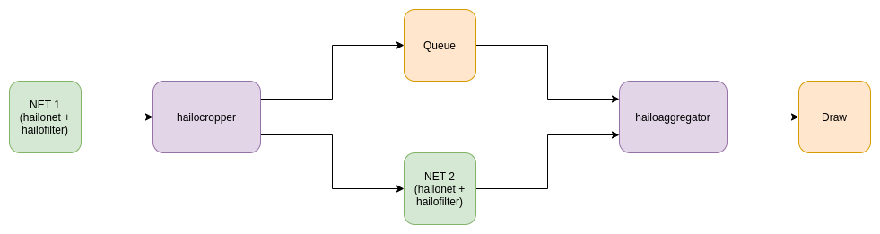

Hailo Aggregator
=================

Overview
--------

HailoAggregator is an element designed for applications with cascading networks or cropping functionality, meaning to perform one task based on a previous task.
It is a complement to the `HailoCropper <hailo_cropper.rst>`_\ , the two elements work together to form versatile apps. It has 2 sink pads and 1 source: the first sinkpad receives the original frame from an upstream hailocropper, while the other receives cropped buffers from the other hailocropper. 
The HailoAggregator waits for all crops of a given orignal frame to arrive, then sends the original buffer with the combined metadata of all collected crops.

HailoAggregator also performs a 'flattening' functionality on the detection metadata when receiving each frame: detections are taken from the cropped frame, copied to the main frame and re-scaled/moved to their corresponding location in the main frame (x,y,width,height).
As an example:

* Face Landmarks based on Face Detection - HailoCropper crops each face detection -> HailoNet + FaceLandmarks post for each face -> HailoAggregator aggregates the frames back.
* Tiling - `hailotilecropper <hailo_tile_cropper.rst>`_ crops the image to tiles -> HailoNet + Detection post for each tile -> HailoAggregator aggregates the frames back and 'flatten` the detection objects in the metadata.

HailoAggregator exports two methods to extend or override in derived elements:

* ``handle_sub_frame_roi``\ : Functionality to perform for each incoming sub frame.
  
  .. code-block::

                           Calls `flattening` method.

* ``post_aggregation``\ : Functionality to perform after all frames are aggregated succesfully.
  
  .. code-block::

                       Base implementation does nothing.
                       
Parameters
^^^^^^^^^^^

There are no unique properties to hailoaggregator. The only parameters are the baseclass parameters, which are 'name' and 'parent'.

Example
-------

Hierarchy
---------

.. code-block::

   GObject
    +----GInitiallyUnowned
          +----GstObject
                +----GstElement
                      +----GstHailoAggregator

   Pad Templates:
     SRC template: 'src'
       Availability: Always
       Capabilities:
         ANY

     SINK template: 'sink'
       Availability: Always
       Capabilities:
         ANY

   Element has no clocking capabilities.
   Element has no URI handling capabilities.

   Pads:
     SINK: 'sink_0'
       Pad Template: 'sink'
     SINK: 'sink_1'
       Pad Template: 'sink'
     SRC: 'src'
       Pad Template: 'src'

   Element Properties:
     name                : The name of the object
                           flags: readable, writable
                           String. Default: "hailoaggregator0"
     parent              : The parent of the object
                           flags: readable, writable
                           Object of type "GstObject"
     flatten-detections  : perform a 'flattening' functionality on the detection metadata 
                           when receiving each frame.
                           flags: readable, writable, changeable only in NULL or READY state
                           Boolean. Default: false
