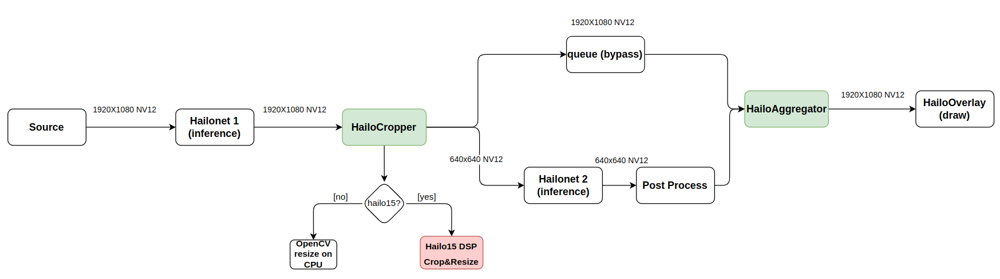

Hailo Cropper
==============

Overview
--------

``HailoCropper`` is an element providing cropping functionality, designed for application with cascading networks, meaning doing one task based on a previous task. It has 1 sink and 2 sources.
``HailoCropper`` receives a frame on its sink pad, then invokes it's ``prepare_crops`` method that returns the vector of crop regions of interest (crop_roi), For each crop_roi it creates a cropped image (representing it's x, y, width, height in the full frame). The cropped images are then sent to the second src.
From the first src we push the original frame that the detections were cropped from.

By default, ``HailoCropper`` receives a video frame that has detections (means a previous ``HailoNet`` + ``HailoFilter`` ran) on it's sinkpad. For each detection it creates a cropped image (using a specific algorithm to create a scaled image with the same aspect ratio).
This is used by the cascading networks app Face Landmarks based on Face Detection.

Derived classes can override the default ``prepare_crops`` behaviour and decide where to crop and how many times.
`hailotilecropper <hailo_tile_cropper.rst>`_ element does this exact thing when splitting the frame into tiles by rows and columns.

Parameters
^^^^^^^^^^

There is only one property for this element other than the common 'name' and 'parent'.
The name of this boolean property is 'internal-offset' and it is used to determine whether we use the original offset\ * of the buffer or overwrite it with our own offset. The offset of the buffer is given to the original buffer and all the crops, and used by the hailoaggregator, to make sure the cropped detections we are 'muxing' with the original buffer are actually from the same buffer.*\ Offset is an attribute of buffer that determines on what offset this buffer is since the start of the pipeline run, represented by number of buffers. It's similar to frame-id in video. On some videos the offset attribute is not created by the filesrc element and it is set to -1 (casted to uint64), therefore if we want to use it to determine what the current frame is, we should somehow track the number of buffers and set this offset accordingly.

Example
-------

.. image:: ../resources/cascading.png

Hierarchy
---------

.. code-block::

   GObject
    +----GInitiallyUnowned
          +----GstObject
                +----GstElement
                      +----GstHailoCropper

   Pad Templates:
     SRC template: 'src'
       Availability: Always
       Capabilities:
         ANY

     SINK template: 'sink'
       Availability: Always
       Capabilities:
         ANY

   Element has no clocking capabilities.
   Element has no URI handling capabilities.

   Pads:
     SINK: 'sink'
       Pad Template: 'sink'
     SRC: 'src_0'
       Pad Template: 'src'
     SRC: 'src_1'
       Pad Template: 'src'

   Element Properties:
     name                : The name of the object
                           flags: readable, writable
                           String. Default: "hailocropper0"
     parent              : The parent of the object
                           flags: readable, writable
                           Object of type "GstObject"
     internal-offset     : Whether to use Gstreamer offset of internal offset.
                           flags: readable, writable, controllable
                           Boolean. Default: false

Hailo-15
--------
HailoCropper can utilize the on-chip DSP (Digital Signal Processor), to perform resize and crop operations.

The DSP is used by default on the Hailo-15 machine, and can be disabled by setting the ``use-dsp`` property.
When disabled OpenCV will be used (on the CPU) to perform the resize and crop operations.

HailoCropper holds a buffer pool (GstBufferPool) that manages the buffers, used by the DSP.
The buffer pool is responsible for allocating and freeing the buffers when the reference count of a buffer reaches 0.
Buffer pool size (maximum buffers that can be allocated simultaneously in the pool) can be controlled using the ``pool-size`` property.

It is recommended to make sure that a buffer is contiguous in memory, before being sent to the DSP.
Non-contiguous buffers will be copied to a new buffer, before being sent to the DSP.

