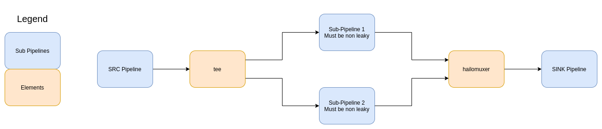

Hailo Muxer
============

Overview
--------

HailoMuxer is an element designed for our new multi-device application. It muxes 2 similar streams into 1 stream, holding both stream's metadata. It has 2 src elements and 1 sink, and whenever there are buffers on both src pads, it takes only 1 of the buffers and passes it on, with both buffer's metadata.

Parameters
^^^^^^^^^^

There are no unique properties to hailomuxer. The only parameters are the baseclass parameters, which are 'name' and 'parent'.

Example
-------

Hierarchy
---------

.. code-block::

   GObject
    +----GInitiallyUnowned
          +----GstObject
                +----GstElement
                      +----GstHailoMuxer

   Pad Templates:
     SRC template: 'src'
       Availability: Always
       Capabilities:
         ANY

     SINK template: 'sink_%u'
       Availability: On request
       Capabilities:
         ANY

   Element has no clocking capabilities.
   Element has no URI handling capabilities.

   Pads:
     SRC: 'src'
       Pad Template: 'src'

   Element Properties:
     name                : The name of the object
                           flags: readable, writable
                           String. Default: "hailomuxer0"
     parent              : The parent of the object
                           flags: readable, writable
                           Object of type "GstObject"
