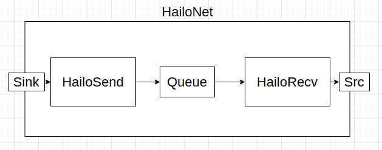

Hailo Net
==========

Overview
--------

Hailonet is a bin element which contains a ``hailosend`` element, a ``hailorecv`` element and a queue between them. This element source is from ``HailoRT`` release. The ``hailosend`` element is responsible for sending the data received from the hailonet’s sink to the Hailo-8 device for inference. Inference is done via the VStreams API. The hailorecv element will read the output buffers from the device and attach them as metadata to the source frame that inferred them. That is why the hailonet has only one source, even in cases where the HEF has more than one output layer.

Parameters
^^^^^^^^^^

Configuration and activation of the Hailo network is done when the pipeline is started.

Infers data using the Hailo-8 chip. The data is inferred according to the selected HEF (\ ``hef`` property). Currently, only HEFs with one input layer are supported!

Selecting a specific PCIe device (when there are more than one) can be done with the ``device-id`` property.

Network switching can be done with the ``is-active`` property (this can’t be done in a CLI application since this property needs to be turned on and off during runtime).

For multi-context networks the ``batch-size`` property can be used to specify the batch size.

Using the inputs and outputs properties, specific VStreams can selected for input and output inference.

Hierarchy
---------

.. code-block::

   GObject
    +----GInitiallyUnowned
          +----GstObject
                +----GstElement
                      +----GstBin
                            +----GstHailoNet

   Implemented Interfaces:
     GstChildProxy

   Pad Templates:
     SINK template: 'sink'
       Availability: Always
       Capabilities:
         ANY

     SRC template: 'src'
       Availability: Always
       Capabilities:
         ANY

   Element has no clocking capabilities.
   Element has no URI handling capabilities.

   Pads:
     SINK: 'sink'
       Pad Template: 'sink'
     SRC: 'src'
       Pad Template: 'src'

   Element Properties:
     name                : The name of the object
                           flags: readable, writable
                           String. Default: "hailonet0"
     parent              : The parent of the object
                           flags: readable, writable
                           Object of type "GstObject"
     async-handling      : The bin will handle Asynchronous state changes
                           flags: readable, writable
                           Boolean. Default: false
     message-forward     : Forwards all children messages
                           flags: readable, writable
                           Boolean. Default: false
     debug               : Should print debug information
                           flags: readable, writable
                           Boolean. Default: false
     device-id           : Device ID ([<domain>]:<bus>:<device>.<func>, same as in lspci command). Excludes device-count.
                           flags: readable, writable
                           String. Default: null
     hef-path            : Location of the HEF file to read
                           flags: readable, writable
                           String. Default: null
     net-name            : Configure and run this specific network. If not passed, configure and run the default network - ONLY if there is one network in the HEF!
                           flags: readable, writable
                           String. Default: null
     batch-size          : How many frame to send in one batch
                           flags: readable, writable
                           Unsigned Integer. Range: 1 - 16 Default: 1 
     outputs-min-pool-size: The minimum amount of buffers to allocate for each output layer
                           flags: readable, writable
                           Unsigned Integer. Range: 0 - 4294967295 Default: 16 
     outputs-max-pool-size: The maximum amount of buffers to allocate for each output layer or 0 for unlimited
                           flags: readable, writable
                           Unsigned Integer. Range: 0 - 4294967295 Default: 0 
     is-active           : Controls whether this element should be active. By default, the hailonet element will not be active unless it is the only one. Setting this property in combination with 'scheduling-algorithm' different than HAILO_SCHEDULING_ALGORITHM_NONE is not supported.
                           flags: readable, writable
                           Boolean. Default: false
     device-count        : Number of physical devices to use. Excludes device-id.
                           flags: readable, writable
                           Unsigned Integer. Range: 1 - 65535 Default: 0 
     vdevice-key         : Relevant only when 'device-count' is passed. If not passed, the created vdevice will be unique to this hailonet.if multiple hailonets share 'vdevice-key' and 'device-count', the created vdevice will be shared between those hailonets
                           flags: readable, writable
                           Unsigned Integer. Range: 1 - 4294967295 Default: 0 
     scheduling-algorithm: Controls the Model Scheduler algorithm of HailoRT. Gets values from the enum GstHailoSchedulingAlgorithms. Using Model Scheduler algorithm different than HAILO_SCHEDULING_ALGORITHM_NONE, excludes the property 'is-active'. When using the same VDevice across multiple hailonets, all should have the same 'scheduling-algorithm'. Currently only supported with 1 device (e.g. device-count=1).
                           flags: readable, writable
                           Enum "GstHailoSchedulingAlgorithms" Default: 0, "HAILO_SCHEDULING_ALGORITHM_NONE"
                              (0): HAILO_SCHEDULING_ALGORITHM_NONE - Scheduler is not active
                              (1): HAILO_SCHEDULING_ALGORITHM_ROUND_ROBIN - Round robin
     scheduler-timeout-ms: The maximum time period that may pass before getting run time from the scheduler, as long as at least one send request has been sent.
                           flags: readable, writable
                           Unsigned Integer. Range: 0 - 4294967295 Default: 0 
     scheduler-threshold : The minimum number of send requests required before the hailonet is considered ready to get run time from the scheduler.
                           flags: readable, writable
                           Unsigned Integer. Range: 1 - 4294967295 Default: 1 
   
   Element Actions:
     "flush" :  void user_function (GstElement* object);
   
   Children:
     hailorecv
     hailo_infer_q_0
     hailosend