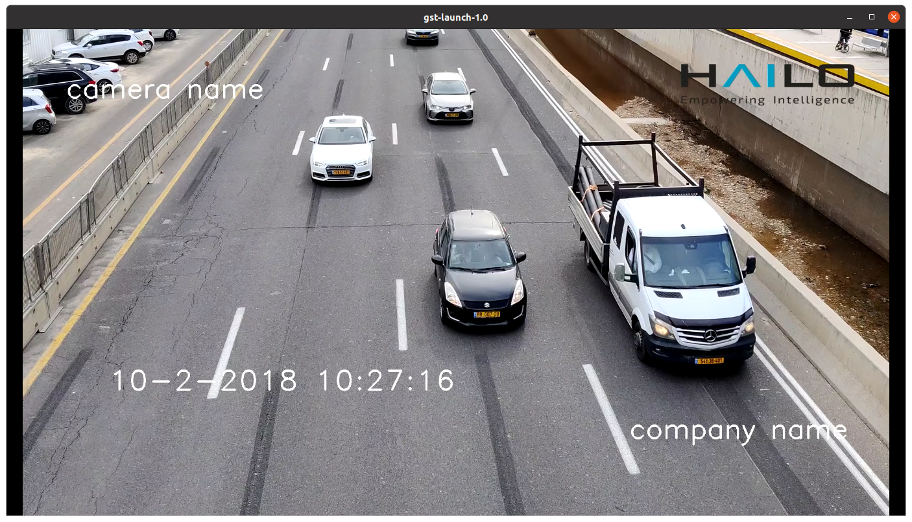

Hailo On-Screen Display
=======================

Overview
--------

| HailoOSD is an element which enables the user to draw static text, images, and timestamps on GstBuffers **using the DSP provided in Hailo-15**.
  By offloading the image blending to the DSP, high performance overlays can be achieved.
  The DSP also supports transparent blending, allowing HailoOSD to draw image files with transparency.
| **Currently only NV12 pipelines are supported by HailoOSD.**

Parameters
^^^^^^^^^^

| The hailoosd element provides default behavior on what telemetry to draw.
| The user can customize the overlay contents via json through the **config-file-path** property. This property accepts the path to a json that follows the following schema: 
| Any number of entries can be added to the **"image"**, **"text"**, and **"dateTime"** arrays in the json. 

.. code-block::

  {
      "image": [
          {
              "id": "image_id",
              "image_path": "/path/to/image",
              "width": 0.2,
              "height": 0.13,
              "x": 0.76,
              "y": 0.05,
              "z-index": 1
          }
      ],
      "dateTime":  [
          {
              "id": "datetime_id",
              "font_size": 2,
              "line_thickness": 3,
              "rgb": [0, 0, 255],
              "x": 0.1,
              "y": 0.7,
              "z-index": 3
          }
      ],
      "text": [
          {
              "id": "text1_id",
              "label": "example text 1",
              "font_size": 2,
              "line_thickness": 3,
              "rgb": [255, 0, 0],
              "x": 0.7,
              "y": 0.8,
              "z-index": 1
          },
          {
              "id": "text2_id",
              "label": "example text 2",
              "font_size": 2,
              "line_thickness": 3,
              "x": 0.05,
              "y": 0.1,
              "z-index": 1
          }
      ]
  }

Hierarchy
---------

.. code-block::

  GObject
  +----GInitiallyUnowned
        +----GstObject
              +----GstElement
                    +----GstBaseTransform
                          +----GstHailoOsd

  Pad Templates:
    SINK template: 'sink'
      Availability: Always
      Capabilities:
        video/x-raw
                  format: { (string)NV12 }
                   width: [ 1, 2147483647 ]
                  height: [ 1, 2147483647 ]
               framerate: [ 0/1, 2147483647/1 ]
    
    SRC template: 'src'
      Availability: Always
      Capabilities:
        video/x-raw
                  format: { (string)NV12 }
                   width: [ 1, 2147483647 ]
                  height: [ 1, 2147483647 ]
               framerate: [ 0/1, 2147483647/1 ]

  Element has no clocking capabilities.
  Element has no URI handling capabilities.

  Pads:
    SINK: 'sink'
      Pad Template: 'sink'
    SRC: 'src'
      Pad Template: 'src'

  Element Properties:
    config-file-path         : json config file path
                          flags: readable, writable, changeable only in NULL or READY state
                          String. Default: "NULL"
    name                : The name of the object
                          flags: readable, writable, 0x2000
                          String. Default: "hailoosd0"
    parent              : The parent of the object
                          flags: readable, writable, 0x2000
                          Object of type "GstObject"
    qos                 : Handle Quality-of-Service events
                          flags: readable, writable
                          Boolean. Default: false