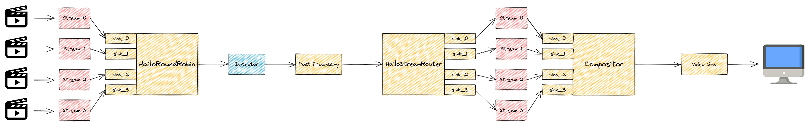

Hailo RoundRobin
================

Overview
--------

``HailoRoundRobin`` is an element that provides muxing functionality.
It receives input from one or more sink pads and forwards them into a single src pad in round-robin method.

It also adds metadata to each buffer with the input pad name it was received on,
The metadata's pupose is to be able to de-mux it easily later on by `hailostreamrouter <hailo_stream_router.rst>`_ .
De-muxing by streamiddemux is not supported with this element.

It can work in 3 modes:

* Funnel mode - push every buffer when it is ready no matter which pad it came from.
* Blocking mode - push every buffer when it is its pad's turn, and if the buffer is not ready, block until ready. This is the default mode.
* Non Blocking mode - push every buffer when it is its pad's turn, and if the buffer is not ready, skip it. This mode is useful when the video sources are not stable and may stop sending buffers for a while. In this case, the pipeline should not be blocked and should continue to process the other streams.

When using non-blocking mode, the element maintains a queue for sink pad that holds pointers to buffers.
When a buffer is pushed to a sink pad, it is added to the queue.
When the src pad wants to push a buffer, the element tries to get a buffer from the queue of the pad that is next in line.
If the queue is empty, the element retries to get a buffer from the queue for a number of times (retries-num property).
If the queue is still empty, the element skips the pad and tries to get a buffer from the next pad in line.
The size of the queue and the number of retries can be configured by the properties: 

* queue-size - Size of the queue for each pad.
* retries-num - Number of retries to get a buffer from a pad queue.

When using non-blocking mode, Compositor element is not supported, since it requires all the streams to be synchronized.

Example
-------

Here's an example of a pesudo pipeline muxing 4 streams into one detection pipeline,
and then de-muxing them into 2 separate pipelines - one for person attributes and one for face attributes.

.. code-block::

    for ((n = 0; n < 4; n++)); do
        filesrc location=video_$n ! decodebin ! roundrobin.sink_$n
    hailoroundrobin name=roundrobin mode=1 !
    <Rest of the pipeline>

Hierarchy
---------

.. code-block::

GObject
 +----GInitiallyUnowned
       +----GstObject
             +----GstElement
                   +----GstHailoRoundRobin

Pad Templates:
  SINK template: 'sink_%u'
    Availability: On request
    Capabilities:
      ANY
  
  SRC template: 'src'
    Availability: Always
    Capabilities:
      ANY

Element has no clocking capabilities.
Element has no URI handling capabilities.

Pads:
  SRC: 'src'
    Pad Template: 'src'

Element Properties:
  mode                : Select the mode of the element (0 - funnel mode (push every buffer when it is ready), 1 - blocking mode (push every buf
fer when it is its pad's turn, and if the buffer is not ready, block until ready), 2 - non blocking mode(push every buffer when it is its pad's
 turn, and if the buffer is not ready, skip it))
                        flags: readable, writable
                        Enum "GstHailoRoundRobinMode" Default: 1, "blocking-mode"
                           (0): funnel-mode      - Funnel Mode (push every buffer when it is ready)
                           (1): blocking-mode    - Blocking Mode (push every buffer when it is its pad's turn, and if the buffer is not ready, 
block until ready)
                           (2): non-blocking-mode - Non Blocking Mode (push every buffer when it is its pad's turn, and if the buffer is not re
ady, skip it)
  name                : The name of the object
                        flags: readable, writable
                        String. Default: "hailoroundrobin0"
  parent              : The parent of the object
                        flags: readable, writable
                        Object of type "GstObject"
  queue-size          : Size of the queue for each pad (only relevant when using non-blocking mode)
                        flags: readable, writable, controllable
                        Unsigned Integer. Range: 1 - 10 Default: 3 
  retries-num         : Number of retries to get a buffer from a pad queue (only relevant when using non-blocking mode)
                        flags: readable, writable, controllable
                        Unsigned Integer. Range: 1 - 20 Default: 3 
