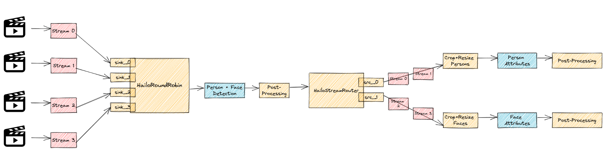

Hailo Stream Router
===================

Overview
--------

``HailoStreamRouter`` is an element that provides de-muxing functionality.
It is designed to be used after muxing any number of streams using a `hailoroundrobin <hailo_roundrobin.rst>`_ element.

.. note::
  `hailoroundrobin <hailo_roundrobin.rst>`_ tags each incoming frame with the input pad name it was received on (adding it to the metadata of the buffer).

Each ``HailoStreamRouter`` has to be configured with a list of input names (In accordance with the ``HailoRoundRobin`` inputs).
As an Example:
.. code-block::

  src_0::input-streams='<sink_0, sink_1>' src_1::input-streams='<sink_2, sink_3>'

``HailoStreamRouter`` receives a frame on its sink pad, reads the input name from it's metadata, and then passes the frame to pre configured source pads.

Example
-------

Here's an example of a pesudo pipeline muxing 4 streams into one detection pipeline,
and then de-muxing them into 2 separate pipelines - one for person attributes and one for face attributes.

.. code-block::

    for ((n = 0; n < 4; n++)); do
      filesrc location=video_$n ! decodebin ! roundrobin.sink_$n 
    hailoroundrobin name=roundrobin funnel-mode=false !
     ... Logic ...
    hailostreamrouter name=router src_0::input-streams='<sink_0, sink_1>' src_1::input-streams='<sink_2, sink_3>'
    router.src_0 ! ... Logic ...
    router.src_1 ! ... Logic ...

In this example HailoStreamRouter is configured with 2 source pads that each have a list of 2 input streams.

Another Example is using ``HailoStreamRouter`` as a classic de-muxer, where each input stream is mapped to a single output, and into compositor afterwards.

.. image:: ../resources/stream_router_example2.png

Hierarchy
---------

.. code-block::

    GObject
    --GInitiallyUnowned
        --GstObject
              --GstElement
                    --GstHailoStreamRouter

  Implemented Interfaces:
    GstChildProxy

  Pad Templates:
    SINK template: 'sink'
      Availability: Always
      Capabilities:
        ANY
    
    SRC template: 'src_%u'
      Availability: On request
      Capabilities:
        ANY
      Type: GstHailoStreamRouterPad
      Pad Properties:
        input-streams       : Input streams of a srcpad
                              flags: readable, writable, controllable
                              GstValueArray of GValues of type "gchararray"

  Element has no clocking capabilities.
  Element has no URI handling capabilities.

  Pads:
    SINK: 'sink'
      Pad Template: 'sink'

  Element Properties:
    name                : The name of the object
                          flags: readable, writable, 0x2000
                          String. Default: "hailostreamrouter0"
    parent              : The parent of the object
                          flags: readable, writable, 0x2000
                          Object of type "GstObject"
