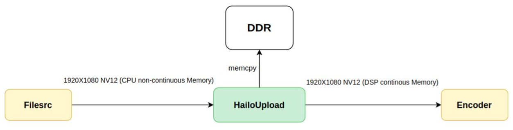

Hailo Upload
============

Overview
--------

``HailoUpload`` is an element specifically designed for Hailo-15 system.
It is responsible for transformation between memory spaces.

The element can be described by the following steps:

- Request an address (pointer) to a physically contiguous buffer from the kernel at a specifc size (determined by the format and resolution of the frame).
- Perform a memory copy to the target memory.
- Hold the address in a buffer pool - to free the buffer when its reference count is zero.
- Ensure that the output buffer is physically contiguous in memory and also virtually contiguous.

DSP and Encoder require physically contiguous buffers.
It is recommended to make sure that a buffer is contiguous in memory, 
before being sent to an element that uses DSP- it is essential to avoid memcopies. (Like in  `HailoCropper <hailo_cropper.rst>`_).
In Encoder - contiguous memory is mandatory. (see Media Library documentation for more information).

As an example, file source allocates non-contiguous buffers, meaning a hailoupload is required to use ``hailoh265enc``:

.. code-block::

        gst-launch-1.0 filesrc location=video.raw name=src_0 ! rawvideoparse format=rgb width=1920 height=1080 ! hailoupload ! hailoh265enc ! fakesink

Another example is to use hailoupload before hailonet, to make sure that the input buffer is virtually contiguous in memory:

.. code-block::

        gst-launch-1.0 v4l2src device=/dev/video0 io-mode=mmap ! video/x-raw,format=NV12,width=1920,height=1080 ! hailoupload ! hailonet hef-path=yolov5m_wo_spp_60p_nv12.hef ! fakesink

``HailoUpload`` inherits from ``HailoDspBaseTransform`` which is responsible for managing the allocation queries and buffer pool.

Hierarchy
---------

 .. code-block::

        GObject                                                                                                                                                                                                    │
    +----GInitiallyUnowned                                                                                                                                                                                    │
        +----GstObject                                                                                                                                                                                      │
                +----GstElement                                                                                                                                                                               │
                    +----GstBaseTransform                                                                                                                                                                   │
                            +----GstHailoDspBaseTransform                                                                                                                                                     │
                                +----GstHailoUpload                                                                                                                                                         │
                                                                                                                                                                                                            │
    Pad Templates:                                                                                                                                                                                             │
    SINK template: 'sink'                                                                                                                                                                                    │
        Availability: Always                                                                                                                                                                                   │
        Capabilities:                                                                                                                                                                                          │
        ANY                                                                                                                                                                                                  │
                                                                                                                                                                                                            │
    SRC template: 'src'                                                                                                                                                                                      │
        Availability: Always                                                                                                                                                                                   │
        Capabilities:                                                                                                                                                                                          │
        ANY                                                                                                                                                                                                  │
                                                                                                                                                                                                            │
    Element has no clocking capabilities.                                                                                                                                                                      │
    Element has no URI handling capabilities.                                                                                                                                                                  │
                                                                                                                                                                                                            │
    Pads:                                                                                                                                                                                                      │
    SINK: 'sink'                                                                                                                                                                                             │
        Pad Template: 'sink'                                                                                                                                                                                   │
    SRC: 'src'                                                                                                                                                                                               │
        Pad Template: 'src'                                                                                                                                                                                    │
                                                                                                                                                                                                            │
    Element Properties:                                                                                                                                                                                        │
    name                : The name of the object                                                                                                                                                             │
                            flags: readable, writable, 0x2000                                                                                                                                                  │
                            String. Default: "hailoupload0"                                                                                                                                                    │
    parent              : The parent of the object                                                                                                                                                           │
                            flags: readable, writable, 0x2000                                                                                                                                                  │
                            Object of type "GstObject"                                                                                                                                                         │
    pool-size           : Size of the pool of buffers to use for cropping. Default 10                                                                                                                        │
                            flags: readable, writable, changeable only in NULL or READY state                                                                                                                  │
                            Unsigned Integer. Range: 1 - 2147483647 Default: 10                                                                                                                                │
    qos                 : Handle Quality-of-Service events                                                                                                                                                   │
                            flags: readable, writable                                                                                                                                                          │
                            Boolean. Default: false         
