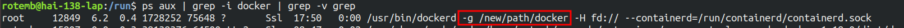

Using Dockers
=============

Install Docker
--------------

The section below would help you with the installation of Docker.

.. code-block:: sh

   # Install curl
   sudo apt-get install -y curl

   # Get and install docker
   curl -fsSL https://get.docker.com -o get-docker.sh
   sh get-docker.sh

   # Add your user (who has root privileges) to the Docker group
   sudo usermod -aG docker $USER

   # Reboot/log out in order to apply the changes to the group  
   sudo reboot

.. note::

    Consider reading `Running out of disk space`_ if your system is space limited

.. _Running TAPPAS container from pre-built Docker image:

Running TAPPAS container from pre-built Docker image
----------------------------------------------------

Preparations
^^^^^^^^^^^^

`HailoRT PCIe driver <https://github.com/hailo-ai/hailort-drivers>`_ is required - install instructions
are provided in HailoRT documentation. Make sure that the driver is installed correctly
by: `Verify Hailo installation <./verify_hailoRT.rst>`_.

.. note::

    The TAPPAS container already contains the required HailoRT version pre-installed.

Download from Hailo developer zone ``tappas_VERSION_ARCH_docker.zip`` and unzip the file, it should contain the following files:

* **hailo_docker_tappas_VERSION.tar**\ : the pre-built docker image
* **run_tappas_docker.sh**\ : Script that loads and runs the docker image
* **dockerfile.tappas_run**\ : Dockerfile used within the first load

Running for the first time
^^^^^^^^^^^^^^^^^^^^^^^^^^

In order to use TAPPAS release Docker image, you should run the following script:

.. code-block:: sh

   ./run_tappas_docker.sh --tappas-image TAPPAS_IMAGE_PATH

.. note::
    
    TAPPAS_IMAGE_PATH is the path to the **hailo_docker_tappas_VERSION.tar**

The script would load the docker image, and start a new container.
The script might take a couple of minutes, and after that, you are ready to go.

Resuming (Second time and on)
^^^^^^^^^^^^^^^^^^^^^^^^^^^^^

From now an on you should run the script with the ``--resume`` flag

.. code-block:: sh

   ./run_tappas_docker.sh --resume

.. note::
    
    The reason that you want to use the ``--resume`` flag is that the container already exists, so only attaching to the container is required.

Flags and advanced use-cases
^^^^^^^^^^^^^^^^^^^^^^^^^^^^

.. code-block:: sh

   ./run_tappas_docker.sh [options] 
   Options:
     --help               Show this help
     --tappas-image       Path to tappas image
     --resume             Resume an old container
     --container-name     Start a container with a specific name, defaults to hailo_tappas_container

Use-cases
~~~~~~~~~

For building a new container with the default name:

.. code-block:: sh

   ./run_tappas_docker.sh --tappas-image TAPPAS_IMAGE_PATH

For resuming an old container:

.. code-block:: sh

   ./run_tappas_docker.sh --resume

Both of this methods can receive a container name:

.. code-block:: sh

   ./run_tappas_docker.sh --tappas-image TAPPAS_IMAGE_PATH --container-name CONTAINER_NAME
   ./run_tappas_docker.sh --resume  --container-name CONTAINER_NAME

for example:

.. code-block:: sh

   ./run_hailort_docker.sh hailo_docker_tappas_3.14.0.tar --container-name hailo_tappas_container

Upgrade Version
---------------

To upgrade, run: `Running TAPPAS container from pre-built Docker image`_

.. note::
    
    TAPPAS requires a specific HailoRT version, therefore, you will might need to upgrade HailoRT version as well. To check which HailoRT version is supported, please visit `This Link <../../README.rst#prerequisites>`_

Troubleshooting
---------------

Hailo containers are taking to much space
^^^^^^^^^^^^^^^^^^^^^^^^^^^^^^^^^^^^^^^^^

Creating new docker containers with ``--override`` does not assure that the directory of cached images and containers is cleaned.
to prevent your system to ran out of memory and clean /var/lib/docker run ``docker system prune`` from time to time.

.. _Running out of disk space:

Running out of disk space
^^^^^^^^^^^^^^^^^^^^^^^^^

**Change Docker root directory** - By default, Docker stores most of its data inside the ``/var/lib/docker`` directory on Linux systems. There may come a time when you want to move this storage space to a new location. For example, the most obvious reason might be that you’re running out of disk space.

Firstly, stop the Docker from running

.. code-block:: sh

   $ sudo systemctl stop docker.service
   $ sudo systemctl stop docker.socket

Next, we need to edit the ``/lib/systemd/system/docker.service`` file

.. code-block:: sh

   $ sudo vim /lib/systemd/system/docker.service

The line we need to edit looks like this:

.. code-block:: sh

   ExecStart=/usr/bin/dockerd -H fd://

Edit the line by putting a ``-g`` and the new desired location of your Docker directory. When you’re done making this change, you can save and exit the file.

.. code-block:: sh

   ExecStart=/usr/bin/dockerd -g /new/path/docker -H fd://

.. image:: ../resources/change_docker_path.png
   :target: ../resources/change_docker_path.png
   :alt: image

If you haven’t already, create the new directory where you plan to move your Docker files to.

.. code-block:: sh

   $ sudo mkdir -p /new/path/docker

Next, reload the systemd configuration for Docker, since we made changes earlier. Then, we can start Docker.

.. code-block:: sh

   $ sudo systemctl daemon-reload
   $ sudo systemctl start docker

Just to make sure that it worked, run the ps command to make sure that the Docker service is utilizing the new directory location.

.. code-block:: sh

   $ ps aux | grep -i docker | grep -v grep

Cannot allocate memory in static TLS block
^^^^^^^^^^^^^^^^^^^^^^^^^^^^^^^^^^^^^^^^^^

In some sceneraios (especially aarch64), you might face the following error:

.. code-block:: sh

    (gst-plugin-scanner:15): GStreamer-WARNING **: 13:58:20.557: Failed to load plugin '/usr/lib/aarch64-linux-gnu/gstreamer-1.0/libgstlibav.so': /lib/aarch64-linux-gnu/libgomp.so.1: cannot allocate memory in static TLS block 

The solution is to export an enviroment variable:

.. code-block:: sh

    export LD_PRELOAD=/usr/lib/aarch64-linux-gnu/libgomp.so.1

