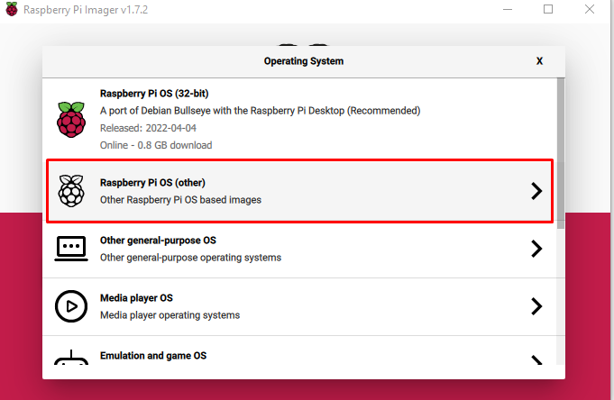
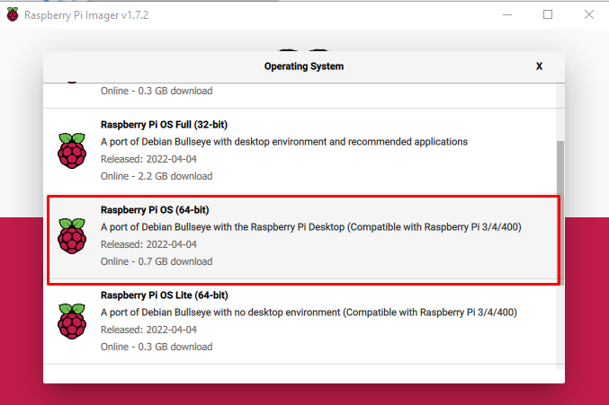
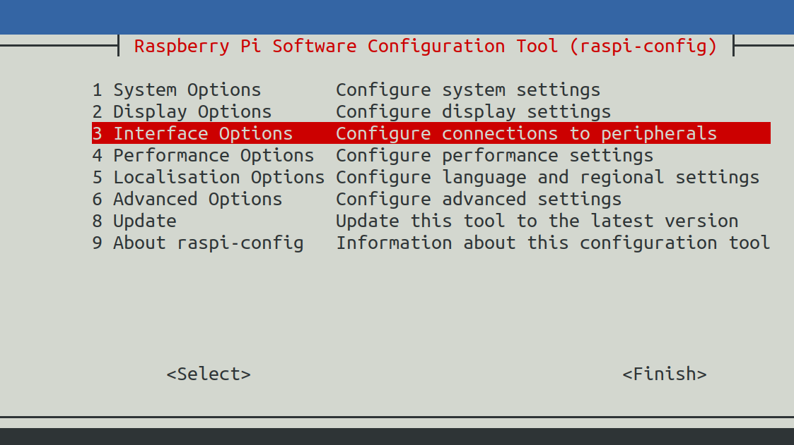
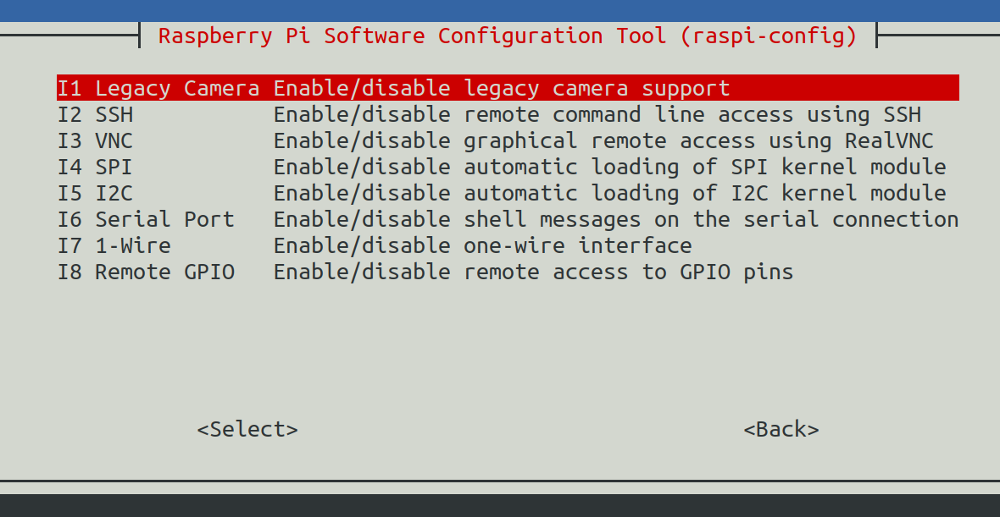
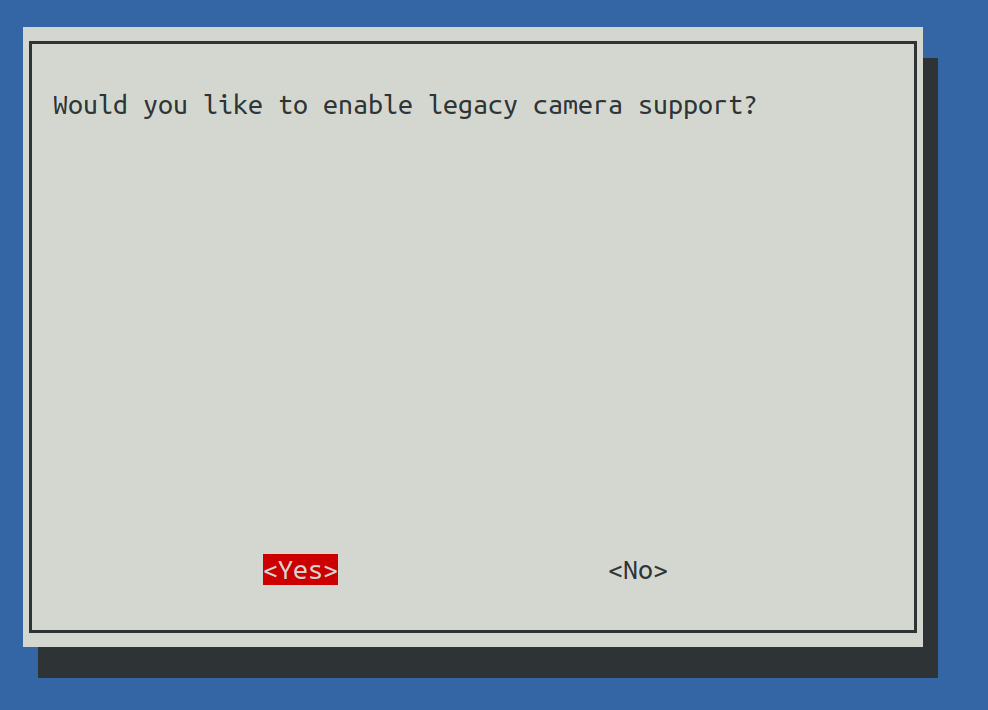
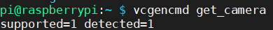

Run TAPPAS on Raspberry PI 4
============================

Overview
--------

This guide focuses on the installation of TAPPAS on Raspberry Pi OS.

Preparing the Device
--------------------

* Device: Raspberry Pi Compute Module 4
* Camera: Raspberry Pi Camera V2
* Operating System: Debian GNU/Linux 11 (bullseye)
* Kernel: Linux 5.15.32-v8+
* Architecture: arm64

Burn Debian GNU/Linux 11 (bullseye) Image
Download `Raspberry Pi Imager <https://www.raspberrypi.com/software/>`_\

Install Raspberrypi kernel headers

.. code-block:: sh

    sudo apt-get install raspberrypi-kernel-headers

TAPPAS Installation
-------------------

Read through on how to `pre build docker image for Raspberry Pi <./docker-install.rst>`_ or `installing TAPPAS manually <./manual-install.rst>`_ 

.. note::
    Raspberry Pi we limit the number of cpu cores to 1 during compilation (more cores accelerates the compilation process, but may cause 'out of swap memory' issue on weak machines like Raspberry Pi)

.. code-block:: sh

    g++-9: fatal error: Killed signal terminated 

Working with HDMI display
-------------------------

After installing TAPPAS and HailoRT, A known issue regarding working with display connected via HDMI requires the following steps:

1) Add the HailoRT PCIe driver to blacklist:

.. code-block:: sh

    # open rpi blacklist configuration file with sudo privileges
    sudo vim /etc/modprobe.d/raspi-blacklist.conf

    # add new line to the file
    blacklist hailo_pci

2) Reboot the machine

3) Install the module manually:

.. code-block:: sh

    sudo modprobe hailo_pci

.. note::

    installing the module manually is required on every boot of the raspberry-pi.

4) `Confirm that HailoRT works <./verify_hailoRT.rst>`_

Working with Raspberry PI's MIPI Camera
---------------------------------------

We tested our applications with  `Raspberry Pi Camera Module 2 <https://www.raspberrypi.com/products/camera-module-v2/>`_\

To support TAPPAS apps, enable camera features that support v4l by doing the following steps:

1) Configure Raspicam:

.. code-block:: sh

    sudo wget https://datasheets.raspberrypi.com/cmio/dt-blob-cam1.bin -O /boot/dt-blob.bin

2) Enable Legacy camera features:

.. code-block:: sh

    sudo raspi-config

3) Reboot the machine

4) Check Raspicam output:

.. code-block:: sh

    vcgencmd get_camera

Run TAPPAS Applications
-----------------------
To read further and learn more more details about each application refer to the link `This section <../../apps/h8/gstreamer/raspberrypi/README.rst>`_

Troubleshooting
---------------

Cannot allocate memory in static TLS block
^^^^^^^^^^^^^^^^^^^^^^^^^^^^^^^^^^^^^^^^^^

In some sceneraios, you might face the following error:

.. code-block:: sh

    (gst-plugin-scanner:15): GStreamer-WARNING **: 13:58:20.557: Failed to load plugin '/usr/lib/aarch64-linux-gnu/gstreamer-1.0/libgstlibav.so': /lib/aarch64-linux-gnu/libgomp.so.1: cannot allocate memory in static TLS block 

The solution is to export an enviroment variable:

.. code-block:: sh

    export LD_PRELOAD=/usr/lib/aarch64-linux-gnu/libgomp.so.1