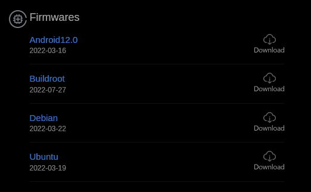
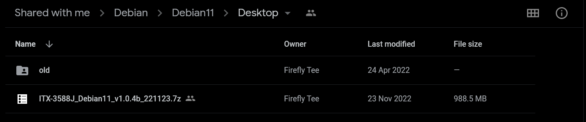
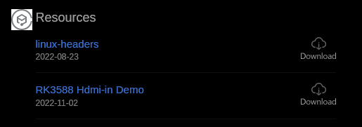
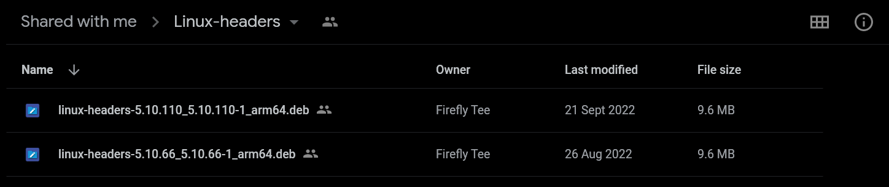

Running Tappas on Rockchip
==========================

Overview
--------

Tappas is supported on Rockchip, using Ubuntu 20.04 and Debian.
In addition to Debian, TAPPAS also supports Ubuntu 20.04 on Rockchip, but we recommend that you use Debian instead of Ubuntu since the hardware accelerators work better under Debian.
For our examples we have used the Firefly ITX-3588J with their Debian image from their download page.
Most of the examples attached show the types of applications that can be run using Tappas.
The Multi-stream Detection examples shows how to use the MPP elements for decode/encode to get the best performance.

This guide will focus on installing TAPPAS on Debian based on Firefly implementation.

Preparing the Device
--------------------

* Device: ITX-3588J
* Operating System: Debian GNU/Linux 11 (bullseye)
* Kernel: Linux 5.10.110
* Architecture: arm64

Burn Debian firmware, which can be downloaded from `here <https://en.t-firefly.com/doc/download/page/id/139.html>`_\.
Always download the desktop firmware.

Firefly allows you to download the linux-kernel-headers from the next `link <https://en.t-firefly.com/doc/download/page/id/139.html>`_\.

Install the linux-kernel-headers:

.. code-block:: sh

    sudo dpkg -i linux-headers-x.x.x_x.x.x_arm64.deb

TAPPAS Installation
-------------------

Read through on how to `install TAPPAS manually <./manual-install.rst>`_ 

After the installation has finished the next three steps may be required on certain systems.

.. code-block:: sh

    # create the next file
    sudo vim /etc/ld.so.conf.d/hailo_tappas.conf

    # add these lines
        # tappas plugins library location
        /opt/hailo/tappas/lib/aarch64-linux-gnu/

    # refresh the ldconfig
    sudo ldconfig

Enabling RGA HW Accelerators
----------------------------

The RGA stands for Raster 2d Graphic Acceleration.
It accelerates 2D graphics operations, such as point/line drawing, image scaling, rotation, BitBLT, alpha blending and image blur/sharpness.
After installing TAPPAS and HailoRT, it is recommended to enable the RGA HW accelerators in order to achieve the best performance.

.. code-block:: sh

    # Open the gst profile configuration file with sudo privileges
    sudo vim /etc/profile.d/gst.sh 

    # Ensure these lines are not commented
    export GST_MPP_VIDEODEC_DEFAULT_FORMAT=NV12
    export GST_VIDEO_CONVERT_USE_RGA=1

    # In order for the changes to take effect,reboot the machine
    sudo reboot

Run Tappas Applications
-----------------------
To read further on this subject and obtain more details about each application enter `This section <../../apps/h8/gstreamer/rockchip/README.rst>`_
