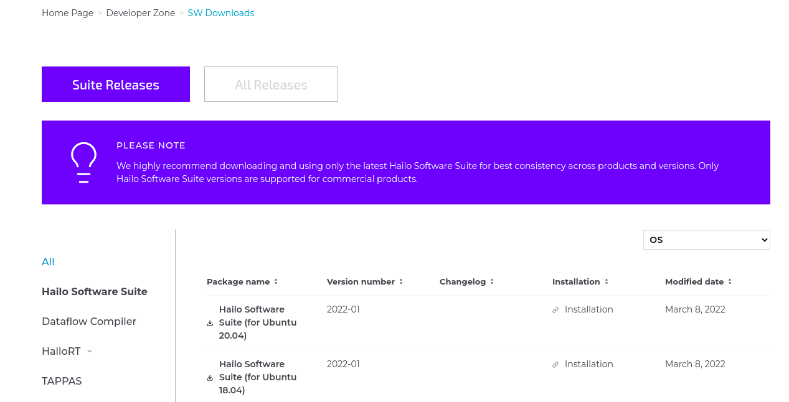

Installation via the Hailo SW Suite
===================================

Download the SW Suite
---------------------

To get started, go to the `Hailo Developer Zone <https://hailo.ai/developer-zone/>`_ and enter the `SW Suite download page <https://hailo.ai/developer-zone/sw-downloads/>`_. From there you can download your prefered version of the ``Hailo SW Suite``. If this is your first time in the ``Developer Zone``\ , you will be asked to register to the site before downloads are enabled, login and then you will be able to download the package.

Install the SW Suite
--------------------

Once the zip is downloaded, extract the folder with:   

.. code-block:: sh

   tar -xf hailo_sw_suite_2023_01.tar.gz

| There are three options for installing the ``Suite``\ : ``Docker`` installation, ``Manual`` installation, and a ``Self Extractable`` installation.
| The instructions can be found for all installation flows, along with their required pre-requisites and sanity checks,  `in the Hailo Developer Zone <https://hailo.ai/developer-zone/documentation/dataflow-compiler/latest/?sp_referrer=suite/suite_install.html>`_.
| 
| This is all that is required to start the installation.  ``TAPPAS`` is included in the ``SW Suite``\ , so by installing the ``Suite`` you should now have the corresponding version of ``TAPPAS`` installed inside.
|
| Note that the ``TAPPAS`` system requirements are documented in the Required Packages section `Here <manual-install.rst>`_.
