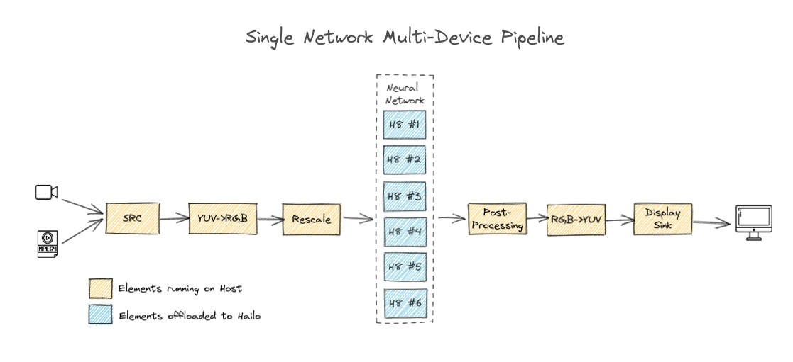

# Single Network Multi-device Pipeline Structure

<div align="center"></div>

This page provides a drill-down into the template of our multi-device pipelines with a focus on explaining the `GStreamer` pipeline.

## Example pipeline

```sh
gst-launch-1.0 \
    $source_element ! videoconvert ! \
    videoscale ! \
    queue leaky=no max-size-buffers=30 max-size-bytes=0 max-size-time=0 ! \
    hailonet hef-path=$hef_path device-count=$device_count is-active=true ! \
    queue leaky=no max-size-buffers=30 max-size-bytes=0 max-size-time=0 ! \
    hailofilter2 function-name=$network_name so-path=$postprocess_so qos=false ! \
    queue leaky=no max-size-buffers=30 max-size-bytes=0 max-size-time=0 ! \
    hailooverlay qos=false ! \
    queue leaky=no max-size-buffers=30 max-size-bytes=0 max-size-time=0 ! \
    videoconvert ! \
    fpsdisplaysink video-sink=$video_sink_element name=hailo_display sync=$sync_pipeline text-overlay=false 
```

This pipeline is based on-top of our [single network pipeline](single_network.md).
The number of physical devices to utilize is set via the `hailonet` device-count property (defaults to 4 in this app)