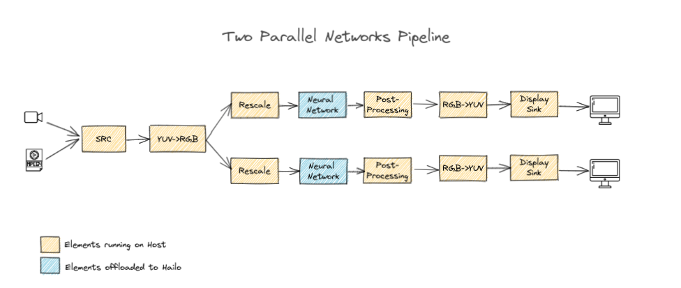

Parallel Networks Structure
===========================

This page provides a drill-down into the template of our parallel networks pipeline with a focus on explaining the ``GStreamer`` pipeline.

Example Pipeline of One Display Multi Source
--------------------------------------------

.. image:: ../../resources/parallel_nets_pipeline.png

.. code-block:: sh

   gst-launch-1.0 \
       $source_element ! videoconvert ! \
       queue name=hailo_pre_split leaky=no max-size-buffers=30 max-size-bytes=0 max-size-time=0 ! \
       tee name=splitter \
       hailomuxer name=hailomuxer ! \
       queue name=hailo_draw0 leaky=no max-size-buffers=30 max-size-bytes=0 max-size-time=0 ! \
       hailooverlay qos=false !  \
       splitter. ! queue name=hailo_pre_infer_q_1 leaky=no max-size-buffers=5 max-size-bytes=0 max-size-time=0 ! \
       hailonet hef-path=$NETWORK_ONE_HEF_PATH is-active=true ! \
       queue name=hailo_postprocess0 leaky=no max-size-buffers=30 max-size-bytes=0 max-size-time=0 ! \
       hailofilter so-path=$NETWORK_ONE_POSTPROCESS_SO function-name=$NETWORK_ONE_POSTPROCESS_FUNCTION_NAME qos=false ! hailomuxer. \
       splitter. ! queue name=hailo_pre_infer_q_0 leaky=no max-size-buffers=5 max-size-bytes=0 max-size-time=0 ! \
       hailonet hef-path=$NETWORK_TWO_HEF_PATH is-active=true ! \
       queue name=hailo_postprocess1 leaky=no max-size-buffers=30 max-size-bytes=0 max-size-time=0 ! \
       hailofilter so-path=$NETWORK_TWO_POSTPROCESS_SO function-name=$NETWORK_TWO_POSTPROCESS_FUNCTION_NAME qos=false ! hailomuxer. \
       queue leaky=no max-size-buffers=30 max-size-bytes=0 max-size-time=0 ! \
       fpsdisplaysink video-sink=$video_sink_element name=hailo_display sync=false text-overlay=false \

Example Pipeline of Two Displays
-----------------------------

.. code-block:: sh

   gst-launch-1.0 \
       $source_element ! videoconvert !
       queue leaky=no max-size-buffers=30 max-size-bytes=0 max-size-time=0 ! \
       tee name=t ! queue ! videoscale ! \
       queue leaky=no max-size-buffers=30 max-size-bytes=0 max-size-time=0 ! \
       hailonet hef-path=$hef_path is-active=true net-name=$network_one_name ! \
       queue leaky=no max-size-buffers=30 max-size-bytes=0 max-size-time=0 ! \
       hailofilter so-path=$network_one_so qos=false ! videoconvert ! \
       fpsdisplaysink video-sink=$video_sink_element name=hailo_display sync=false text-overlay=false \
       t. ! \
       videoscale ! queue ! \
       hailonet hef-path=$hef_path is-active=true net-name=$network_two_name ! \
       queue leaky=no max-size-buffers=30 max-size-bytes=0 max-size-time=0 ! \
       hailofilter so-path=$network_two_so function-name=mobilenet_ssd_merged qos=false ! \
       queue leaky=no max-size-buffers=30 max-size-bytes=0 max-size-time=0 ! \
       hailooverlay ! videoconvert ! \
       fpsdisplaysink video-sink=$video_sink_element name=hailo_display2 sync=false text-overlay=false ${additional_parameters}

This pipeline is based on-top of the `single network pipeline <single_network.rst>`_\ , the modification amounts to using the GStreamer built in the tee element.
