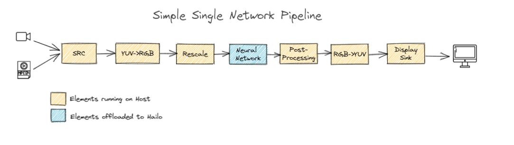
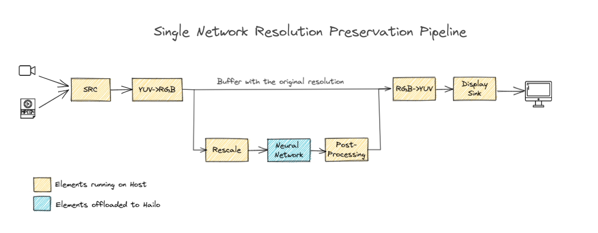
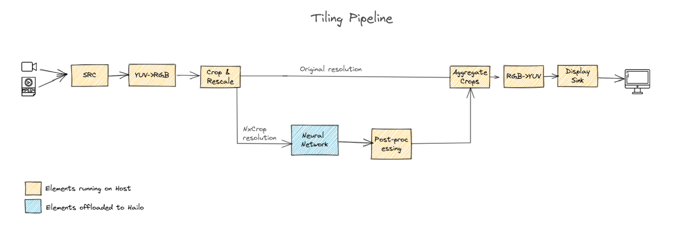

Single Network Pipeline Structure
=================================

This page provides a drill-down into the template of our single network pipelines with a focus on explaining the ``GStreamer`` pipeline.

.. _Example pipeline:

Example Pipeline
----------------

.. code-block:: sh

   gst-launch-1.0 \
       filesrc location=$video_device ! decodebin ! videoconvert ! \
       videoscale ! \
       queue leaky=no max-size-buffers=30 max-size-bytes=0 max-size-time=0 ! \
       hailonet hef-path=$hef_path is-active=true ! \
       queue leaky=no max-size-buffers=30 max-size-bytes=0 max-size-time=0 ! \
       hailofilter function-name=yolov5 so-path=$POSTPROCESS_SO qos=false ! \
       queue leaky=no max-size-buffers=30 max-size-bytes=0 max-size-time=0 ! \
       hailooverlay ! \
       videoconvert ! \
       fpsdisplaysink video-sink=xvimagesink name=hailo_display sync=true text-overlay=false

The pipeline functionality will be explained section by section:

.. code-block::

       filesrc location=$video_device ! decodebin ! videoconvert !

Specifies the location of the video used, then decodes and converts to the required format.

.. code-block::

      videoscale ! \

   Re-scale the video dimensions to fit the input of the network. The video scale finds out the requires width and height using caps negotiation with ``hailonet``.

.. code-block::

       queue leaky=no max-size-buffers=30 max-size-bytes=0 max-size-time=0 ! \

Before sending the frames into the ``hailonet`` element, set a queue so no frames are lost (Read more about queues `here <https://gstreamer.freedesktop.org/documentation/coreelements/queue.html?gi-language=c>`_\ )

.. code-block::

       hailonet hef-path=$hef_path is-active=true ! \
       queue leaky=no max-size-buffers=30 max-size-bytes=0 max-size-time=0 ! \

Performs the inference on the Hailo-8 device.

.. code-block::

       hailofilter function-name=$POSTPROCESS_NAME so-path=$POSTPROCESS_SO qos=false ! \
       queue name=hailo_draw0 leaky=no max-size-buffers=30 max-size-bytes=0 max-size-time=0 ! \
       hailooverlay  ! \

`hailofilter <../elements/hailo_filter.rst>`_ performs a given post-process to extract the objects. The following `hailooverlay <../elements/hailo_overlay.rst>`_ element is able to draw standard ``HailoObjects`` to the buffer.

.. code-block::

       videoconvert ! \
       fpsdisplaysink video-sink=xvimagesink name=hailo_display sync=true text-overlay=false

Apply the final convert to let GStreamer utilize the format required by the ``fpsdisplaysink`` element

Example Pipeline with Resolution Preservation
---------------------------------------------

Using this template the source resolution would be preserved, this is an extension to our `Example pipeline`_

An example for pipelines who preserve the original resolution:

.. code-block:: sh

   gst-launch-1.0 \
       $source_element ! videoconvert ! \
       tee name=t hailomuxer name=mux \
       t. ! queue leaky=no max-size-buffers=30 max-size-bytes=0 max-size-time=0 ! mux. \
       t. ! videoscale ! \
       queue leaky=no max-size-buffers=30 max-size-bytes=0 max-size-time=0 ! \
       hailonet hef-path=$hef_path is-active=true ! \
       queue leaky=no max-size-buffers=30 max-size-bytes=0 max-size-time=0 ! \
       hailofilter function-name=$network_name so-path=$postprocess_so qos=false ! mux. \
       mux. ! queue leaky=no max-size-buffers=30 max-size-bytes=0 max-size-time=0 ! \
       hailooverlay ! queue leaky=no max-size-buffers=30 max-size-bytes=0 max-size-time=0 ! \
       videoconvert ! \
       fpsdisplaysink video-sink=$video_sink_element name=hailo_display sync=$sync_pipeline text-overlay=false

Example Pipeline Single Network with Tiling
-------------------------------------------

Tiling introduces two new elements:

* ``hailotilecropper`` which splits the frame into tiles by separating the frame into rows and columns
   (given as parameters to the element).
* ``hailotileaggregator`` which aggregates the cropped tiles and stitches them back to the original resolution.
