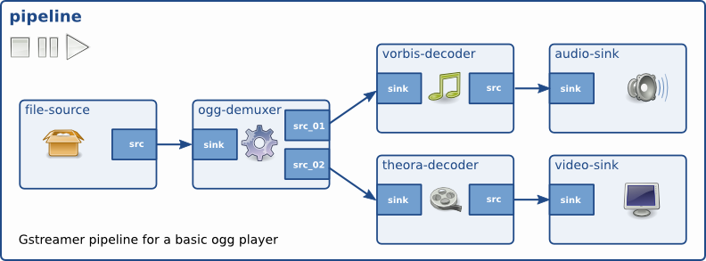

GStreamer Framework
===================

GStreamer Principles
--------------------

* 
  Object-oriented​ - All GStreamer Objects can be extended using the GObject inheritance methods. All plugins are loaded dynamically and can be extended and upgraded independently.​

* 
  GStreamer adheres to GObject, the GLib 2.0 object model. A programmer familiar with GLib 2.0 or GTK+ will be comfortable with GStreamer.​

* 
  Extensible​ core plugins to encapsulate all common media streaming functionalities.

* 
  Allow binary-only plugins​ - Plugins are shared libraries that are loaded at runtime. ​

* 
  High performance​

  * using GLib's GSlice allocator​
  * ref-counting and copy on write minimize the usage of memcpy.
  * allowing hardware acceleration by using specialized plugins.​

GStreamer Elements
------------------

* 
  **Elements** - have one specific function for processing/ generating / consuming data. By chaining together several such elements, a pipeline can be created to perform a specific task.​

* 
  **Pads** - are an element's input and output, which can connect to other elements. A pad can be viewed as a “plug” or “port” on an element where links may be made with other elements, and through which data can flow to or from those elements. Data types are negotiated between pads using a process called Caps Negotiation. Data types are described by GstCaps.​

* 
  **Bin** - A bin is a container for a collection of elements. Since bins are subclasses of elements themselves, a bin can be mostly controlled as if it was an element, thereby subtracting away a lot of complexity from the user's application. A pipeline is a top-level bin. It provides a bus for the application and manages the synchronization for its children.

Terminology
-----------

NVR (Network Video Recorder)
^^^^^^^^^^^^^^^^^^^^^^^^^^^^^

NVR is a specialized hardware and software solution used in IP (Internet Protocol) video surveillance systems. In most cases, the NVR is intended for obtaining video streams from the IP cameras (via the IP network) for the purpose of storage and subsequent playback.

Real Time Streaming Protocol (RTSP)
^^^^^^^^^^^^^^^^^^^^^^^^^^^^^^^^^^^^

Is a network control protocol designed for use in entertainment and communications systems to control streaming media servers. This protocol is used for establishing and controlling media sessions between endpoints.

Rockchip Media Process Platform (MPP)
^^^^^^^^^^^^^^^^^^^^^^^^^^^^^^^^^^^^^

The MPP is a library for Rockchip SoC's which provides high performance on multimedia (video and image) processing.