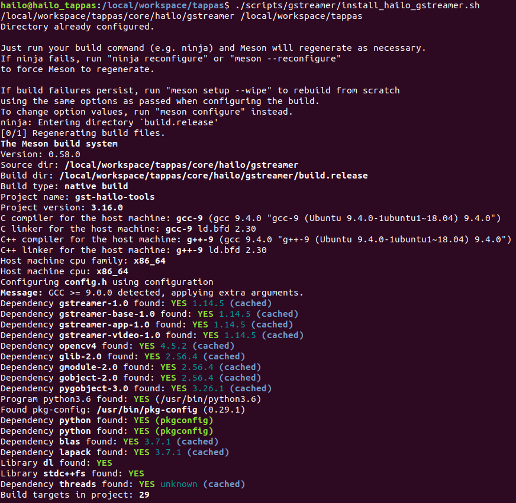

===================
Compiling Your Code
===================

The Meson Build System
----------------------

`Meson <https://mesonbuild.com/>`_ is an open source build system that places the emphasis on speed and ease of use. `GStreamer uses meson <https://gstreamer.freedesktop.org/documentation/installing/building-from-source-using-meson.html?gi-language=c>`_ for all sub-projects to generate build instructions to be executed by `ninja <https://ninja-build.org/>`_\ , another build system focuses entirely on a speed that requires a higher level build system (ie: meson) to generate its input files. \
Similar to GStreamer, ``TAPPAS`` also uses Meson, and compiling new projects requires the adjustment of the ``meson.build`` files.

How to Compile
--------------

| To help streamline this process the TAPPAS Framework have provided a script that handles most of the work. The script can be found at `scripts/gstreamer/install_hailo_gstreamer.sh <../../scripts/gstreamer/install_hailo_gstreamer.sh>`_.
| The following arguments are available:  

* | ``--build-dir``   Path to the build directory. Defaults to ``core/hailo``.
* | ``--build-mode`` Build mode, debug/release, default is release.
* | ``--skip-hailort``  Skip compiling HailoRT. 
* | ``--python-version`` Specify which Python version to use.
* | ``--compile-libgsthailo`` Compile libgsthailo instead of copying it from the release.
  | From the TAPPAS home directory folder you can run:

.. code-block:: sh

   ./scripts/gstreamer/install_hailo_gstreamer.sh

