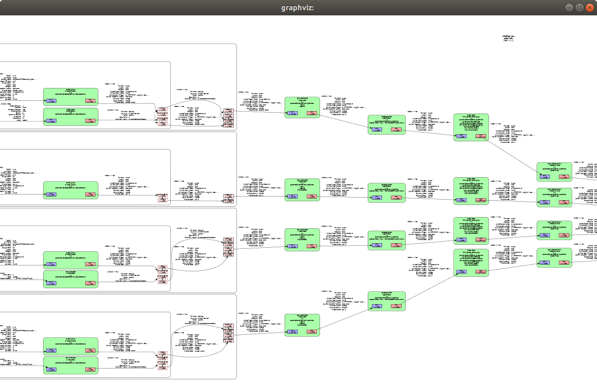

=========
Debugging
=========

GstShark
--------

GstShark is an open-source project from RidgeRun that provides benchmarks and profiling tools for GStreamer 1.7.1 (and above). It includes tracers for generating debug information plus some tools to analyze the debug information. GstShark provides easy to use and useful tracers, paired with analysis tools to enable straightforward optimizations.

GstShark leverages GStreamer's built in tracing system and adds plotting tools to simplify the process of understanding the bottlenecks in the user's pipeline.

As part of the TAPPAS framework, we have expanded the available profiling mechanisms to include TAPPAS related tracers and a new plotting tool.

The profiling tool provides 3 general features that can be used to debug the pipeline:

* 
  Tracers log printouts - At the most basic level, printouts are available from the traces of the different measurements made. An experienced user will be able to make observations at runtime. Printouts can be found in the debug file: GST_DEBUG_FILE=$TAPPAS_WORKSPACE/tappas_traces.log.

* 
  Graphic visualization - Shown above, gst-shark can generate a pipeline graph that shows how elements are connected and what caps were negotiated between them. This is a very convenient feature for observing the pipeline in a more comfortable way. The graph is generated at runtime so it is very effective for seeing and debugging how elements were actually connected and in what formats the data ended up in.

* 
  Plotting tool - A python script that generates a graph plot for each tracer metric enabled. This is a powerful tool to visualize each metric that can be used for deeper debugging.

Install
-------

Follow RidgeRun tutorial: `GstShark <https://developer.ridgerun.com/wiki/index.php?title=GstShark>`_

Bash Shortcuts
--------------
      
Please refer to the following section: `Using GstShark in yocto-compiled images`_

.. code-block:: sh

   vim ~/.bashrc

.. code-block:: sh

   # set gstreamer debug
   gst_set_debug() {
     export HAILO_PROFILE_LOCATION=/tmp/profile
     export GST_DEBUG="GST_TRACER:7"
     export GST_DEBUG_FILE=$TAPPAS_WORKSPACE/tappas_traces.log
     export GST_TRACERS="cpuusage;proctime;interlatency;scheduletime;bitrate;framerate;queuelevel;threadmonitor;numerator;buffer;detections;graphic"
     export GST_DEBUG_NO_COLOR=1
     echo 'Options for TRACERS:"'
     echo 'export GST_TRACERS="cpuusage;proctime;interlatency;scheduletime;bitrate;framerate;queuelevel;threadmonitor;numerator;buffer;detections;graphic"'
   }

   # set trace to collect graphic data of gstreamer pipeline
   gst_set_graphic() {
     export HAILO_PROFILE_LOCATION=/tmp/profile
     export GST_DEBUG_DUMP_DOT_DIR=/tmp/
     export GST_DEBUG="GST_TRACER:7"
     export GST_TRACERS="graphic"
     echo 'export GST_TRACERS="graphic"'
   }

   # unset gstreamer debug
   gst_unset_debug() {
     unset GST_TRACERS
     unset GST_DEBUG
     unset GST_DEBUG_DUMP_DOT_DIR
     unset HAILO_PROFILE_LOCATION
     unset GST_DEBUG_FILE
     unset GST_DEBUG_NO_COLOR
   }

   # plot the gst-shark dump files
   gst_plot_debug() {
     export HAILO_PROFILE_LOCATION=/tmp/profile
     split_traces_dir=$TAPPAS_WORKSPACE/tappas_traces_$(date +%d.%m.%Y_%H:%M:%S)
     $TAPPAS_WORKSPACE/sources/gst-shark/scripts/graphics/split_traces.sh $split_traces_dir
     python3 $TAPPAS_WORKSPACE/sources/gst-shark/scripts/graphics/plot_all_to_html.py -p $split_traces_dir
     echo 'In order to plot the graphic pipeline graph, run:'
     echo "dot $HAILO_PROFILE_LOCATION/graphic/pipeline_<timestamp>.dot -T x11"
   }

Note that 4 functions were added: two sets, an unset, and a plot function. The set functions enable gst-shark by setting environment variables, the chief of which is GST_TRACERS. This enables the different trace hooks in the pipeline. The available tracers are listed in the echo command at the end of each set. You can enable any combination of the available tracers, just chain them together with a ';' (notice that the difference between gst_set_debug and gst_set_graphic is that gst_set_debug enables all tracers whereas gst_set_graphic only enables the graphic tracer that draws the pipeline graph). HAILO_PROFILE_LOCATION and GST_DEBUG_DUMP_DOT_DIR set locations where the dump files are stored, the first sets where the tracer dumps are (used for gst-plot), and the latter where the dot file is saved (the graphic pipeline graph). Unset disables all tracers, and gst_plot_debug runs plot script.

.. _Using GstShark in yocto-compiled images:

Using GstShark in Yocto-Compiled Images
---------------------------------------
Enable TAPPAS tracers:

* 
  Export the following environment variables:

  .. code-block:: sh

     export HAILO_PROFILE_LOCATION=/tmp/profile
     export GST_DEBUG="GST_TRACER:7"
     export GST_DEBUG_NO_COLOR=1

* 
  Select the tracers by setting the GST_TRACERS environment variable to the list of tracers, separated by ; as in the example:

  .. code-block:: sh

     export GST_TRACERS="scheduletime;bitrate;threadmonitor;numerator;buffer;detections"

* 
  You should export only some of the tracers, exporting too many tracers may fail the embedded device. All tracers explained: `Understanding GstShark tappas plotted graphs`_

* 
  If you want to save the output to a file, run the following command before running the app:

  .. code-block:: sh

     export GST_DEBUG_FILE=<file_path>

* 
  If you want to plot the tracers output, use a strong machine (not an embedded device) with a full tappas installation and copy there the output file, then run the following commands:
    
  .. code-block:: sh
    
     export GST_DEBUG_FILE=<file_path>
     gst_plot_debug

Using GstShark
--------------

Let’s say there is a GStreamer app to be profiled, Start by enabling gst-shark:

.. raw:: html

   

Then just run your app, it will be possible to see all kinds of tracer prints on the debug output file: GST_DEBUG_FILE=$TAPPAS_WORKSPACE/tappas_traces.log.

.. raw:: html

   

After you have run a gstreamer pipeline with tracers enabled, plot them using the plot script, just run: 

.. code-block:: sh

   gst_plot_debug

It will print to the console the path of the html file that contains the plots, which can be opened in the browser. In addition it will print the command to open the pipeline graph, which can be run in a terminal to open the graph.

.. raw:: html

   

   

.. _Understanding GstShark tappas plotted graphs:

Understanding GstShark TAPPAS Plotted Graphs
--------------------------------------------

Each graph inspects a different metric of the pipeline, it is recommended to read more about what each one represents here:

* CPU Usage (cpuusage) - Measures the CPU usage every second. In multiprocessor systems this measurements are presented per core.
* Processing Time (proctime) - Measures the time an element takes to produce an output given the corresponding input.
* InterLatency (interlatency) - Measures the latency time at different points in the pipeline.
* Schedule Time (scheduling) - Measures the amount of time between two consecutive buffers in a sink pad.
* Buffer (buffer) - Prints information of every buffer that passes through every sink pad in the pipeline.
* Bitrate (bitrate) - Measures the current stream bitrate in bits per second.
* Framerate (framerate) - Measures the amount of frames that go through a src pad every second.
* Queue Level (queuelevel) - Measures the amount of data queued in every queue element in the pipeline.
* Thread Monitor (threadmonitor) - Measures the CPU usage of every thread in the pipeline.
* Numerator (numerator) - Numerates the buffers by setting the field "offset" of the buffer metadata. This trace is different from the others because it does not collect any data, it just numerates the buffers.
* Detections (detections) - Prints information about the objects detected in every buffer that passes through every pad in the pipeline. This trace only works with the TAPPAS framework since it collects the TAPPAS detection objects.
* Graphic (graphics) - Records a graphical representation of the current pipeline.

.. note::
    When using the Thread Monitor tracer, provide meaningful names to the queues because the names of the threads in the graph will be based on the names of the queues. This will  help easily identify the threads and understand their purpose when analyzing the trace. In addition, due to the way this tracer works, it is important to keep the names of the queues shorter than 16 characters. If the names are longer than this, the thread names in the graph will be truncated.

Modify Buffering Mode and Size
^^^^^^^^^^^^^^^^^^^^^^^^^^^^^^

.. code-block:: sh

   $ export GST_SHARK_FILE_BUFFERING=0

With the no buffering mode every I/O operation is written as soon as possible.

The following command is an example of how to define the environment variable that will change the buffering mode to full buffering and the buffering size, this command uses a positive integer value for the size:

.. code-block:: sh

   $ export GST_SHARK_FILE_BUFFERING=1024

Individual Element Tracing (filter)
^^^^^^^^^^^^^^^^^^^^^^^^^^^^^^^^^^^

The individual element tracing, or filter parameter, allows the user to choose which elements get included in the tracing. The value to be set in the filter is a Glib Compatible Regular Expression, meaning that elements to be traced can be grouped by using a regex that matches with their name.

The filtering applies to the element name, NOT the factory. This is, if the element is specified as "identity name=myelem", it should be referred to as "myelem" and not to "identity"

Print the amount of frames that flow every 5 seconds through the different src pads in the pipe:

.. code-block:: sh

   GST_TRACERS="framerate(period=5)" GST_DEBUG=GST_TRACER:7

Print the amount of bits that flow every 3 seconds through the different src pads in the pipe:

.. code-block:: sh

   GST_TRACERS="bitrate(period=3)" GST_DEBUG=GST_TRACER:7

Print the amount of frames that flow every 5 seconds and bits that flow every 3 seconds through the different src pads in the pipe:

.. code-block:: sh

   GST_TRACERS="framerate(period=5);bitrate(period=3)" GST_DEBUG=GST_TRACER:7

Print the amount of frames that flow every 5 through the identity:

.. code-block:: sh

   GST_TRACERS="framerate(period=5,filter=identity);bitrate(period=3)" GST_DEBUG=GST_TRACER:7

Using gst-instruments
---------------------

gst-instruments is a set of performance profiling and data flow inspection tools for GStreamer pipelines.

* 
  ``gst-top-1.0`` at the start of the pipeline will analyze and profile the run. (gst-top-1.0 gst-launch-1.0 ! audiotestsrc ! autovideosink)

* 
  ``gst-report-1.0`` - generates performance report for input trace file.

* 
  ``gst-report-1.0 --dot gst-top.gsttracee | dot -Tsvg > perf.svg`` - generates performance graph in DOT format.

`Read more in gst-instruments github page <https://github.com/kirushyk/gst-instruments>`_
