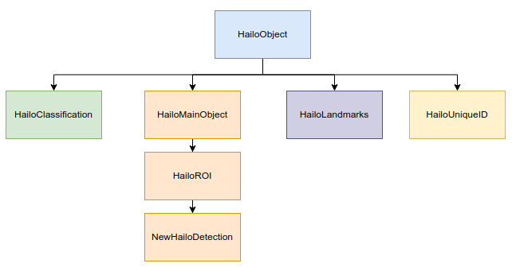

========================
Hailo Objects API
========================

| The ``TAPPAS`` provides a set of abstractions for the different objects that might be handled in a user's pipeline, such as ``tensors``\ , ``detections``\ , ``classifications``\ , or ``landmarks``. If the user wants to write their own custom pipeline behavior (\ ``postprocessing``\ , ``drawing``\ , etc..), then it is worthwhile to become familiar with these classes.
| This guide documents the different classes available in the ``TAPPAS`` and their interactions.

Structs
===============

.. _HailoBBox:

HailoBBox
-----------------

| Represents a bounding box.
| ``SOURCE``\ : `core/hailo/general/hailo_objects.hpp <../../core/hailo/general/hailo_objects.hpp>`_  

Constructor
^^^^^^^^^^^

.. code-block:: cpp

   HailoBBox(float xmin, float ymin, float width, float height)

Functions
^^^^^^^^^

.. list-table::
   :header-rows: 1

   * - Function
     - Return Type
     - Description
   * - ``xmin()``
     - float
     - Normalized xmin position.
   * - ``ymin()``
     - float
     - Normalized ymin position.
   * - ``width()``
     - float
     - Normalized width of bounding box.
   * - ``height()``
     - float
     - Normalized height of bounding box.
   * - ``xmax()``
     - float
     - Normalized xmax position.
   * - ``ymax()``
     - float
     - Normalized ymax position.

.. _HailoPoint:

HailoPoint
------------------

| Represents a detected point (landmark).
| ``SOURCE``\ : `core/hailo/general/hailo_objects.hpp <../../core/hailo/general/hailo_objects.hpp>`_  

Constructor
^^^^^^^^^^^

.. code-block:: cpp

   HailoPoint(float x, float y, float confidence = 1.0f)

Functions
^^^^^^^^^

.. list-table::
   :header-rows: 1

   * - Function
     - Return Type
     - Description
   * - ``x()``
     - float
     - Normalized x position.
   * - ``y()``
     - float
     - Normalized y position.
   * - ``confidence()``
     - float
     - The confidence in the point's accuracy, float between 0.0 to 1.0 - default is 1.0.

|
|

Enumerations
====================

.. _hailo_object_t:

hailo_object_t
----------------------

Typing enumeration for `HailoObject`_ instances.  

.. code-block:: cpp

   typedef enum
   {
       HAILO_ROI,
       HAILO_CLASSIFICATION,
       HAILO_DETECTION,
       HAILO_LANDMARKS,
       HAILO_TILE,
       HAILO_UNIQUE_ID,
       HAILO_MATRIX,
       HAILO_DEPTH_MASK,
       HAILO_CLASS_MASK,
       HAILO_CONF_CLASS_MASK,
       HAILO_USER_META
   } hailo_object_t;

|
|

.. _HailoTensor:

.. _HailoTensorPtr:

HailoTensor
======================

``Tensors`` are the ouput vector of the network inference. Usually these are N-dimensional matrices that hold little "human readable" value at first, but after a little postprocessing become meaningful objects such as detections or landmarks. All postprocesses start by looking at the output tensors. In fact, usually there will be no need to construct one it will be `provided to your postprocess <write-your-own-postprocess.rst>`_ via the `hailofilter <../elements/hailo_filter.rst>`_ element. To make handling these vectors easier, they are provided in a ``HailoTensor`` class.  \
``Shared pointer handle``\ : **HailoTensorPtr**  \
``SOURCE``\ : `core/hailo/general/hailo_tensors.hpp <../../core/hailo/general/hailo_tensors.hpp>`_  

Functions
---------

.. list-table::
   :widths: 30 30 40
   :header-rows: 1

   * - Function
     - Return Type
     - Description
   * - ``name()``
     - std::string
     - Get the tensor name.
   * - ``data()``
     - uint8_t *
     - Get the tensor data pointer.
   * - ``width()``
     - uint32_t
     - Get the tensor width.
   * - ``height()``
     - uint32_t
     - Get the tensor height.
   * - ``features()``
     - uint32_t
     - Get the tensor features.
   * - ``size()``
     - uint32_t
     - Get the tensor total length.
   * - ``shape()``
     - std::vector\<std::size_t\>
     - Get the tensor dimensions.
   * - ``nms_shape()``
     - hailo_tensor_nms_shape_t
     - Get the nms shape.
   * - ``quant_info()``
     - hailo_tensor_quant_info_t
     - Get the quantization information.
   * - ``format()``
     - hailo_tensor_format_t
     - Get the tensor format type.
   * - ``fix_scale(T num)``
     - float
     - Takes a quantized number of template type 'T' and returns its dequantized value ('float').
   * - ``quantize(T num)``
     - T
     - Takes a dequantized number of template type 'T' and returns its quantized value ('T').  
   * - |  ``get(uint row,``
       |     ``uint col,``
       |     ``uint channel)``
     - | uint8_t
     - | Get the tensor value at this location.   
   * - | ``get_uint16(uint row,`` 
       |            ``uint col,`` 
       |            ``uint channel)``
     - | uint16_t
     - | Get the tensor value (uint16_t) at this location.
   * - | ``get_full_percision(``
       |     ``uint row,`` 
       |     ``uint col,`` 
       |     ``uint channel,`` 
       |     ``bool is_uint16)``
     - | float
     - | Get the tensor dequantized value at this location.

|
|

.. _HailoObject:

.. _HailoObjectPtr:

HailoObject
===================

| ``HailoObject`` represents objects that are usable output after postprocessing. They can be detections, classifications, landmarks, or any other similar postprocess results.
| This class is an abstraction for other objects to inherit from. To more conveniently compare different types of inheriting classes, ``HailoObject``\ s store their object type from an enumerated list `hailo_object_t`_.
| The ``class inheritance hierarchy`` is as follows:  

| ``Shared pointer handle``\ : **HailoObjectPtr**
| ``SOURCE``\ : `core/hailo/general/hailo_objects.hpp <../../core/hailo/general/hailo_objects.hpp>`_  

Constructor
-----------

.. code-block:: cpp

   HailoObject()

Functions
---------

.. list-table::
   :header-rows: 1

   * - Function
     - Return Type
     - Description
   * - ``get_type()``
     - `hailo_object_t`_
     - The type of the object from the list of enumerated types shown above.

|
|

.. _HailoMainObject:

HailoMainObject
=======================

| Inherits from `HailoObject`_
| ``HailoMainObject`` represents a `HailoObject`_ that can hold other `HailoObject`_\ s. For example a face detection can hold landmarks or age classification, gender classification etc...
| ``Shared pointer handle``\ : **HailoMainObjectPtr**  \
| ``SOURCE``\ : `core/hailo/general/hailo_objects.hpp <../../core/hailo/general/hailo_objects.hpp>`_  

Constructor
-----------

.. code-block:: cpp

   HailoMainObject()

Functions
---------

.. list-table::
   :widths: 35 25 40
   :header-rows: 1

   * - Function
     - Return Type
     - Description
   * - | ``add_object``
       | ``(HailoObjectPtr obj)`` 
     - | void
     - | Add a `HailoObject`_ to this `HailoMainObject`_.
   * - | ``add_tensor``
       | ``(HailoTensorPtr tensor)``
     - | void
     - | Add a `HailoTensor`_ to this `HailoMainObject`_.
   * - | ``remove_object``
       | ``(HailoObjectPtr obj)``
     - | void
     - | Remove a `HailoObject`_ from this `HailoMainObject`_.
   * - ``remove_object(uint index)``
     - void
     - Remove a `HailoObject`_ from this `HailoMainObject`_ by index.
   * - | ``remove_objects_typed``
       | ``(hailo_object_t type)``
     - | void
     - | Removes all the objects of a given type, attached to this `HailoMainObject`_.
   * - | ``get_tensor``
       | ``(std::string name)``
     - | `HailoTensorPtr`_
     - | Get a tensor from this `HailoMainObject`_.
   * - ``has_tensors()``
     - bool
     - Checks whether there are tensors attached to this `HailoMainObject`_.
   * - | ``get_tensors()``
     - | std::vector
       | \<\ `HailoTensorPtr`_\>
     - | Get a vector of the tensors attached to this `HailoMainObject`_.
   * - | ``get_tensors_by_name()``
     - | std::map
       | \<std::string, \ `HailoTensorPtr`_\> 
     - | Get the map of tensor names to their corresponding `HailoTensorPtr`_ objects.
   * - ``clear_tensors()``
     - void
     - Clear all tensors attached to this `HailoMainObject`_.
   * - | ``get_objects()``
     - | std::vector
       | \<\ `HailoObjectPtr`_\>
     - | Get the objects attached to this `HailoMainObject`_.
   * - | ``get_objects_typed``
       | ``(hailo_object_t type)``
     - | std::vector
       | \<\ `HailoObjectPtr`_\>
     - | Get the objects of a given type, attached to this `HailoMainObject`_.

|
|

.. _HailoROI:

HailoROI
================

| Inherits from `HailoMainObject`_
| ``HailoROI`` represents an ROI (Region Of Interest): a part of an image that can hold other objects. Mostly inherited by other objects but isn't abstract. Can represent the whole image by giving the right HailoBBox.
| ``Shared pointer handle``\ : **HailoROIPtr**  \
| ``SOURCE``\ : `core/hailo/general/hailo_objects.hpp <../../core/hailo/general/hailo_objects.hpp>`_  

Constructor
-----------

.. code-block:: cpp

   HailoROI(HailoBBox bbox, std::string stream_id = "")

Functions
---------

.. list-table::
   :header-rows: 1

   * - Function
     - Return Type
     - Description
   * - | ``shared_from_this()``
     - | std::shared_ptr
       | \<\ `HailoROI`_\>
     - | Get a shared pointer to this instance.
   * - ``get_type()``
     - `hailo_object_t`_
     - This `HailoObject`_\ 's type: HAILO_ROI
   * - | ``add_object``
       | ``(HailoObjectPtr obj)``
     - | void
     - | Add an object to the main object.
   * - | ``add_unscaled_object``
       | ``(HailoObjectPtr obj)``
     - | void
     - | Adds an object to the main object. Ignores any potential scaling of ROIs
   * - ``get_bbox()``
     - `HailoBBox`_
     - Get the bbox of this ROI.
   * - ``set_bbox(HailoBBox bbox)``
     - void
     - Set the bbox of this ROI.
   * - ``get_scaling_bbox()``
     - `HailoBBox`_
     - Get the scaling bbox of this ROI, useful in case of nested ROIs.
   * - | ``set_scaling_bbox``
       | ``(HailoBBox bbox)``
     - | void
     - | Set the scaling bbox of this ROI, useful in case of nested ROIs.
   * - ``clear_scaling_bbox()``
     - void
     - Clear the scaling bbox of this ROI.
   * - ``get_stream_id()``
     - std::string
     - Get the stream ID of this ROI.
   * - | ``set_stream_id``
       | ``(std::string stream_id)``
     - | std::string
     - | Set the stream ID of this ROI.
     

| 
| 

HailoDetection
=========================

| Inherits from `HailoROI`_
| ``HailoDetection`` represents a detection in an ROI. It is assumed that all numbers are normalized (between 0 and 1) so that objects remain in relative size for easy image resizing.
| ``Shared pointer handle``\ : **HailoDetectionPtr**  \
| ``SOURCE``\ : `core/hailo/general/hailo_objects.hpp <../../core/hailo/general/hailo_objects.hpp>`_  

Constructors
------------

.. code-block:: cpp

   HailoDetection(HailoBBox bbox, const std::string &label, float confidence)
   HailoDetection(HailoBBox bbox, int class_id, const std::string &label, float confidence)

Functions
---------

.. list-table::
   :widths: 35 30 35
   :header-rows: 1

   * - Function
     - Return Type
     - Description
   * - ``clone()``
     - std::shared_ptr<`HailoObject`_\>
     - Creates a deep copy of this `HailoDetection`_\  object.
   * - ``get_type()``
     - `hailo_object_t`_
     - This `HailoObject`_\ 's type: HAILO_DETECTION
   * - ``get_confidence()``
     - float
     - This detection's confidence.
   * - ``get_label()``
     - std::string
     - This detection's label.
   * - ``get_class_id()``
     - int
     - This detection's class id.
   * - ``set_confidence(float conf)``
     - void
     - Sets the confidence score for this detection.
   * - ``set_label(std::string label)``
     - void
     - Sets the label for this detection.
   * - ``operator<(const HailoDetection &other)``
     - bool
     - Overload < operator, compares confidences.
   * - ``operator>(const HailoDetection &other)``
     - bool
     - Overload > operator, compares confidences.

.. _HailoClassification:

HailoClassification
===========================

| Inherits from `HailoObject`_
| ``HailoClassification`` represents a classification of an ROI. Classifications can have different ``types``\ , for example a classification of type 'color' can have a ``label`` of red or blue.
| ``Shared pointer handle``\ : **HailoClassificationPtr**  \
| ``SOURCE``\ : `core/hailo/general/hailo_objects.hpp <../../core/hailo/general/hailo_objects.hpp>`_  

Constructors
------------

.. code-block:: cpp

   HailoClassification(const std::string &classification_type, const std::string &label, float confidence)
   HailoClassification(const std::string &classification_type, int class_id, std::string label, float confidence)

Functions
---------

.. list-table::
   :widths: 36 30 34
   :header-rows: 1

   * - Function
     - Return Type
     - Description
   * - ``clone()``
     - std::shared_ptr<`HailoObject`_\>
     - Creates a deep copy of this `HailoClassification`_\  object.
   * - ``get_type()``
     - `hailo_object_t`_
     - This `HailoObject`_\ 's type: HAILO_CLASSIFICATION
   * - ``get_confidence()``
     - float
     - This classification's confidence.
   * - ``get_label()``
     - std::string
     - This classification's label (e.g. "Horse", "Monkey", "Tiger" for type "Animals").
   * - ``get_classification_type()``
     - std::string
     - This classification's type (e.g. "age", "gender", "color", etc...).
   * - ``get_class_id()``
     - int
     - This classification's class id.

|
|

.. _HailoLandmarks:

HailoLandmarks
======================

| Inherits from `HailoObject`_
| ``HailoLandmarks`` represents **a set** of landmarks on a given ROI. Like `HailoClassification`_\ , `HailoLandmarks`_ can also have different ``types``\ , for example a landmark can be of type "pose" or "facial landmarking". Each landmark in the set is represented as a `HailoPoint`_.
| ``Shared pointer handle``\ : **HailoLandmarksPtr**  \
| ``SOURCE``\ : `core/hailo/general/hailo_objects.hpp <../../core/hailo/general/hailo_objects.hpp>`_  

Constructors
------------

.. code-block:: cpp

   HailoLandmarks(std::string landmarks_name, float threshold = 0.0f, const std::vector<std::pair<int, int>> pairs = {})
   std::string landmarks_name, std::vector<HailoPoint> points, float threshold = 0.0f, const std::vector<std::pair<int, int>> pairs = {})

Functions
---------

.. list-table::
   :widths: 36 30 34
   :header-rows: 1

   * - Function
     - Return Type
     - Description
   * - ``clone()``
     - std::shared_ptr<`HailoObject`_\>
     - Creates a deep copy of this `HailoLandmarks`_\  object.
   * - ``get_type()``
     - `hailo_object_t`_
     - This `HailoObject`_\ 's type: HAILO_LANDMARKS
   * - ``add_point(HailoPoint point)``
     - void
     - Add a point to this landmarks object.
   * - ``get_points()``
     - std::vector\<\ `HailoPoint`_\>
     - Gets the set of points held by this Landmarks object.
   * - ``get_landmarks_type()``
     - std::string
     - This landmark's type (e.g. "pose estimation", "face landmark", etc...).
   * - ``get_pairs()``
     - std::vector<std::pair<int, int>>
     - vector of pairs of joints that should be connected in overlay.
   * - ``get_threshold()``
     - float
     - Gets the threshold held by this Landmarks object.
   * - | ``set_points``
       | ``(std::vector<HailoPoint> points)``
     - | void
     - | Set a new vector of points to this `HailoLandmarks`_\  object.

|
|

HailoUniqueID
=====================

| Inherits from `HailoObject`_
| ``HailoUniqueID`` represents a unique id of an ROI. Sometimes the user may want to give ROIs unique ids (for example, when tracking detections), and having a `HailoObject`_ abstraction makes adding and removing ids very simple (via ``add_object()`` and ``remove_object()``\ ). If no unique if is provided at construction, then a default -1 is used.
| ``Shared pointer handle``\ : **HailoUniqueIDPtr**  \
| ``SOURCE``\ : `core/hailo/general/hailo_objects.hpp <../../core/hailo/general/hailo_objects.hpp>`_  

Constructors
------------

.. code-block:: cpp

   HailoUniqueID()
   HailoUniqueID(int unique_id)

Functions
---------

.. list-table::
   :widths: 20 30 50
   :header-rows: 1

   * - Function
     - Return Type
     - Description
   * - ``clone()``
     - std::shared_ptr<`HailoObject`_\>
     - Creates a deep copy of this `HailoUniqueID`_\  object.
   * - ``get_type()``
     - `hailo_object_t`_
     - This `HailoObject`_\ 's type: HAILO_UNIQUE_ID
   * - ``get_id()``
     - int
     - Get the unique id.
   * - ``get_mode()``
     - int
     - Get the mode.

|
|

.. _HailoMask:

HailoMask
=================

| Inherits from `HailoObject`_
| ``HailoMask`` represents a mask of an ROI. Whenever the output of a postprocess is masks (tensors with result for every pixel) we will ROIs mask objects.
| ``Shared pointer handle``\ : **HailoMaskPtr**  \
| ``SOURCE``\ : `core/hailo/general/hailo_objects.hpp <../../core/hailo/general/hailo_objects.hpp>`_  

Constructors
------------

.. code-block:: cpp

   HailoMask(int mask_width, int mask_height, float transparency)

Functions
---------

.. list-table::
   :widths: 30 20 50
   :header-rows: 1

   * - Function
     - Return Type
     - Description
   * - ``get_width()``
     - int
     - get the mask width
   * - ``get_height()``
     - int
     - get the mask height
   * - ``get_transparency()``
     - float
     - get the desired drawing transparency

|
|

HailoDepthMask
======================

| Inherits from `HailoMask`_.
| ``HailoDepthMask`` represents a mask of an ROI, with float values for each pixel. The values represent depth between minimum and maximum values.
| ``Shared pointer handle``\ : **HailoDepthMaskPtr**  \
| ``SOURCE``\ : `core/hailo/general/hailo_objects.hpp <../../core/hailo/general/hailo_objects.hpp>`_  

Constructors
------------

.. code-block:: cpp

   HailoDepthMask(std::vector<float> &&data_vec, int mask_width, int mask_height, float transparency)

Functions
---------

.. list-table::
   :widths: 20 30 50
   :header-rows: 1

   * - Function
     - Return Type
     - Description
   * - ``get_type()``
     - `hailo_object_t`_
     - This `HailoObject`_\ 's type: HAILO_DEPTH_MASK
   * - ``get_data()``
     - const std::vector `<float>`
     - get the mask data vector

|
|

HailoClassMask
======================

| Inherits from `HailoMask`_
| ``HailoClassMask`` represents a mask of an ROI, with uint8_t class id classification for each pixel.
| ``Shared pointer handle``\ : **HailoClassMaskPtr**  \
| ``SOURCE``\ : `core/hailo/general/hailo_objects.hpp <../../core/hailo/general/hailo_objects.hpp>`_  

Constructors
------------

.. code-block:: cpp

   HailoClassMask(std::vector<uint8_t> &&data_vec, int mask_width, int mask_height, float transparency)

Functions
---------

.. list-table::
   :widths: 20 30 50
   :header-rows: 1

   * - Function
     - Return Type
     - Description
   * - ``get_type()``
     - `hailo_object_t`_
     - This `HailoObject`_\ 's type: HAILO_CLASS_MASK
   * - ``get_data()``
     - const std::vector\ `<uint8_t>`
     - get the mask data vector

|
|

HailoConfClassMask
==========================

| Inherits from `HailoMask`_
| ``HailoConfClassMask`` represents a mask of an ROI, contains mask-class-id and confidence float value for each pixel.
| ``Shared pointer handle``\ : **HailoConfClassMaskPtr**  \
| ``SOURCE``\ : `core/hailo/general/hailo_objects.hpp <../../core/hailo/general/hailo_objects.hpp>`_  

Constructors
------------

.. code-block:: cpp

   HailoConfClassMask(std::vector<float> &&data_vec, int mask_width, int mask_height, float transparency, int class_id)

Functions
---------

.. list-table::
   :widths: 25 25 50
   :header-rows: 1

   * - Function
     - Return Type
     - Description
   * - ``get_type()``
     - `hailo_object_t`_
     - This `HailoObject`_\ 's type: HAILO_CONF_CLASS_MASK
   * - ``get_data()``
     - const std::vector\ `<float>`
     - get the mask data vector
   * - ``get_class_id()``
     - int
     - get the mask class id

|
|

HailoMatrix
===================

| Inherits from `HailoObject`_
| ``HailoMatrix`` represents a matrix, contains float values. This matrix can be added to any HailoObject for different use cases. 
| ``Shared pointer handle``\ : **HailoMatrixPtr**  \
| ``SOURCE``\ : `core/hailo/general/hailo_objects.hpp <../../core/hailo/general/hailo_objects.hpp>`_  

Constructors
------------

.. code-block:: cpp

       HailoMatrix(float *data_ptr, uint32_t mat_height, uint32_t mat_width, uint32_t mat_features = HailoMatrix::DEFAULT_NUMBER_OF_FEATURES)

Functions
---------

.. list-table::
   :widths: 20 35 45
   :header-rows: 1

   * - Function
     - Return Type
     - Description
   * - ``clone()``
     - std::shared_ptr<`HailoObject`_\>
     - Creates a deep copy of this `HailoMatrix`_\ object.
   * - ``get_type()``
     - `hailo_object_t`_
     - This `HailoObject`_\ 's type: HAILO_MATRIX
   * - ``width()``
     - const uint32_t
     - get matrix width
   * - ``height()``
     - const uint32_t
     - get matrix height
   * - ``features()``
     - const uint32_t
     - get matrix number of features
   * - ``size()``
     - const uint32_t
     - get number of elements in matrix
   * - ``shape()``
     - std::vectorstd::size_t
     - get the shape of the matrix
   * - ``get_data()``
     - std::vector<float> 
     - get the constant reference to the matrix data

|
|

HailoUserMeta
===================

| Inherits from `HailoObject`_
| ``HailoUserMeta`` represents a sample metadata for users. 
| ``Shared pointer handle``\ : **HailoUserMetaPtr**  \
| ``SOURCE``\ : `core/hailo/general/hailo_objects.hpp <../../core/hailo/general/hailo_objects.hpp>`_  

Constructors
------------

.. code-block:: cpp

       HailoUserMeta()
       HailoUserMeta(int user_int, std::string user_string, float user_float) : m_user_int(user_int), m_user_string(user_string), m_user_float(user_float)

Functions
---------

.. list-table::
   :widths: 45 20 35
   :header-rows: 1

   * - Function
     - Return Type
     - Description
   * - ``get_type()``
     - `hailo_object_t`_
     - This `HailoObject`_\ 's type: HAILO_USER_META
   * - ``get_user_float()``
     - folat
     - get the user-defined floating-point value in a thread-safe manner.
   * - ``get_user_string()``
     - std::string
     - get the user-defined string in a thread-safe manner.
   * - ``get_user_int()``
     - int
     - get the user-defined integer value in a thread-safe manner   
   * - ``set_user_float(float user_float)``
     - void
     - set the user-defined floating-point value in a thread-safe manner.
   * - ``set_user_string(std::string user_string)``
     - void
     - set the user-defined string in a thread-safe manner.
   * - ``set_user_int(int user_int)``
     - void
     - set the user-defined integer value in a thread-safe manner.
  

