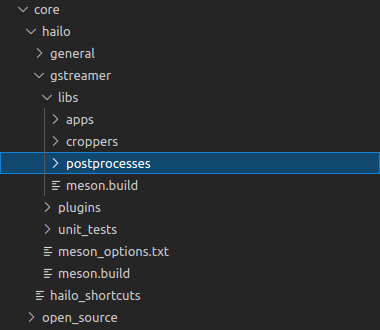
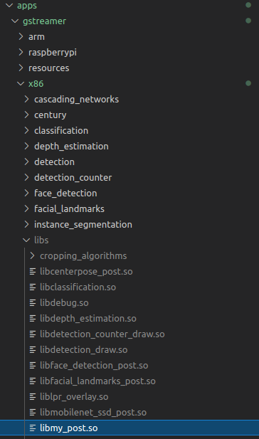
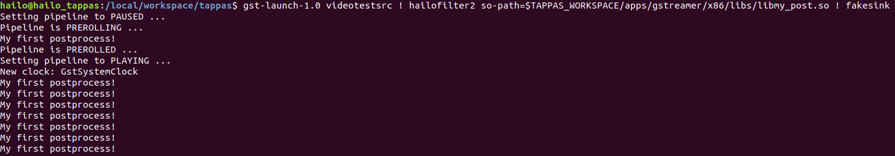
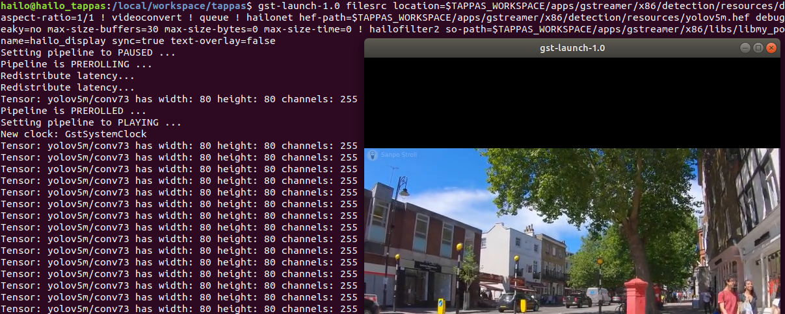
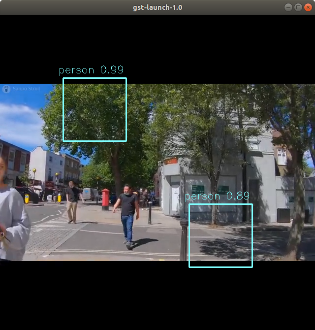

============================
Writing Your Own Postprocess
============================

Overview
--------

If you want to add a network to the Tappas that is not already supported, then you will likely need to implement a new postprocess and drawing filter. Fortunately with the use of the `hailofilter <../elements/hailo_filter.rst>`_\ , you don't need to create any new GStreamer elements, just provide the .so (compiled shared object binary) that applies your filter! \
In this guide we will go over how to create such an .so and what mechanisms/structures are available to you as you create your postprocess.

Getting Started
---------------

Where are all the files?
^^^^^^^^^^^^^^^^^^^^^^^^

To begin your postprocess writng journey, it is good to understand where you can find all the relevant source files that already exist, and how to add your own. \
From the Tappas home directory, you can find the ``core/`` folder. Inside this ``core/`` directory are a few subdirectories that host different types of source files. The ``open_source`` folder contains source files from 3rd party libraries (opencv, xtensor, etc..), while the ``hailo`` folder contains source files for all kinds of Hailo tools, such as the Hailo Gstreamer elements, the different metas provided, and the source files for the postprocesses of the networks that were already provided in the Tappas. Inside this directory is one titled ``general/``\ , which contains sources for `the different object classes <hailo-objects-api.rst>`_ (detections, classifications, etc..) available. Next to ``general`` is a directory titled ``gstreamer/``\ , and inside that are two folders of interest: ``libs/`` and ``plugins/``. The former contains the source code for all the postprocess and drawing functions packaged in the Tappas, while the latter contains source code for the different Hailo GStreamer elements, and the different metas available. This guide will mostly focus on this ``core/hailo/`` directory, as it has everything we need to create and compile a new .so! You can take a moment to peruse around, when you are ready to continue enter the ``postprocesses/`` directory:

Preparing the Header File: Default Filter Function
^^^^^^^^^^^^^^^^^^^^^^^^^^^^^^^^^^^^^^^^^^^^^^^^^^

We can create our new postprocess here in the ``postprocesses/`` folder. Create a new header file named ``my_post.hpp``.\
In the first lines we want to import useful classes to our postprocess, so add the following includes:

.. code-block:: cpp

   #pragma once
   #include "hailo_objects.hpp"
   #include "hailo_common.hpp"

``"hailo_objects.hpp"`` contains classes that represent the `different inputs (tensors) and outputs <hailo-objects-api.rst>`_ (detections, classifications, etc...) that your postprocess might handle. You can find the header in `core/hailo/general/hailo_objects.hpp <../../core/hailo/general/hailo_objects.hpp>`_. Your main point of entry for data in the postprocess is the ``HailoROI``\ , which can have a tensor or a number of tensors attached. ``"hailo_common.hpp"`` provides common useful functions for handling these classes. Let's wrap up the header file by adding a function prototype for our filter, your whole header file should look like:

.. code-block:: cpp

   #pragma once
   #include "hailo_objects.hpp"
   #include "hailo_common.hpp"

   __BEGIN_DECLS
   void filter(HailoROIPtr roi);
   __END_DECLS

Yes really, that's it! The ``hailofilter`` element does not expect much, just that the above ``filter`` function be provided. We will discuss adding `Multiple Filters in One .so`_ later. Note that the ``filter`` function takes a ``HailoROIPtr`` as a parameter; this will provide you with the ``HailoROI`` of each passing image.

Implementing filter()
^^^^^^^^^^^^^^^^^^^^^

Let's start implementing the actual filter so that you can see how to access and work with tensors. Start by creating a new file called ``my_post.cpp``. Open it and include the following:

.. code-block:: cpp

   #include <iostream>
   #include "my_post.hpp"

| The ``<iostream>`` will allow us to print to the console, and the ``"my_post.hpp"`` includes the header file we just wrote.
| For now add the follwoing implmentation for filter() so that we have a working postprocess we can test:

.. code-block:: cpp

   // Default filter function
   void filter(HailoROIPtr roi)
   {
     std::cout << "My first postprocess!" << std::endl;
   }

That should be enough to try compiling and running a pipeline! Next we will see how to add our postprocess to the meson project so that it compiles.

Compiling and Running
---------------------

Building with Meson
^^^^^^^^^^^^^^^^^^^

`Meson <https://mesonbuild.com/>`_ is an open source build system that puts an emphasis on speed and ease of use. `GStreamer uses meson <https://gstreamer.freedesktop.org/documentation/installing/building-from-source-using-meson.html?gi-language=c>`_ for all subprojects to generate build instructions to be executed by `ninja <https://ninja-build.org/>`_\ , another build system focused soley on speed that requires a higher level build system (ie: meson) to generate its input files. \
Like GStreamer, Tappas also uses meson, and compiling new projects requires adjusting the ``meson.build`` files. Here we will discuss how to add yours. \
In the ``libs/postprocesses`` path you will find a `meson.build <../../core/hailo/libs/postprocesses/meson.build>`_\ , open it and add the following entry for our postprocess:

.. code-block:: cpp

   ################################################
   # MY POST SOURCES
   ################################################
   my_post_sources = [
     'my_post.cpp',
   ]

   my_post_lib = shared_library('my_post',
     my_post_sources,
     include_directories: [hailo_general_inc] + xtensor_inc,
     dependencies : post_deps,
     gnu_symbol_visibility : 'default',
     install: true,
     install_dir: post_proc_install_dir,
   )

This should give meson all the information it needs to compile our postprocess. In short, we are providing paths to cpp compilers, linked libraries, included directories, and dependencies. Where are all these path variables coming from? Great question: from the parent meson project, you can read that meson file to see what packages and directories are available at `core/hailo/meson.build <../../core/hailo/meson.build>`_.

.. _script we used earlier:

Compiling the .so
^^^^^^^^^^^^^^^^^

| You should now be ready to compile your postprocess. To help streamline this process we have gone ahead and provided a script that handles most of the work. You can find this script at `scripts/gstreamer/install_hailo_gstreamer.sh <../../scripts/gstreamer/install_hailo_gstreamer.sh>`_. This script includes some flags that allow you do more specific operations, but they are not needed right now.
| From the Tappas home directory folder you can run:

.. code-block:: sh

   ./scripts/gstreamer/install_hailo_gstreamer.sh

.. image:: ../resources/compiling.png

If all goes well you should see some happy green ``YES``\ , and our .so should appear in ``apps/gstreamer/libs/post_processes/``\ !

Running the .so
^^^^^^^^^^^^^^^

Congratulations! You've compiled your first postprocess! Now you are ready to run the postprocess and see the results. Since it is still so generic, we can try it. Run this test pipeline in your terminal to see if it works:

.. code-block:: sh

   gst-launch-1.0 videotestsrc ! hailofilter so-path=$TAPPAS_WORKSPACE/apps/gstreamer/libs/post_processes/libmy_post.so ! fakesink

See in the above pipeline that we gave the ``hailofilter`` the path to ``libmy_post.so`` in the ``so-path`` property. So now every time a buffer is received in that ``hailofilter``\ 's sink pad, it calls the ``filter()`` function in ``libmy_post.so``. The resulting app should print our chosen text ``"My first postprocess!"`` in the console:

Filter Basics
-------------

Working with Tensors
^^^^^^^^^^^^^^^^^^^^

Printing statements on every buffer is cool and all, but we would like a postprocess that can actually do operations on inference tensors. Let's take a look at how we can do that. \
Head back to ``my_post.cpp`` and swap our print statement with the following:

.. code-block:: cpp

   // Get the output layers from the hailo frame.
   std::vector<HailoTensorPtr> tensors = roi->get_tensors();

The ``HailoROI`` has two ways of providing the output tensors of a network: via the ``get_tensors()`` and ``get_tensor(std::string name)`` functions. The first (which we used here) returns an ``std::vector`` of ``HailoTensorPtr`` objects. These are an ``std::shared_ptr`` to a ``HailoTensor``\ : a class that represents an output tensor of a network. ``HailoTensor`` holds all kinds of important tensor metadata besides the data itself; such as the width, height, number of channels, and even quantization parameters. You can see the full implementation for this class at `core/hailo/general/hailo_tensors.hpp <../../core/hailo/general/hailo_tensors.hpp>`_. \
``get_tensor(std::string name)`` also returns a ``HailoTensorPtr``\ , but only the one with  the given name output layer name. This can be convenient if you want to perform operations on specific layers whose names you know in advanced. \
\
So now that we have a vector of ``HailoTensorPtr`` objects, lets get some information out of one. Add the following lines to our ``filter()`` function:

.. code-block:: cpp

   // Get the first output tensor
   HailoTensorPtr first_tensor = tensors[0];
   std::cout << "Tensor: " << first_tensor->name();
   std::cout << " has width: " << first_tensor->shape()[0];
   std::cout << " height: " << first_tensor->shape()[1];
   std::cout << " channels: " << first_tensor->shape()[2] << std::endl;

Recompile with the same `script we used earlier`_. Run a test pipeline, and this time see actual parameters of the tensor printed out:

.. code-block:: sh

   gst-launch-1.0 filesrc location=$TAPPAS_WORKSPACE/apps/gstreamer/general/detection/resources/detection.mp4 name=src_0 ! decodebin ! videoscale ! video/x-raw, pixel-aspect-ratio=1/1 ! videoconvert ! queue ! hailonet hef-path=$TAPPAS_WORKSPACE/apps/gstreamer/general/detection/resources/yolov5m_wo_spp_60p.hef is-active=true ! queue leaky=no max-size-buffers=30 max-size-bytes=0 max-size-time=0 ! hailofilter so-path=$TAPPAS_WORKSPACE/apps/gstreamer/libs/post_processes/libmy_post.so qos=false ! videoconvert ! fpsdisplaysink video-sink=ximagesink name=hailo_display sync=true text-overlay=false

With a ``HailoTensorPtr`` in hand, you have everything you need to perform your postprocess operations. You can access the actual tensor values from the ``HailoTensorPtr`` with:

.. code-block:: cpp

   auto first_tensor_data = first_tensor->data();

Keep in mind that at this point the data is of type ``uint8_t``\ , You will have to dequantize the tensor to a ``float`` if you want the full precision. Luckily the quantization parameters (scale and zero point) are stored in the ``HailoTensorPtr`` and can be applied through ``tensor->fix_scale(uint8_t num)``.

Attaching Detection Objects to the Frame
^^^^^^^^^^^^^^^^^^^^^^^^^^^^^^^^^^^^^^^^

Now that you know how to create a basic filter and access your inference tensor, let's take a look at how to add a detection object to your ``hailo_frame``.\
Remove the prints from the ``filter()`` function and replace them with the following function call:

.. code-block:: cpp

   std::vector<HailoDetectionPtr> detections = demo_detection_objects();

Here we are calling a function ``demo_detection_objects()`` that will return some detection objects. Copy the following function definition into your ``my_post.cpp``\ :

.. code-block:: cpp

   std::vector<HailoDetection> demo_detection_objects()
   {
     std::vector<HailoDetection> objects; // The detection objects we will eventually return
     HailoDetection first_detection = HailoDetection(HailoBBox(0.2, 0.2, 0.2, 0.2), "person", 0.99);
     HailoDetection second_detection = HailoDetection(HailoBBox(0.6, 0.6, 0.2, 0.2), "person", 0.89);
     objects.push_back(first_detection);
     objects.push_back(second_detection);

     return objects;
   }

In this function we are creating two instances of a ``HailoDetection`` and pushing them into a vector that we return. Note that when creating a ``HailoDetection``\ , we give a series of parameters. The expected parameters are as follows:

.. code-block:: cpp

   HailoDetection(HailoBBox bbox, const std::string &label, float confidence)

| Where ``HailoBBox`` is a class that represents a bounding box, it is initialized as ``HailoBBox(float xmin, float ymin, float width, float height)``.
| **NOTE:**  It is assumed that the ``xmin, ymin, width, and height`` given are a **percentage of the image size** (meaning, if the box is **half** as wide as the width of the image, then ``width=0.5``\ ). This protects the pipeline's ability to resize buffers without comprimising the correct relative size of the detection boxes. 
| 
| Looking back at the demo function we just introduced, we are adding two instances of ``HailoDetection``\ : ``first_detection`` and ``second_detection``. According to the parameters we saw, ``first_detection`` has an ``xmin`` 20% along the x axis, and a ``ymin`` 20% down the y axis. The ``width`` and ``height`` are also 20% of the image. The last two parameters, ``label`` and ``confidence``\ , show that this instance has a 99% ``confidence`` for ``label`` person. 
| 
| Now that we have a couple of ``HailoDetection``\ s in hand, lets add them to the original ``HailoROIPtr``. There is a helper function we need in the `core/hailo/general/hailo_common.hpp <../../core/hailo/general/hailo_common.hpp>`_ file that we included earlier in ``my_post.hpp``.
| This file will no doubt have other features you will find useful, so it is recommended to keep the file handy. 
| With the include in place, let's add the following function call to the end of the ``filter()`` function:

.. code-block:: cpp

   // Update the frame with the found detections.
   hailo_common::add_detections(roi, detections);

| This function takes a ``HailoROIPtr`` and a ``HailoDetection`` vector, then adds each ``HailoDetection`` to the ``HailoROIPtr``. Now that our detections have been added to the ``hailo_frame`` our postprocess is done!
| To recap, our whole ``my_post.cpp`` should look like this:

.. code-block:: cpp

   #include <iostream>
   #include "my_post.hpp"

   std::vector<HailoDetection> demo_detection_objects()
   {
     std::vector<HailoDetection> objects; // The detection objects we will eventually return
     HailoDetection first_detection = HailoDetection(HailoBBox(0.2, 0.2, 0.2, 0.2), "person", 0.99);
     HailoDetection second_detection = HailoDetection(HailoBBox(0.6, 0.6, 0.2, 0.2), "person", 0.89);
     objects.push_back(first_detection);
     objects.push_back(second_detection);
     return objects;
   }

   // Default filter function
   void filter(HailoROIPtr roi)
   {
       std::vector<HailoTensorPtr> tensors = roi->get_tensors();

       std::vector<HailoDetection> detections = demo_detection_objects();
       hailo_common::add_detections(roi, detections);
   }

Recompile again and run the test pipeline, if all goes well then you should see the original video run with no problems! But we still don't see any detections? Don't worry, they are attached to each buffer, however no overlay is drawing them onto the image itself. To see how our detection boxes can be drawn, read on to `Next Steps Drawing`_.

Next Steps
----------

.. _Next Steps Drawing:

Drawing
^^^^^^^

| At this point we have a working postprocess that attaches two detection boxes to each passing buffer. But how do we get the GStreamer pipeline to draw those boxes onto the image? We have provided a GStreamer element - `hailooverlay <../elements/hailo_overlay.rst>`_ - that draws any Hailo provided output classes (detections, classifications, landmarks, etc..) on the buffer, all you have to do is include it in your pipeline!
| The element should be added in the pipeline after the ``hailofilter`` element with our postprocess.
| Now our pipeline should look like:

.. code-block:: sh

   gst-launch-1.0 filesrc location=$TAPPAS_WORKSPACE/apps/gstreamer/general/detection/resources/detection.mp4 name=src_0 ! decodebin ! videoscale ! video/x-raw, pixel-aspect-ratio=1/1 ! videoconvert ! queue ! hailonet hef-path=$TAPPAS_WORKSPACE/apps/gstreamer/general/detection/resources/yolov5m_wo_spp_60p.hef is-active=true ! queue leaky=no max-size-buffers=30 max-size-bytes=0 max-size-time=0 ! hailofilter so-path=$TAPPAS_WORKSPACE/apps/gstreamer/libs/post_processes/libmy_post.so qos=false ! queue ! hailooverlay ! videoconvert ! fpsdisplaysink video-sink=ximagesink name=hailo_display sync=true text-overlay=false

Run the expanded pipeline above to see the original video, but this time with the two detection boxes we added!

As expected, both boxes are labeled as ``person``\ , and each is shown with the assigned ``confidence``. Obviously, the two boxes don't move or match any object in the video; this is because we hardcoded their values for the sake of this tutorial. It is up to you to extract the correct numbers from the inferred tensor of your network, as you can see among the postprocesses already implemented in the Tappas each network can be different. We hope that this guide gives you a strong starting point on your development journey, good luck!

.. _Multiple Filters in One .so:

Multiple Filters in One .so
^^^^^^^^^^^^^^^^^^^^^^^^^^^

While the ``hailofilter`` always calls on a ``filter()`` function by default, you can provide the element access to other functions in your ``.so`` to call instead. This may be of interest if you are developing a postprocess that applies to mutliple networks, but each network needs slightly different starting parameters (in the Tappas case, mutliple flavors of the `Yolo detection network are handled via the same .so <../../core/hailo/libs/postprocesses/yolo/yolo_postprocess.cpp>`_\ ). \
So how do you do it? Simply by declaring the extra functions in the header file, then pointing the ``hailofilter`` to that function via the ``function-name`` property. \
Let's look at the yolo networks as an example, open up `libs/postprocesses/detection/yolo_postprocess.hpp <../../core/hailo/libs/postprocesses/detection/yolo_postprocess.hpp>`_ to see what functions are made available to the ``hailofilter``\ :

.. code-block:: cpp

   #pragma once
   #include "hailo_objects.hpp"
   #include "hailo_common.hpp"

   __BEGIN_DECLS
   void filter(HailoROIPtr roi);
   void yolox(HailoROIPtr roi);
   void yoloxx (HailoROIPtr roi);
   void yolov3(HailoROIPtr roi);
   void yolov4(HailoROIPtr roi);
   void tiny_yolov4_license_plates(HailoROIPtr roi);
   void yolov5(HailoROIPtr roi);
   void yolov5_no_persons(HailoROIPtr roi);
   void yolov5_counter(HailoROIPtr roi);
   void yolov5_vehicles_only(HailoROIPtr roi);
   __END_DECLS

Any of the functions declared here can be given as a ``function-name`` property to the ``hailofilter`` element. Condsider this pipeline for running the ``Yolov5`` network:

.. code-block:: sh

   gst-launch-1.0 filesrc location=/local/workspace/tappas/apps/gstreamer/general/detection/resources/detection.mp4 name=src_0 ! decodebin ! videoscale ! video/x-raw, pixel-aspect-ratio=1/1 ! videoconvert ! queue leaky=no max-size-buffers=30 max-size-bytes=0 max-size-time=0 ! hailonet hef-path=/local/workspace/tappas/apps/gstreamer/general/detection/resources/yolov5m_wo_spp_60p.hef is-active=true ! queue leaky=no max-size-buffers=30 max-size-bytes=0 max-size-time=0 ! hailofilter function-name=yolov5 so-path=/local/workspace/tappas/apps/gstreamer/libs/post_processes//libyolo_post.so qos=false ! queue leaky=no max-size-buffers=30 max-size-bytes=0 max-size-time=0 ! hailooverlay ! videoconvert ! fpsdisplaysink video-sink=xvimagesink name=hailo_display sync=false text-overlay=false

The ``hailofilter`` above that performs the postprecess points to ``libyolo_post.so`` in the ``so-path``\ , but it also includes the property ``function-name=yolov5``. This lets the ``hailofilter`` know that instead of the default ``filter()`` function it should call on the ``yolov5`` function instead.
