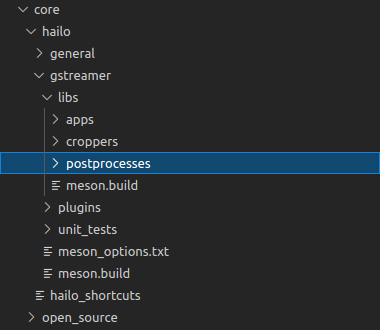
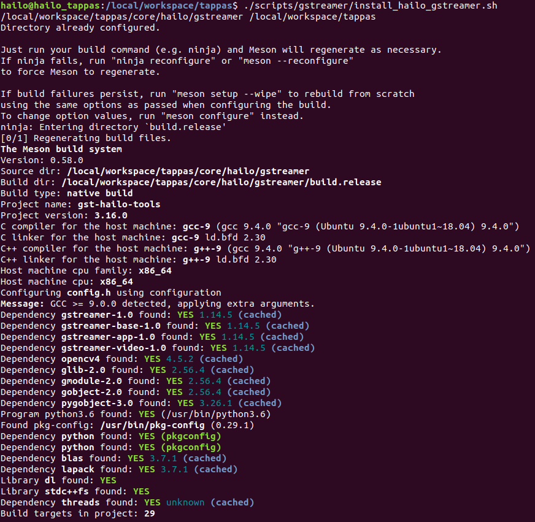
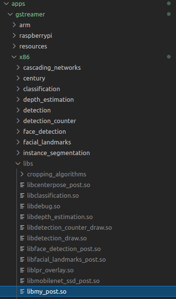
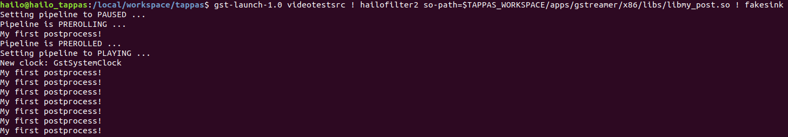
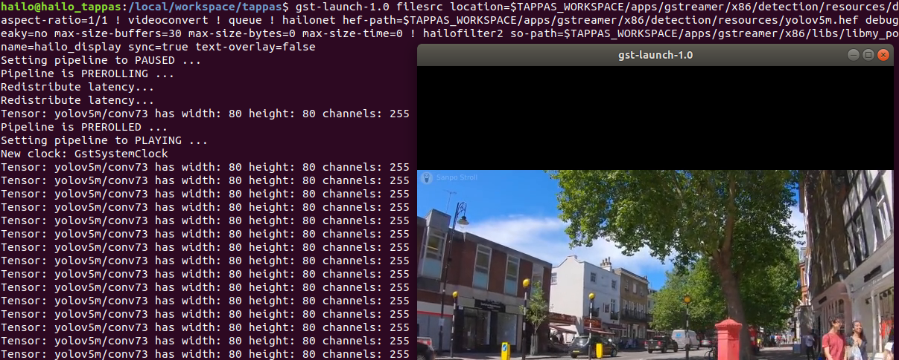
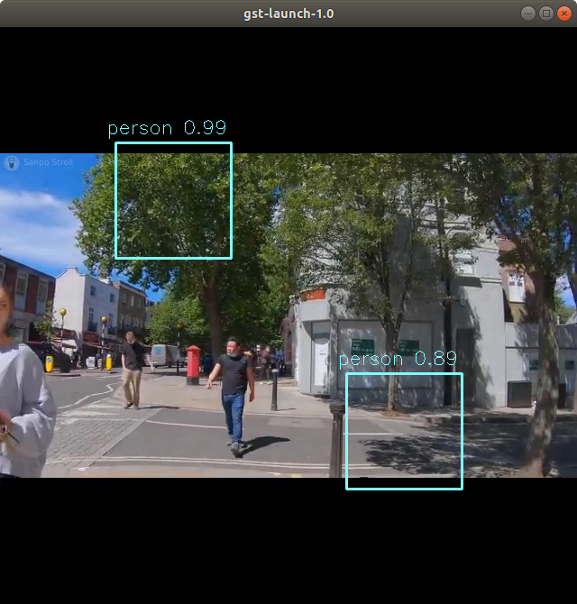

============================
Writing Your Own Postprocess
============================

Overview
--------

When adding a network to the TAPPAS that is not already supported, it most likely requires implementing a new post-process and drawing filter. Fortunately with the use of the `hailofilter <../elements/hailo_filter.rst>`_\ , there is no need to create any new GStreamer elements, just provide the .so (compiled shared object binary) that applies to the filter! \
This guide covers how to create such an .so and what mechanisms/structures are available for creating a postprocess.

Getting Started
---------------

File Location
^^^^^^^^^^^^^

When creating or working with a postprocess, it is important to know where to find all the relevant source files that already exist, and how to add new ones. \
From the TAPPAS home directory, one can find the ``core/`` folder. Inside this ``core/`` directory are a few subdirectories that host different types of source files. The ``open_source`` folder contains source files from 3rd party libraries (opencv, xtensor, etc..), while the ``hailo`` folder contains source files for all kinds of Hailo tools, such as the Hailo Gstreamer elements, the different metas provided, and the source files for the postprocesses of the networks that were already provided in the TAPPAS. Inside this directory is one titled ``general/``\ , which contains sources for `the different object classes <hailo-objects-api.rst>`_ (detections, classifications, etc..) available. Next to ``general`` are two folders of interest: ``libs/`` and ``plugins/``. The former contains the source code for all the postprocess and drawing functions packaged in the TAPPAS, while the latter contains source code for the different Hailo GStreamer elements, and the different metas available. This guide will mostly focus on this ``core/hailo/`` directory, as it has everything needed to create and compile a new .so! It is recommended that users spend time familiarizing themselves with these locations, and then when ready to continue enter the ``libs/postprocesses/`` directory:

Preparing the Header File: Default Filter Function
^^^^^^^^^^^^^^^^^^^^^^^^^^^^^^^^^^^^^^^^^^^^^^^^^^

The new postprocess can be created here in the ``core/hailo/libs/postprocesses/`` folder. Create a new header file named ``my_post.hpp``.\
In the first lines, import the classes required for the post-processing step by adding the following includes:

.. code-block:: cpp

   #pragma once
   #include "hailo_objects.hpp"
   #include "hailo_common.hpp"

``"hailo_objects.hpp"`` contains classes that represent the `different inputs (tensors) and outputs <hailo-objects-api.rst>`_ (detections, classifications, etc...) that your postprocess might handle. You can find the header in `core/hailo/general/hailo_objects.hpp <../../core/hailo/general/hailo_objects.hpp>`_. Your main point of entry for data in the postprocess is the ``HailoROI``\ , which can have a tensor or a number of tensors attached. ``"hailo_common.hpp"`` provides common useful functions for handling these classes. Wrap up the header file by adding a function prototype for your filter, the whole header file should look like:

.. code-block:: cpp

   #pragma once
   #include "hailo_objects.hpp"
   #include "hailo_common.hpp"

   __BEGIN_DECLS
   void filter(HailoROIPtr roi);
   __END_DECLS

The process is now complete. The ``hailofilter`` element does not expect much, just that the above ``filter`` function be provided. Adding `Multiple Filters in One .so`_ will be described later. Note that the ``filter`` function takes a ``HailoROIPtr`` as a parameter; this will provide you with the ``HailoROI`` of each passing image.

Implementing a Filter()
^^^^^^^^^^^^^^^^^^^^^^

Start implementing the actual filter to see how to access and work with tensors. Start by creating a new file called ``my_post.cpp``. Open it and include the following:

.. code-block:: cpp

   #include <iostream>
   #include "my_post.hpp"

| The ``<iostream>`` will allow printing to the console, and the ``"my_post.hpp"`` includes the header file created above.
| For now add the following implementation for the filter() to have a working postprocess to test:

.. code-block:: cpp

   // Default filter function
   void filter(HailoROIPtr roi)
   {
     std::cout << "My first postprocess!" << std::endl;
   }

This is sufficient for compiling and running a pipeline. Next, the following section describes how to add the postprocess to the meson project so that it compiles.

Compiling and Running
---------------------

Building with Meson
^^^^^^^^^^^^^^^^^^^

`Meson <https://mesonbuild.com/>`_ is an open source build system that places an emphasis on speed and ease of use. `GStreamer uses meson <https://gstreamer.freedesktop.org/documentation/installing/building-from-source-using-meson.html?gi-language=c>`_ for all sub-projects to generate build instructions to be executed by `ninja <https://ninja-build.org/>`_\ . Ninja is a build system that focuses specifically on speed, and it requires a higher level build system (ie: meson) to generate its input files. \
Like GStreamer, TAPPAS also uses meson, and compiling new projects requires adjusting the ``meson.build`` files. \
In the ``libs/postprocesses`` path, find the `meson.build <../../core/hailo/libs/postprocesses/meson.build>`_\ , open it and add the following entry for the postprocess:

.. code-block:: cpp

   ################################################
   # MY POST SOURCES
   ################################################
   my_post_sources = [
     'my_post.cpp',
   ]

   my_post_lib = shared_library('my_post',
     my_post_sources,
     include_directories: [hailo_general_inc] + xtensor_inc,
     dependencies : post_deps,
     gnu_symbol_visibility : 'default',
     install: true,
     install_dir: post_proc_install_dir,
   )

This will provide meson with all the information required to compile the postprocess. In short, this provides paths to cpp compilers, linked libraries, included directories and dependencies. All these path variables come from the parent meson project, the meson file can be read to see what packages and directories are available at `core/hailo/meson.build <../../core/hailo/meson.build>`_.

.. _compilation script:

Compiling the .so
^^^^^^^^^^^^^^^^^

| The postprocess is now ready to compile. To help streamline this process a script has been provided that handles most of the work. The script can be found at `scripts/gstreamer/install_hailo_gstreamer.sh <../../scripts/gstreamer/install_hailo_gstreamer.sh>`_. It includes some flags that allow the user to do more specific operations, but they are not needed right now.
| From the TAPPAS home directory folder you can run:

.. code-block:: sh

   ./scripts/gstreamer/install_hailo_gstreamer.sh

If all runs correctly, a green ``YES`` is displayed and the .so is installed to the post-processes directory (default: ``/usr/lib/<arch>-linux-gnu/hailo/tappas/post_processes/``\ )!

Running the .so
^^^^^^^^^^^^^^^

Now that the user has successfully compiled their first postprocess, they can continue to run the postprocess and view the results. Since it is still generic, run this test pipeline in the terminal to see if it works:

.. code-block:: sh

   gst-launch-1.0 videotestsrc ! hailofilter so-path=/usr/lib/$(uname -m)-linux-gnu/hailo/tappas/post_processes/libmy_post.so ! fakesink

Note in the above pipeline that the ``hailofilter`` is given the path to ``libmy_post.so`` in the ``so-path`` property. So now every time a buffer is received in that ``hailofilter``\ 's sink pad, it calls the ``filter()`` function in ``libmy_post.so``. The resulting app should print the text ``"My first postprocess!"`` in the console:

Filter Basics
-------------

Working with Tensors
^^^^^^^^^^^^^^^^^^^^

Printing statements on every buffer is useful, however a postprocess that can actually do operations on inference tensors is more practical. This section describes how this can be achieved. \
Go back to ``my_post.cpp`` and replace the print statement with the following:

.. code-block:: cpp

   // Get the output layers from the hailo frame.
   std::vector<HailoTensorPtr> tensors = roi->get_tensors();

The ``HailoROI`` has two ways of providing the output tensors of a network: via the ``get_tensors()`` and ``get_tensor(std::string name)`` functions. The first (which is used here) returns an ``std::vector`` of ``HailoTensorPtr`` objects. These are an ``std::shared_ptr`` to a ``HailoTensor``\ : a class that represents an output tensor of a network. ``HailoTensor`` holds all kinds of important tensor metadata besides the data itself; such as the width, height, number of channels, and even quantization parameters. A full implementation for this class can be viewed at `core/hailo/general/hailo_tensors.hpp <../../core/hailo/general/hailo_tensors.hpp>`_. \
``get_tensor(std::string name)`` also returns a ``HailoTensorPtr``\ , but only the one with the given name output layer name. This can be convenient for performing operations on specific layers whose names are known in advance. \
\
Now that there is a vector of ``HailoTensorPtr`` objects, let's examine the information that can be obtained from it. Add the following lines to the ``filter()`` function:

.. code-block:: cpp

   // Get the first output tensor
   HailoTensorPtr first_tensor = tensors[0];
   std::cout << "Tensor: " << first_tensor->name();
   std::cout << " has width: " << first_tensor->shape()[0];
   std::cout << " height: " << first_tensor->shape()[1];
   std::cout << " channels: " << first_tensor->shape()[2] << std::endl;

Recompile with the same `compilation script`_. Run a test pipeline, and this time see actual parameters of the tensor printed out:

.. code-block:: sh

   gst-launch-1.0 filesrc location=$TAPPAS_WORKSPACE/apps/detection/resources/detection.mp4 name=src_0 ! decodebin ! videoscale ! video/x-raw, pixel-aspect-ratio=1/1 ! videoconvert ! queue ! hailonet hef-path=$TAPPAS_WORKSPACE/apps/detection/resources/yolov5m_wo_spp.hef is-active=true ! queue leaky=no max-size-buffers=30 max-size-bytes=0 max-size-time=0 ! hailofilter so-path=/usr/lib/$(uname -m)-linux-gnu/hailo/tappas/post_processes/libmy_post.so qos=false ! videoconvert ! fpsdisplaysink video-sink=ximagesink name=hailo_display sync=true text-overlay=false

With a ``HailoTensorPtr`` the user has everything needed to perform postprocess operations. The actual tensor values can be accessed from the ``HailoTensorPtr`` with:

.. code-block:: cpp

   auto first_tensor_data = first_tensor->data();

Remember at this point the data is of type ``uint8_t``\ , for full precision the tensor needs to be dequantized to a ``float``. To aid this the quantization parameters (scale and zero point) are stored in the ``HailoTensorPtr`` and can be applied through ``tensor->fix_scale(uint8_t num)``.

Attaching Detection Objects to the Frame
^^^^^^^^^^^^^^^^^^^^^^^^^^^^^^^^^^^^^^^^

Now that the basics of creating a filter and accessing inference tensors are covered, the next step is to add a detection object to the ``hailo_frame``.\
Remove the prints from the ``filter()`` function and replace them with the following function call:

.. code-block:: cpp

   std::vector<HailoDetectionPtr> detections = demo_detection_objects();

The function ``demo_detection_objects()`` returns some detection objects. Copy the following function definition into ``my_post.cpp``\ :

.. code-block:: cpp

   std::vector<HailoDetection> demo_detection_objects()
   {
     std::vector<HailoDetection> objects; // The detection objects we will eventually return
     HailoDetection first_detection = HailoDetection(HailoBBox(0.2, 0.2, 0.2, 0.2), "person", 0.99);
     HailoDetection second_detection = HailoDetection(HailoBBox(0.6, 0.6, 0.2, 0.2), "person", 0.89);
     objects.push_back(first_detection);
     objects.push_back(second_detection);

     return objects;
   }

In this function two instances of ``HailoDetection`` are created and pushed into a vector that is returned. Note that when creating a ``HailoDetection``\ , a series of parameters are provided. The expected parameters are as follows:

.. code-block:: cpp

   HailoDetection(HailoBBox bbox, const std::string &label, float confidence)

| Where ``HailoBBox`` is a class that represents a bounding box, it is initialized as ``HailoBBox(float xmin, float ymin, float width, float height)``.
| **NOTE:**  It is assumed that the ``xmin, ymin, width, and height`` given are a **percentage of the image size** (meaning, if the box is **half** as wide as the width of the image, then ``width=0.5``\ ). This protects the pipeline's ability to resize buffers without compromising the correct relative size of the detection boxes. 
| 
| Looking back at the demo function introduced above, two instances of ``HailoDetection`` are added: ``first_detection`` and ``second_detection``. According to the parameters shown, ``first_detection`` has an ``xmin`` 20% along the x axis, and a ``ymin`` 20% down the y axis. The ``width`` and ``height`` are also 20% of the image. The last two parameters, ``label`` and ``confidence``\ , show that this instance has a 99% ``confidence`` for ``label`` person. 
| 
| Now that a couple of ``HailoDetection``\ s are available, add them to the original ``HailoROIPtr``. A helper function in the `core/hailo/general/hailo_common.hpp <../../core/hailo/general/hailo_common.hpp>`_ file (included earlier in ``my_post.hpp``) is needed for this.
| This file has other features that will be useful, so it is recommended to keep the file readily available. 
| With the include in place, add the following function call to the end of the ``filter()`` function:

.. code-block:: cpp

   // Update the frame with the found detections.
   hailo_common::add_detections(roi, detections);

| This function takes a ``HailoROIPtr`` and a ``HailoDetection`` vector, then adds each ``HailoDetection`` to the ``HailoROIPtr``. Now that the detections have been added to the ``hailo_frame`` the postprocess is done!
| To recap, the whole ``my_post.cpp`` should look like this:

.. code-block:: cpp

   #include <iostream>
   #include "my_post.hpp"

   std::vector<HailoDetection> demo_detection_objects()
   {
     std::vector<HailoDetection> objects; // The detection objects we will eventually return
     HailoDetection first_detection = HailoDetection(HailoBBox(0.2, 0.2, 0.2, 0.2), "person", 0.99);
     HailoDetection second_detection = HailoDetection(HailoBBox(0.6, 0.6, 0.2, 0.2), "person", 0.89);
     objects.push_back(first_detection);
     objects.push_back(second_detection);
     return objects;
   }

   // Default filter function
   void filter(HailoROIPtr roi)
   {
       std::vector<HailoTensorPtr> tensors = roi->get_tensors();

       std::vector<HailoDetection> detections = demo_detection_objects();
       hailo_common::add_detections(roi, detections);
   }

Recompile again and run the test pipeline. If all is correct then the original video should run with no problems. If no detections are visible, this is because they are attached to each buffer, however no overlay is drawing them onto the image itself. To see how the detection boxes can be drawn, read further in `Next Steps Drawing`_.

Next Steps
----------

.. _Next Steps Drawing:

Drawing
^^^^^^^

| The postprocess now attaches two detection boxes to each passing buffer. To draw those boxes onto the image, use the `hailooverlay <../elements/hailo_overlay.rst>`_ GStreamer element, which draws any Hailo provided output classes (detections, classifications, landmarks, etc..) on the buffer.
| The element should be added in the pipeline after the ``hailofilter`` element with the postprocess.
| Now the pipeline should look like:

.. code-block:: sh

   gst-launch-1.0 filesrc location=$TAPPAS_WORKSPACE/apps/detection/resources/detection.mp4 name=src_0 ! decodebin ! videoscale ! video/x-raw, pixel-aspect-ratio=1/1 ! videoconvert ! queue ! hailonet hef-path=$TAPPAS_WORKSPACE/apps/detection/resources/yolov5m_wo_spp.hef is-active=true ! queue leaky=no max-size-buffers=30 max-size-bytes=0 max-size-time=0 ! hailofilter so-path=/usr/lib/$(uname -m)-linux-gnu/hailo/tappas/post_processes/libmy_post.so qos=false ! queue ! hailooverlay ! videoconvert ! fpsdisplaysink video-sink=ximagesink name=hailo_display sync=true text-overlay=false

Run the expanded pipeline above to see the original video, but this time with the two detection boxes added.

Both boxes will be labeled as ``person``\ , and each is shown with the assigned ``confidence``. Note that the two boxes don't move or match any object in the video; this is because the values are hardcoded for this tutorial. It is up to the user to extract the correct numbers from the inferred tensor of their network, as can be seen among the postprocesses already implemented in the TAPPAS, each network can be different. This guide provides a strong starting point for further development.

.. _Multiple Filters in One .so:

Multiple Filters in One .so
^^^^^^^^^^^^^^^^^^^^^^^^^^^

By default, the ``hailofilter`` calls the ``filter()`` function, but it can also call other functions in the ``.so``. This is useful for developing a postprocess that applies to multiple networks where each network needs slightly different starting parameters (in the TAPPAS case, multiple flavors of the `Yolo detection network are handled via the same .so <../../core/hailo/libs/postprocesses/yolo/yolo_postprocess.cpp>`_\ ). \
This can be achieved by declaring the extra functions in the header file, then pointing the ``hailofilter`` to that function via the ``function-name`` property. \
Taking the Yolo networks as an example, open up `libs/postprocesses/detection/yolo_postprocess.hpp <../../core/hailo/libs/postprocesses/detection/yolo_postprocess.hpp>`_ to see what functions are made available to the ``hailofilter``\ :

.. code-block:: cpp

   #pragma once
   #include "hailo_objects.hpp"
   #include "hailo_common.hpp"

   __BEGIN_DECLS
   void filter(HailoROIPtr roi);
   void yolov5(HailoROIPtr roi, void *params_void_ptr);
   void yolox(HailoROIPtr roi, void *params_void_ptr);
   void yoloxx(HailoROIPtr roi, void *params_void_ptr);
   void yolov3(HailoROIPtr roi, void *params_void_ptr);
   void yolov4(HailoROIPtr roi, void *params_void_ptr);
   void tiny_yolov4_license_plates(HailoROIPtr roi, void *params_void_ptr);
   void yolov5_no_persons(HailoROIPtr roi, void *params_void_ptr);
   void yolov5_no_faces(HailoROIPtr roi, void *params_void_ptr);
   void yolov5_counter(HailoROIPtr roi, void *params_void_ptr);
   void yolov5_vehicles_only(HailoROIPtr roi, void *params_void_ptr);
   void yolov5_personface(HailoROIPtr roi, void *params_void_ptr);
   void yolov5_personface_letterbox(HailoROIPtr roi, void *params_void_ptr);
   void yolov5_no_faces_letterbox(HailoROIPtr roi, void *params_void_ptr);
   void yolov5_adas(HailoROIPtr roi, void *params_void_ptr);
   __END_DECLS

Any of the functions declared here can be given as a ``function-name`` property to the ``hailofilter`` element. Consider this pipeline for running the ``Yolov5`` network:

.. code-block:: sh

   gst-launch-1.0 filesrc location=$TAPPAS_WORKSPACE/apps/detection/resources/detection.mp4 name=src_0 ! decodebin ! videoscale ! video/x-raw, pixel-aspect-ratio=1/1 ! videoconvert ! queue leaky=no max-size-buffers=30 max-size-bytes=0 max-size-time=0 ! hailonet hef-path=$TAPPAS_WORKSPACE/apps/detection/resources/yolov5m_wo_spp.hef is-active=true ! queue leaky=no max-size-buffers=30 max-size-bytes=0 max-size-time=0 ! hailofilter function-name=yolov5 so-path=/usr/lib/$(uname -m)-linux-gnu/hailo/tappas/post_processes/libyolo_post.so qos=false ! queue leaky=no max-size-buffers=30 max-size-bytes=0 max-size-time=0 ! hailooverlay ! videoconvert ! fpsdisplaysink video-sink=xvimagesink name=hailo_display sync=false text-overlay=false

The ``hailofilter`` above that performs the post-process points to ``libyolo_post.so`` in the ``so-path``\ , but it also includes the property ``function-name=yolov5``. This lets the ``hailofilter`` know that instead of the default ``filter()`` function it should call on the ``yolov5`` function instead.
